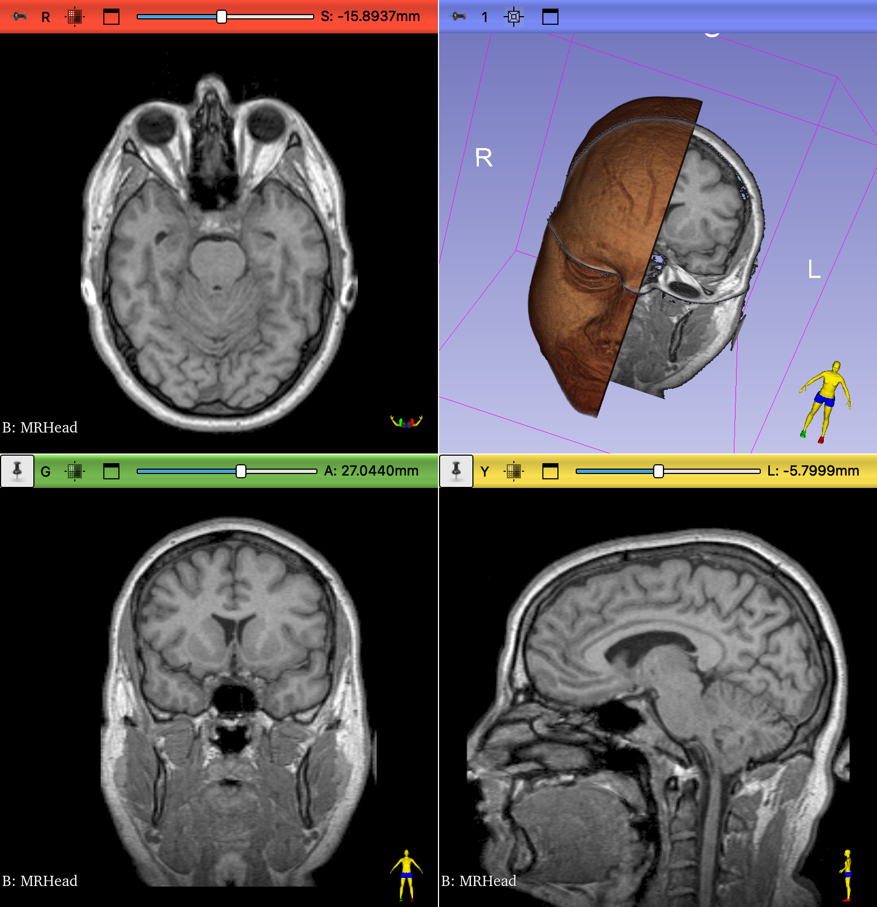

## CT VS MRI

In this exercise, we load a dataset that contains a CT and two MRI volumes, all aligned with each other

## Sample Data

1. Load CT-MR Brain

## Review the Data

Use the Data module to review the loaded datasets: { width="30"}

{ width="450"}

>notice that the default is to hide the first two volumes and display MRBrainT2 (only row with an open eye icon)

## Volume Information Exploration

1. Open the `Volumes` Modules and review the Information
2. Select each volume in the Active Volume Menu and then examine the:
    - Image Dimensions and Image Spacing
    - Scalar Type
    - Scalar Range

{ width="450"}

??? question "Which is the largest volume (Has the Largest Dimensions)"

    - The CT volume has the most Z-slices and the most voxels: nearly 20 million voxels (512 X 507 X 76).
    - The MR volumes only have roughly 5 million voxels.

??? question "Which volume has the smallest voxels?"

    - CT voxels have the smallest XY and Z dimensions in the Image Spacing Row
    - The size of the CT voxels are: $0.43 * 0.43 * 2.5 = 0.46 mm^3$
    - The size of MR1 voxels are: $0.47 * 0.47 * 7 = 1.55 mm^3$
    - The size of MR2 voxels are: $0.39 * 0.39 * 4 = 0.61 mm^3$

??? question "Which volume has the widest dynamic range?"

    The CT volume ranges from -3024 to 1996, so that's widest range. Notice how CT volumes have negative values, which MR volumes do not

## Display Volumes in the viewers

1. Display each volume in the Viewers and scrub through the slices
2. Change the displayed volume by:
   1. Clicking on the push-pin icon in one of the viewers
   2. Clicking on the Chain icon to close the chain link
   3. Changing the listed volume
   { width="450"}

As you scrub through each volume, what differences do you notice right away?

- Which volume has an obvious cylindrical dataset?
- Which volume has the highest resolution the Sagittal Plane?
- Which volume(s) has the highest resolution in the Axial Plane?
- Which Volume was captured at an angle oblique to the Inferior-Superior Axis?

!!! note "Maximize viewer"

    Remember For each viewer, you can expand the view by clicking on the "Maximize View" icon (![][icon-expand]{ width="25"}) or double-clicking on the image itself. To restore the full-layout view, click on the "Restore Layout" icon (![icon-full-layout][]{width="25"}).

[icon-expand]: images/button-viewer-expand-icon-green.png
[icon-full-layout]: images/button-viewer-de-expand-icon-green.png

### Compare Volumes

We can show the different volumes in different viewers. Since we only have one high resolution view for the each of MR volumes, let's display those views and one view of the CT volume

1. Click on the push-pin icon and then the Chain Link icon to break the link
2. Set the Red Viewer to MRBrainT2 and display the red slice in the 3D viewer by clicking open the eye icon.
3. Set the Green Viewer to CTBrain. Display the green slice in the 3D viewer by clicking open the eye icon.
4. Switch to the `Volumes` Module and set the CTBRain volume to the "CT-Brain" preset. Adjust the threshold to remove the air around the skull.
5. Set the Yellow viewer to MRBrainT1. Fit to window.
6. Fit to the volumes to the Window: { width="25"}. 
7. Switch to the `Volume Rendering` module and turn on volume rendering for the T1 Brain.
8. Enable cropping for the volume render and crop the left half of the face. Hide the ROI when you are finished.

You should see the following in the viewers:

{ width="450"}

- In which volume can you see the white and gray matter most clearly?
- In which volume is the skull the brightest?
- Notice how thick the slices in T1 render in the 3D viewer—that gives you an indication of the resolution of the volume
- In the MR volumes, compare the colors of the white vs gray matter
- Compare the MR volumes to the CT volumes
- What Structures can you identify?
  - In T2, Can you find the uncus? The basal ganglia. The thalamus
  - Can you find the Cochlea in the T2 brain? Look for the shrek ears on slice -23.9265mm
  - In T1 (-5.2014): Corpus Callosum, Fornix, Cerebral Aqueduct, Thalamus, 4th ventricle, Pituitary Gland
  - Can you find the Pineal gland in the CT volume? The Pineal Gland is often calcified. Look for a small white dot
  - In the CT scan, can you find a putative meningioma (calcified falcine tumor) in the forebrain? Sync the CTBrain and T1 slices to the tumor location. Can you see evidence of the Tumor in the T1 scan?

### Overlay volumes

We can compare the CT to MR scans by overlaying the volumes. Switch to the `View Controllers` module and set up the viewer volumes as follows:

{ width="450"}
>Only Change the Red and Yellow slice controllers. Set the overlay transparency to 0.70

You should now see the following in the viewers:

{ width="450"}

- Play around with the transparencies of the overlays using the Slice viewers
- Use the CT to determine the extent of the skull. Notice that it is very diffulty to see the dura matter in the CT scan, but is visible in the MR scans.
- For the CT/T2 overlay notice the intensity of the ventricles and the skull as you change the transparencies from CT to MR
- For the CT/T1 overlay, scrub to the location of the falcine tumor and observe the transition between CT to MR

## Volume Render the Skull

1. Switch to the `Volume Rendering` module
2. Turn off the MRBrainT1 volume render by clicking closed the corresponding eye icon in the "Volume:MRBrainT1" row.
3. Turn on rendering of the CT volume by clicking open the corresponding eye icon in the "Volume:CTBrain" row.
4. Slide the "Shift" slider back and forth to reveal the head restraint. Does the patient have straight or curly hair?
5. Set the Display preset to "CT-AAA"
6. Enable Cropping and display the ROI by clicking open the "Display ROI" eye icon
   1. Crop the left half of the skull 
   2. Crop the right side of the volume to remove any remnant of the restraint
7. Do you see the intracranial sinus
8. Can you see the tumor?
   1. if not, adjust the crop ROI

{ width="250"}

## Save your work

{ width="25"}

1. Click on the Save icon
2. Make sure that everything is selected
3. Change Directory for selected files
4. Create a new Folder Called CT-MR
5. Open that new folder
6. Make sure all the Directory paths point to this new folder
7. Click Save
8. Click to Overwrite all

## Exercise: Explore the MRHead dataset

There are several MR datasets. Let's open the MRHead

1. In the File Menu, select "Close Scene" to close the CT-MR dataset. You don't have to save again if you just saved the project
2. Switch to the `Sample Data` module (File:Download Sample Data)
3. Select MRHead
4. Display the red viewer slice in 3D
5. Display the yellow viewer slice in 3D
6. Switch to the `Volume Rendering` module.
   1. Render MRHead in 3D
   2. Select the "MR Default" preset
   3. Crop the render Sagitally along the midline
7. Bonus, can you remove the black surrounding the volume from being displayed in 3D?

{ width="450"}

??? question "Is this a T1 or T2 dataset?"

    likely T1

??? question "How Large is the volume?"

    $256 * 256 * 130 = 8,519,680$ voxels

??? question "How large is a voxel in this dataset?"

    $1 * 1 * 1.3 = 1.3mm^3$

### ID STRUCTURE

1. Lobes and Sulci
    - temporal lobe
    - occipital lobe
    - Parieto occiptal sulcus
    - Calcarine Sulcus
    - Uncus
    - Cingulate Gyrus
2. Brainstem
    - Midbrain, pons, medulla
    - Tectum
    - Spinal Cord
3. Ventricles
    - Lateral
    - 3rd
    - Cerebral aqueduct
    - 4th
    - Falx Cerebri
    - Septum pellucidum
4. Cisterns
    - Magna
    - Quadrigeminal
    - Interpeduncular
5. Cerebellum
7. Mammillary Bodies
8. Corpus Callosum
9. Fornix
10. Auditory Nerve
11. Pituitary Gland
12. Basal Ganglia
13. Thalamus
14. Hippocampus
15. Choroid Plexus

