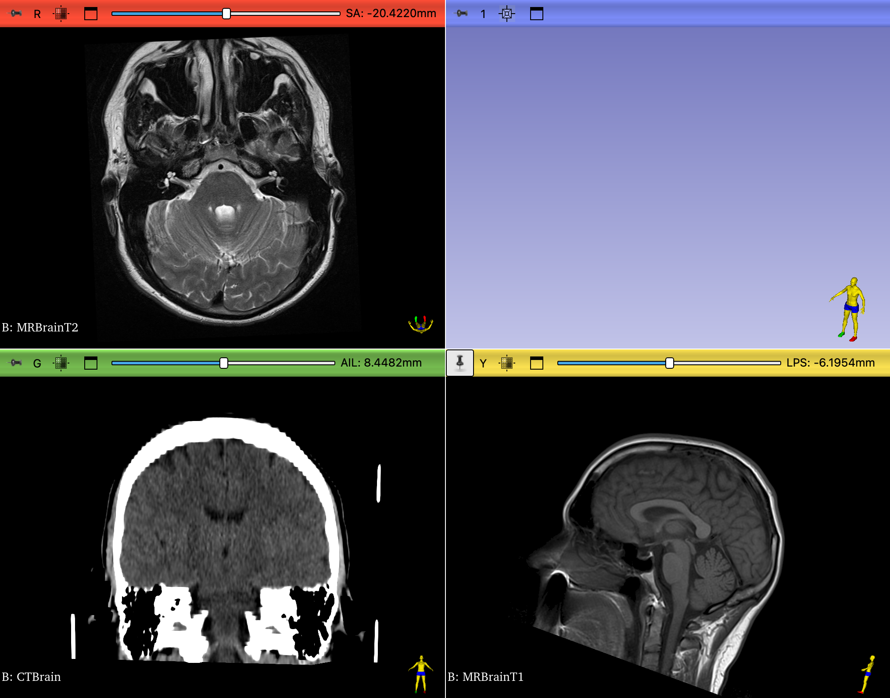
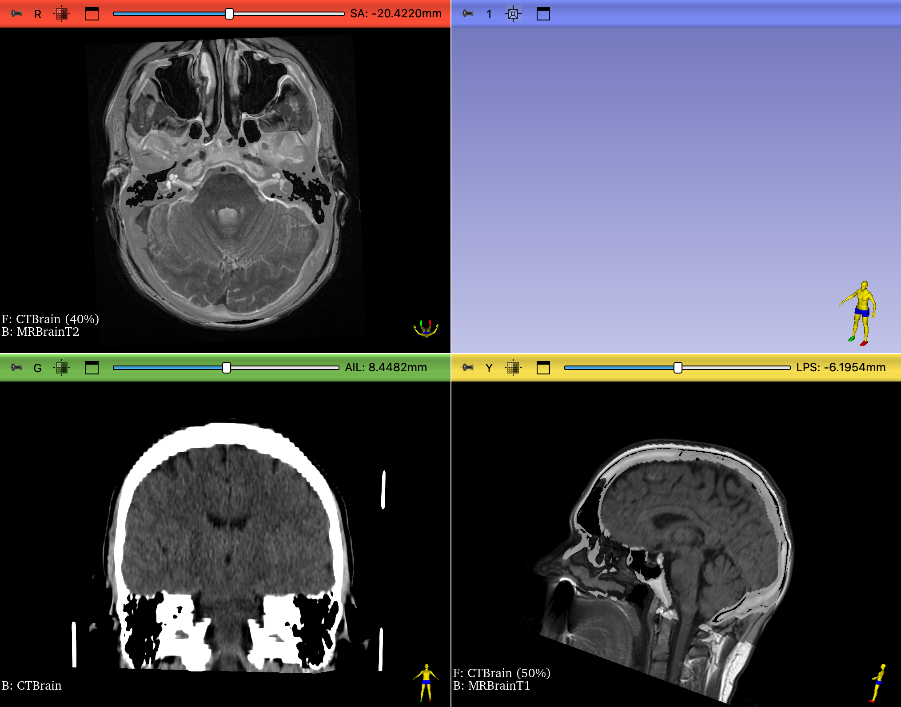

## CT VS MRI

In this exercise, we load a dataset that contains a CT and two MRI volumes, all aligned with each other

## Sample Data

Load the "CT-MR Brain" dataset

## Review the Data

Use the Data module to review the loaded datasets: { width="30"}

{ width="450"}

>notice that the default is to hide the first two volumes and display MRBrainT2 (only row with an open eye icon)

## Volume Information Exploration

1. Open the `Volumes` Modules and review the Information
2. Select each volume in the Active Volume Menu and then examine the:
    - Image Dimensions and Image Spacing
    - Scalar Type
    - Scalar Range

{ width="450"}

??? question "Which is the largest volume (Has the Largest Dimensions)"

    - The CT volume has the most Z-slices and the most voxels: nearly 20 million voxels (512 X 507 X 76).
    - The MR volumes only have roughly 5 million voxels.

??? question "Which volume has the smallest voxels?"

    - CT voxels have the smallest XY and Z dimensions in the Image Spacing Row
    - The size of the CT voxels are: $0.43 * 0.43 * 2.5 = 0.46 mm^3$
    - The size of MR1 voxels are: $0.47 * 0.47 * 7 = 1.55 mm^3$
    - The size of MR2 voxels are: $0.39 * 0.39 * 4 = 0.61 mm^3$

??? question "Which volume has the widest dynamic range?"

    The CT volume ranges from -3024 to 1996, so that's widest range. Notice how CT volumes have negative values, which MR volumes do not

## Display Volumes in the viewers

1. Display each volume in the Viewers and scrub through the slices
2. Change the displayed volume by:
   1. Clicking on the push-pin icon in one of the viewers
   2. Clicking on the Chain icon to close the chain link
   3. Changing the listed volume

{ width="450"}

As you scrub through each volume, what differences do you notice right away?

- Which volume has an obvious cylindrical dataset?
- Which volume has the highest resolution the Sagittal Plane?
- Which volume(s) has the highest resolution in the Axial Plane?
- Which Volume was captured at an angle oblique to the Inferior-Superior Axis?

!!! note "Maximize viewer"

    Remember For each viewer, you can expand the view by clicking on the "Maximize View" icon (![expand icon][icon-expand]{ width="25"}) or double-clicking on the image itself. To restore the full-layout view, click on the "Restore Layout" icon (![restore icon][icon-full-layout]{width="25"}).
        
    [icon-expand]: images/button-viewer-expand-icon-green.png

    [icon-full-layout]: images/button-viewer-de-expand-icon-green.png

### Compare Slice Views

We have only one high resolution view for the each of MR volumes, so let's display those volumes in separate viewers.  Click on the push-pin icon and set the Chain-Link icon to unlinked ({ width="18"}) so the viewers are not synchronized. Set the viewers as follows:

- **Red Viewer**: MRBrainT2.
- **Green Viewer**: to CTBrain.
- **Yellow viewer**: to MRBrainT1.

Be sure to fit all the volumes to the Window: { width="25"}. You should see the following in the viewers:

{ width="450"}

>Notice how the bottom of the T1 volume is at an angle. This is because the volume has been aligned (registered) to the CT volume

- In which volume(s) can you see the white and gray matter most clearly?
- In which volume is the skull the brightest?

In the **MR volumes**

- Compare the colors of the white vs gray matter
- Compare the MR volumes to the CT volumes
- What Structures can you identify?

In the **T2 Volume**, find:

- The uncus
- The basal ganglia.
- The thalamus
- The Cochlea? (Look for the shrek ears on slice -23.9265mm)

In the **T1 Volume**, find:

- Corpus Callosum
- Fornix
- Cerebral Aqueduct
- Thalamus
- 4th ventricle
- Pituitary Gland

In the **CT Volume**, find:

- The **pineal gland.** The pineal gland is often calcified. Look for a small white dot.
- A **putative meningioma** (calcified falcine tumor) in the forebrain?

Sync the CTBrain and T1 slices to the tumor location.

- Can you see evidence of the tumor in the T1 scan?

### Overlay volumes

We can compare the CT to MR scans by overlaying the volumes. Switch to the `View Controllers` module and set up the viewer volumes as follows:

{ width="450"}
>Only Change the Red and Yellow slice controllers. Set the overlay transparency to 0.70

You should now see the following in the viewers:

{ width="450"}

Adjust the transparencies of the overlays as you review the slices

- Review the CT to determine the extent of the skull. Notice the Dura mater is difficult to see in the CT scan, but is clearly visible in the MR scans.
- For the CT/T2 overlay notice the intensity of the ventricles and the skull as you change the transparencies from CT to MR
- For the CT/T1 overlay, scrub to the location of the falcine tumor and observe the transition between CT to MR

## Add Slices to the 3D view

Add the T1 and T2 slices to the 3D view by clicking on the respective slice viewer pushpins and toggling on the eye icon.

{ width="250"}

>**3D view of the MR volumes.** Notice how the volumes were captured at angles to each other.

To remove the edges of the slices in the 3D view, switch to the **Volume Module** and:

1. Select each MR Volume in the `Volume` pop-menu
2. Under the Display tab, set the `Threshold` as indicated in the table below:

| Volume | Lower Threshold |
| ------ | --------------- |
| MRT1   | 70              |
| MRT2   | 30              |

## Volume Render the Skull

Switch to the `Volume Rendering` module. Render and review each volume by selecting the volume in the `Volume` pop-up menu and toggling the eye icon. Create the following three renders (sequentially, not at the same time).

{ width="650"}
>**3D renders of the CT-MR volumes.**

Crop the rendered volume to get the views shown in T1 and CT.

- Be sure to remove the left halves of the volumes.
- Add the MR slices to the 3D viewer (Red and Yellow viewers) for all renders.
- Remove the edges of the MR slices 

For the T1 render

- Select the MR-default preset
- Notice how thick the slices are in T1 render in the 3D viewer
- This gives you an indication of the resolution of the volume.

For the CT render:

- Slide the "Shift" slider back and forth to reveal the head restraint. Does the patient have straight or curly hair?
- Select the CT-AAA preset to reveal the skull
- Find the Intracranial sinus
- Find the falcine tumor. If not visible, adjust the crop ROI.