# CT PET Multimodal Datasets

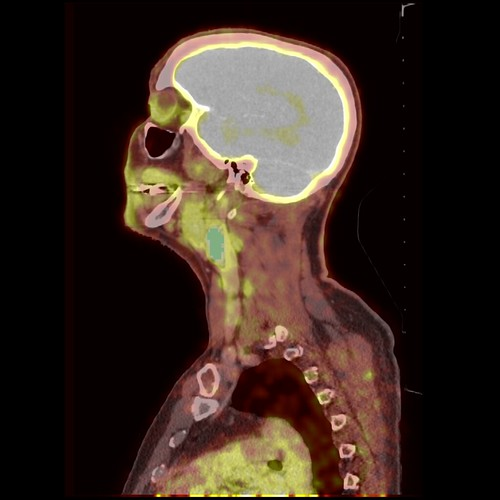{ width="250"}

This exercise was derived from a section of the Quantitative Imaging Example from the Slicer website.

[PET/CT Visualization and Analysis]

[PET/CT Visualization and Analysis]: https://www.dropbox.com/s/8wswnxidudinets/PETCT_overview.pdf?dl=1

## FDG

What's [FDG 18F](http://www.wikiwand.com/en/Fludeoxyglucose_(18F))?

- Fluorodeoxyglucose: a radiopharmaceutical glucose analog. Tumors love glucose.

## Load Dataset

The datasets in this exercise are multimodal PT CT datasets. They were acquired from a patient who presented with a tumor. The following are the impressions from the Surgeon.

- **Pathology**: poorly differentiated squamous cell carcinoma

- **Treatment**: radiotherapy and chemotherapy (weekly cis-platin)

- **Datasets:** Two 18F-FDG PET and CT scans acquired within a 5-month interval.

To load the data, we will load .MRB files. An .MRB file is like a zip file and contains all the data from a study (CT and PET images).

### Method 1: Add Data Dialog

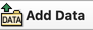{ width="100"}

1. In Slicer, click on the "Add Data" button.
2. Click on "Choose File(s) to Add"
3. Navigate to the  "dataset3_PETCT" folder in the Unit 3 data folder of the MATLAB drive.
4. Shift-Select both "PET_CT_pre-treatment.mrb" and "PET_CT_post-treatment.mrb"
5. Click "OK""

### Method 2: Drag-and-drop

1. Navigate to the  "dataset3_PETCT" folder in the Unit 3 data folder of the MATLAB drive.
2. Find the file called "PET_CT_pre-treatment.mrb"
3. Drag-and-drop that file to Slicer.
4. Click "OK" on the pop-up dialog that appears
5. Repeat for the "PET_CT_post-treatment.mrb" file

## Data Module

- Switch to the Data Module

??? question "How many Volumes are loaded?"

    You should see 5 different volumes (as indicated by the cube icons)

    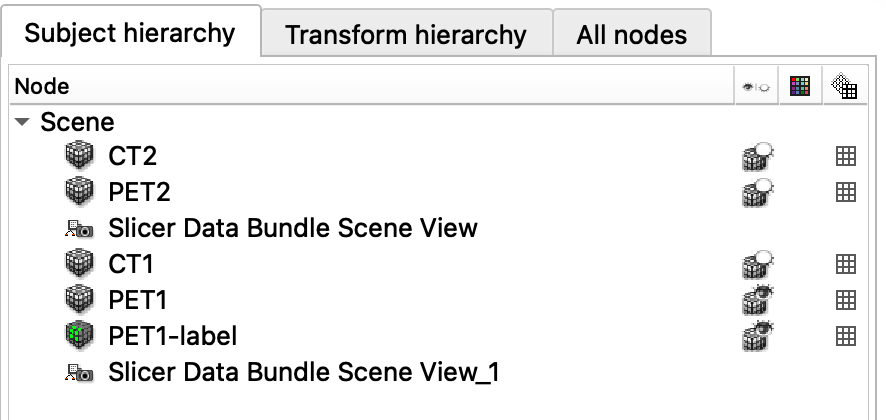{ width="250"}

    - CT1, CT2, PET1, PET2,
    - PET1-label is a label file (a segmentation of the Tumor)
    - The other files control the view

## Inspect the Volumes

- Switch to the Volumes Module
- Set the Active Volume first to CT1, then to PET1
- Compare the CT and PET voxels sizes.

??? question "Which has a smaller voxel (and better resolution)?"

    The CT dataset clearly has a higher resolution because its voxels are much smaller (Compare the Image Spacing values)

    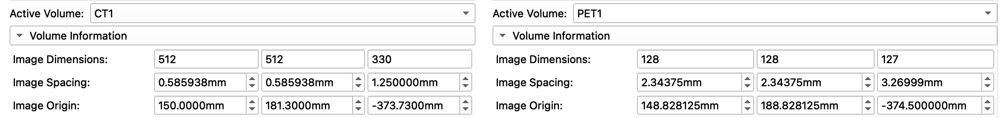{ width="650"}

## Display an overlay of the PET CT datasets

Left-click on the pin icon in the top left corner to display the red slice viewer menu.

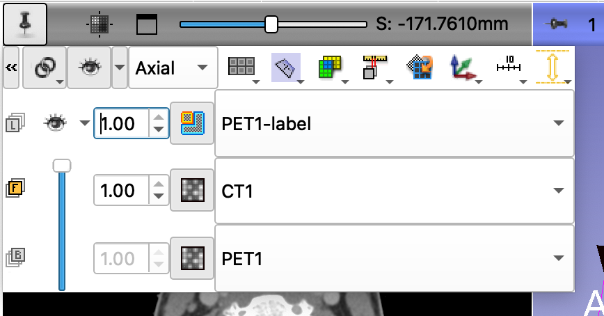{width=350}

- The CT1 volume is displayed in the Foreground viewer

- The PET1 volume is displayed in the Background viewer

- The PET1-Label is displayed in the Label map viewer

Use the slider to fade between the Bg viewer and the Fg viewer to display the PET volume overlaid on the CT volume. Change the CT1 value to **0.60**.

Your settings should now be as follows:

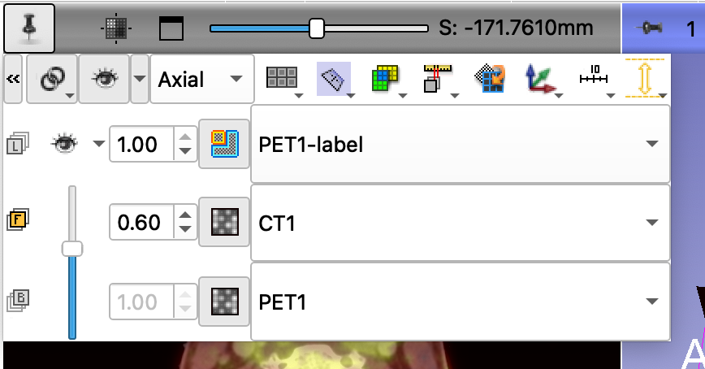{ width="350"}

### Remove black edges of the orthogonal planes

You can remove the black portions of the orthogonal places in the 3D Viewer using controls in the Volumes Module.

1. Switch to the volumes module
2. Set the Active Volume to "PET1."
3. In the display tab, adjust the left Threshold slider to set the lower limit of the threshold. In this example, we use a lower Threshold setting of 400

### Adjust position of the orthogonal planes

- Move the mouse around the tumor.
- Hold the shift-button to align the three slice views.
- Note the label appears as a green outline.
- You can toggle between an outline and a filled in object by clicking on the icon next to PET1-label.

### Final Result

When you are finished, you should see something similar to the following:

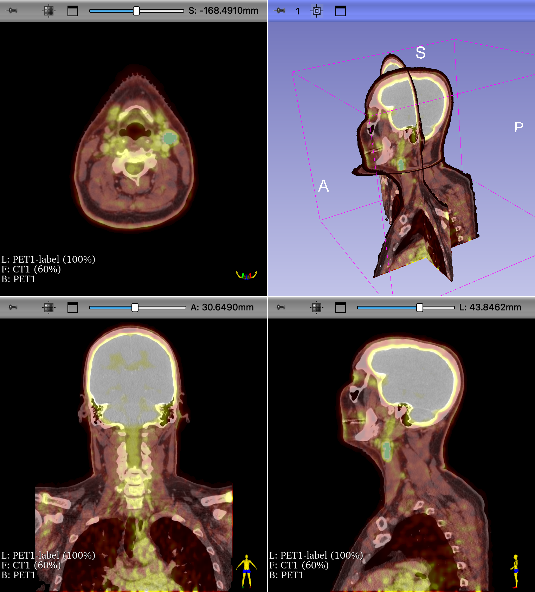{ width="450"}

>Four-up view of CT1 and PET1 overlay. Tumor segmentation shown in green. Edges of the orthogonal slices in the 3D viewer were removed from display using threshold settings in the volumes module.

### Add a volume render of the Skull

We can add a volume render to the scene fairly easily, using the Volume Render module

{ width="150"}

- Switch to the Volume Rendering Module
- Choose the CT1 Volume
- Select the CT-AAA preset
- Adjust the `Shift` slider to clean-up the noise
- Use the crop function to remove the table.
- Scrub the Slice so that it intersects the PET1_label

### Create a 3D segmentation of the Tumor

This is an old dataset that uses old 3D Slicer methodology for their segmentations, called labelmaps. Instead of labelmaps, Slicer has switched to using Segmentation volumes. Luckily, it is easy to convert the labelmap into a segmentation volume using the Data module.

{ width="50"}

1. Switch to the Data module
2. Right-click on PET1-label (this is the label map)
3. From the contextual menu, select "Convert labelmap to segmentation node."

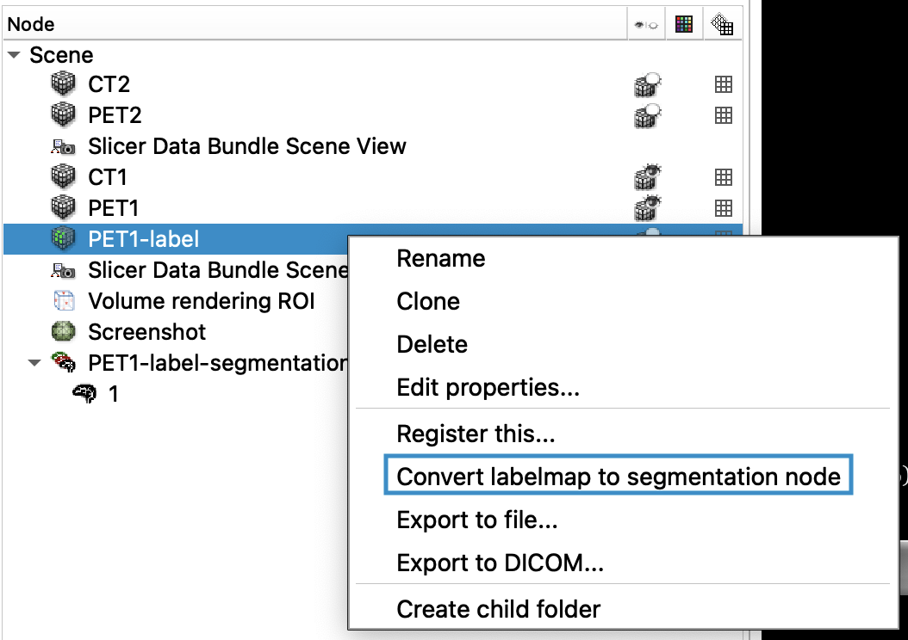{ width="350"}

- This creates a new item in the data table called "PET1-label-segmentation". Notice the different icon
- There is also now a new row in the Slice View Controls that lists this segmentation volume (instead of the labelmap)

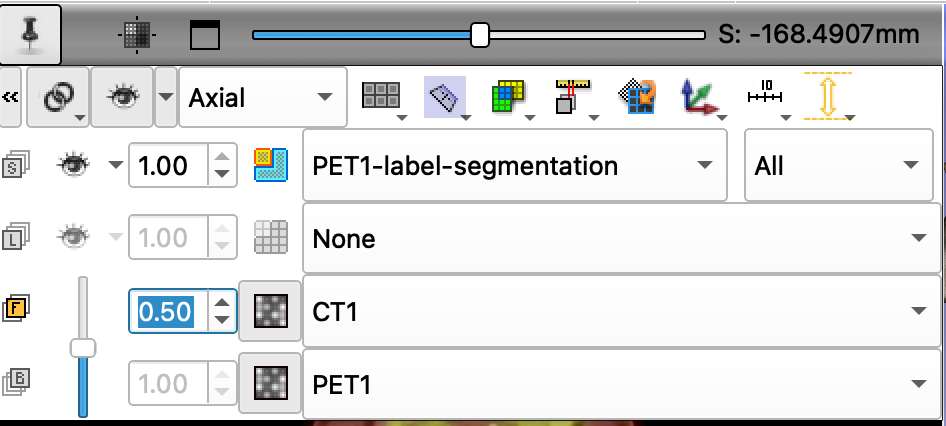{ width="350"}

We can make this new segmentation appear in the 3D using the Segment Editor Module:

{ width="30"}

1. Switch to the Segment Editor Module by clicking on the icon in the toolbar (or selecting in the Modules pop-up menu)
2. Click on the "Show 3D" button
3. You should now see a 3D segmentation of the tumor

### Final 3D Render of the Multimodal dataset
  
You should now see the following in the 3D view:

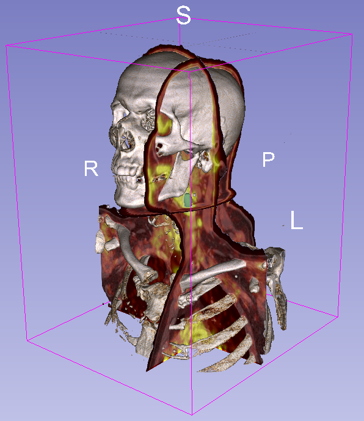{ width="450"}

- Hide the 3D slices to view just the skeleton and the tumor

### Review Findings

The following are the clinical findings for the patient:

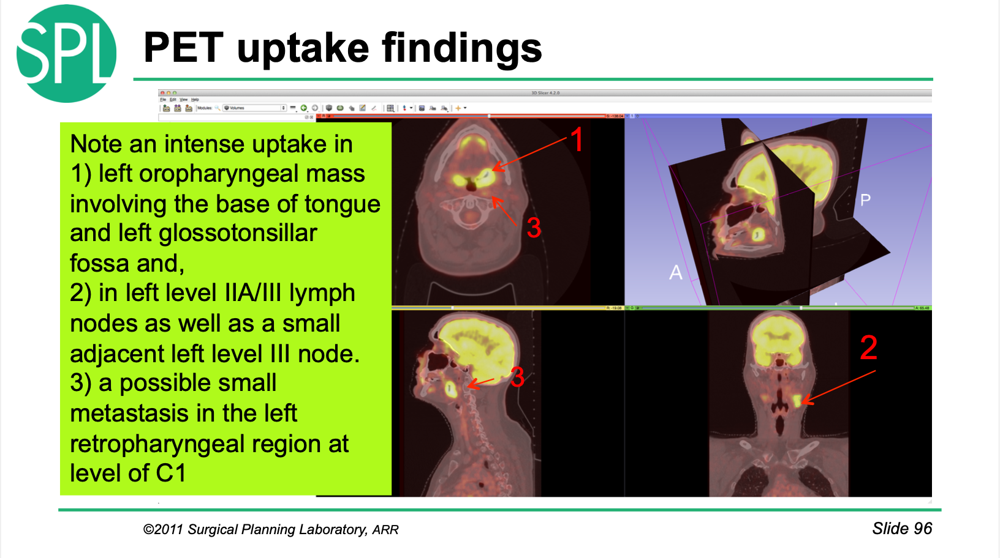{ width="550"}

## Before and After Comparisons

This multimodal dataset includes CT and PET scans from before and after () treatment (CT1-PET1 vs CT2-PET2, respectively) . We can use a different layout to visualize all of the volumes at once.

Choose "Three over Three" from the Layout Menu:

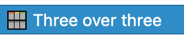{ width="150"}

Open the View Controllers Module.

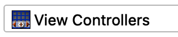{ width="150"}

- here you see the view controller for all of the slice viewers shown. 
- Since there are six viewers, there are six controllers
- Reveal all of the controls by clicking on the >> icon
- Be sure to unlink the chain (so your changes are not copied into all of the viewers)

Use these settings:

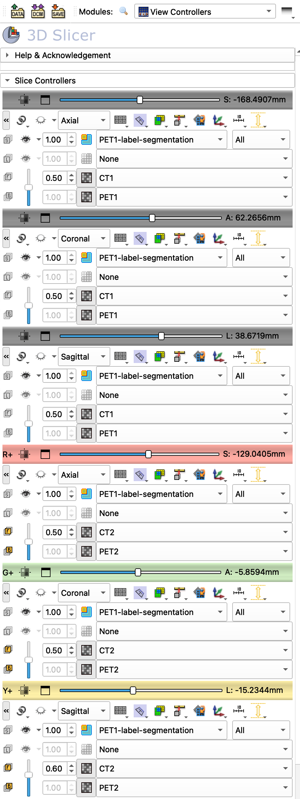{ width="450"}

You should get something that looks like this: 

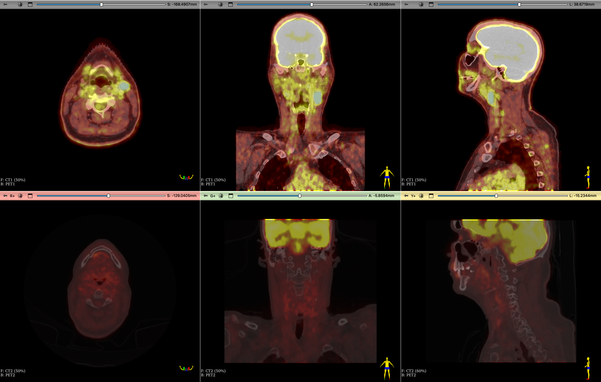{ width="550"}

Review the results
- Are the volumes the same size?
- Can you find the same region where the tumor was?
- Is the tumor still there?

Review and try to match the views shown the the physicians' findings [here](PETCT-Follow-up-findings.pdf).