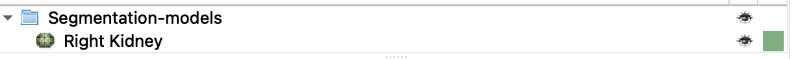

# Create a model of Kidneys using the Segmentation Module

So far, we have created a segmentation (aka a label mask) and rendered this segmentation in 3D using the `Segment Editor` module. The next step is to create a surface model (with faces and vertices) of the segmentation using the `Segmentation` module.

Switch to the  `Segmentation` module by clicking on the "Segmentations..." button (right arrow) { width="30"} or you can just find Segmentations in the Module Menu

{ width="250"}

The `Segmentation` module organizes all of the segments created using the `Segment Editor`. In fact, the top half of the module looks identical to the Segment Editor.

Additional tabs include:

- **Display**: where you can control the display of the segmentation render (in 3D)
- **Representations**: where you can create different types of label masks
- **Copy/move**: Where you can move segmentations to different Segmentation nodes
- **Export/import models and labelmaps**: Create models and/or labelmaps
- **Export to files**: save your segmentations as .OJB files
- **Binary labelmap layers**: Controls layers in segmentations

To create a surface model of the kidney, use these steps:

1. Make sure that you only have the Right kidney in the segmentation table (remove the background segmentation)
2. Click open the **Export/import models and labelmaps** tab.
3. Use these settings:
    { width="450"}

4. Click on the "Export" button

#### Review Model

1. The 3D model should appear in the 3D viewer (it should look the same as the 3D render of the segmentation).
2. Make sure that the segmentation render didn't reappear by toggling the 3D view at the top of the Segmentations module
3. Switch to `Models` Module. { width="250"}
4. You should see the Right Kidney listed
    { width="450"}
5. In the Display tab, change the opacity to 0.5
    { width="250"}

#### Review  Data

1. Click on the Data Module
2. Review the hierarchy
    { width="450"}
3. Save your work
    { width="450"}
   >notice, this time just a couple of things are checked… This is what has changed. Choose overwrite when asked

#### Create a model of the aorta

Use the similar steps to create a 3D surface of the aorta as you did for the kidney, with the following changes.

1. Hide the Right Kidney in the segmentation table
2. For the Export/import models tab, use the following settings
   - **Operation**: Export
   - **Output type:** Models
   - **Output Node:** Segmentation-models (you created this in the previous step)
   - **Exported Segments:** "Visible" - that way, you don't remake the kidney model, since its not visible (see step 1)
3. Export
4. Switch to the `Models` module
5. There should now be a row for the Aorta
6. Save your work!

# Surface Models - Tumors

So far we have created segmentations (or masks), which are binary volumes or label maps. Sometimes, further analysis or visualization requires the creation of surface models from these masks. To create Surface Models, we use the Segmentations module:

{ width="250"}

At the top of the Segmentations Module, you can set the **Active Segmentation** node from the pop-up menu

{ width="450"}

### Decimation

Remember, the process of creating surface models usually creates too many triangles, which might make the surface model unwieldy to operate. So, you should always decimate a surface model after you create them to remove these excess triangles.

In the **Representations** tab:

{ width="450"}

1. **Closed Surface:** Click on the `Create` or `Update` button to bring up the Advanced segmentation conversion dialog window.
2. **Advanced segmentation conversion dialog window:** Select the `Binary labelmap->` row in the top table.

    { width="350"}

3. In the lower table, change the `Decimation Factor` to 0.5 to 0.75.
    - Keep an eye on your 3D structures and ensure that you don't over-decimate (they will start to look jagged when over-decimated.)

### Create Models

Be sure that you have set the segmentation nodes in the **Active Segmentation** pop-up menu at the top of the Segmentation Module (e.g. SegTumor1). Surface Models will be created of those segments found in that Segmentation node (e.g. Tumor1)

In the **Export/import models and labelmaps** section using the following steps:

1. **Operation:** `Export`
2. **Output type:** `Models`
3. **Output node:** Create New node as "MRTumorModels"
4. Click the `Export` button

Switch to the Models Module:

{ width="250"}

You should see a model of the segmentation that you just made under the MRTumorModels Node.

Repeat for the other segments. When you are done, you should see the following in the Models Module.

{ width="450"}

Switch to the Data module

- You should see the MRTumorModels listed there
- Right-click on "MRTumorModels"
- Select "Convert models to segmentation mode"
- A new segmentation node called "MRTumorModels segmentation" will be added to the list

SAVE YOUR WORK!