# Creating and Displaying Surface Models

So far, we have created segmentations packaged into segmentation volumes (aka label maps). And while we have rendered segmentations in 3D using the `Segment Editor` module, we have not actually created  independent 3D surface models. In this module, we will create such models from our previous segmentation efforts.

Segmentations are useful for masking regions of interest in a volume and for calculating statistics, like volume and length. However, they can be a bit wieldy to manage without specialized software and tend to be rather large. Segmentations are defined by their location in the larger segmentation volume. This can make it difficult to compare multiple masks across multiple segmentation volumes, especially when some of these masks are chiral (e.g. left vs right kidney or femur)

In certain situations, 3D surfaces can offer some advantages. A 3D surface is typically represented as a series of vertices and faces. So, 3D surfaces can be more compact: you can create surfaces of the internal structures, not the entire volume, so they are independent from the segmentation volume. 3D surfaces can be displayed by the major Operating Systems (PC, Mac), and 3D surfaces can uploaded to websites designed to share and display 3D surfaces (e.g. Sketchfab).

## Creating models from the CTACardio segmentations

We start by loading our CTACardio segmentations.

1. Clear **Slicer** by closing the scene (File:Close Scene) or restarting **Slicer**
2. Click on the **Add DATA** button and select the "CTACardio MRML scene" file to load the CTACardio segmentation volumes into **Slicer**.

### Segmentation Module

You create 3D surface models of the segmentation using the `Segmentation` module.

Switch to the  `Segmentation` module by clicking on the "Segmentations..." button (right arrow) { width="30"} or you can just find Segmentations in the Module Menu

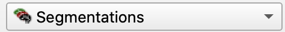{ width="250"}

The `Segmentation` module organizes all of the segments created using the `Segment Editor`. In fact, the top half of the module looks identical to the Segment Editor.

Additional tabs include:

- **Display**: where you can control the display of the segmentation render (in 3D)
- **Representations**: where you can create different types of label masks
- **Copy/move**: Where you can move segmentations to different Segmentation nodes
- **Export/import models and labelmaps**: Create models and/or labelmaps
- **Export to files**: save your segmentations as .OJB files
- **Binary labelmap layers**: Controls layers in segmentations

We'll start by creating a surface model of the kidneys and the aorta, so make sure that correct segmentation is listed as the Active Segmentation.

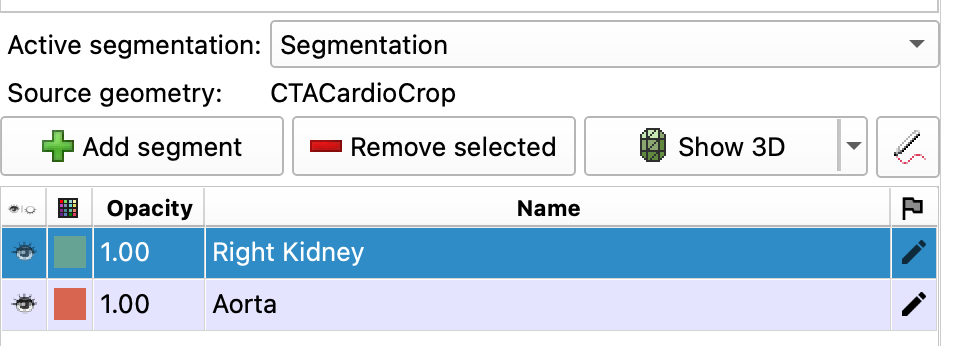{ width="450"}
>Note, you may have additional segmentations listed in your table (like Left Kidney)

### Decimation

The process of creating surface models usually creates too many triangles, which might make the surface model unwieldy to operate. So, you should always decimate a surface model after you create them to remove these excess triangles.

In the **Representations** tab:

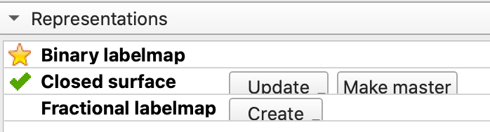{ width="450"}

1. **Closed Surface:** Click on the `Create` or `Update` button to bring up the Advanced segmentation conversion dialog window.
2. **Advanced segmentation conversion dialog window:** Select the `Binary labelmap->` row in the top table.
>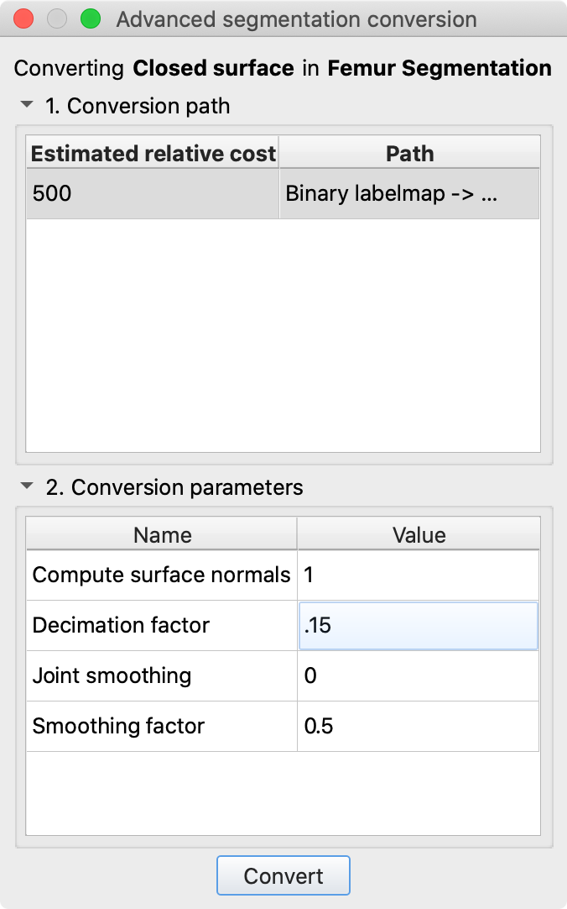{ width="350"}
3. In the lower table, change the `Decimation Factor` to 0.5 to 0.75.
    - Keep an eye on your 3D structures and ensure that you don't over-decimate (they will start to look jagged when over-decimated.)

### Create Surface Models

Open the **Export/import models and labelmaps** tab and use these settings

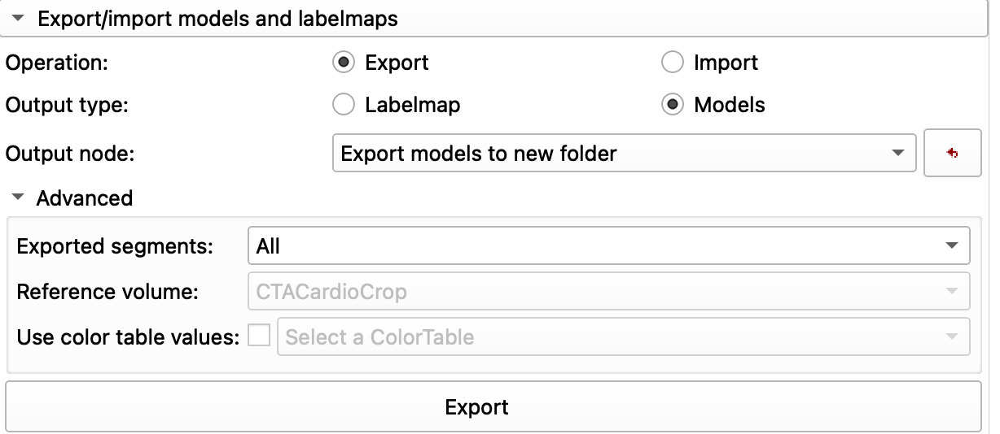{ width="450"}

Then, Click on the "Export" button

The 3D models should appear in the 3D viewer (it should look the same as the 3D render of the segmentation).

!!! warning "Models vs 3D segmentations"

    3D models and Segmentation shown in 3D will likely look identical, because, in practice they are. Slicer makes 3D models of segmentations to display them in the 3D viewer. Sometimes, the only way to differentiate between the two is to toggle the 3D view button at the top of the Segmentations module. That button controls the visualization of segmentations as 3D models. Vizualization of the actual surface models is controlled in the **Models Module**

#### Review Data and Save

1. Click on the Data Module
2. Review the hierarchy
>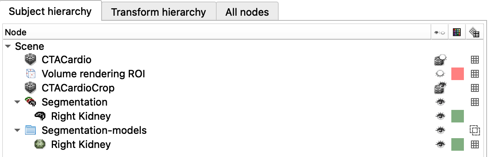{ width="450"}
3. Save your work

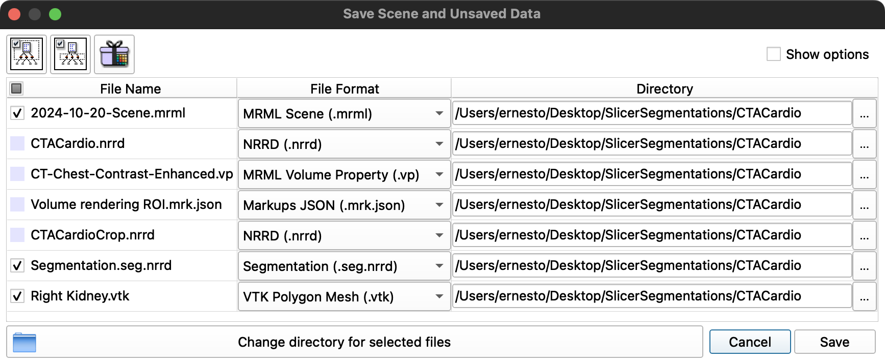{ width="450"}
   >notice that just a couple of things are checked… This is what has changed. Choose overwrite when asked.

## Models Module

The Models Module lists all of the models created and controls their display

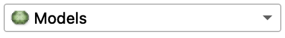{ width="250"}

1. Switch to `Models` Module.
2. You should see your models listed
>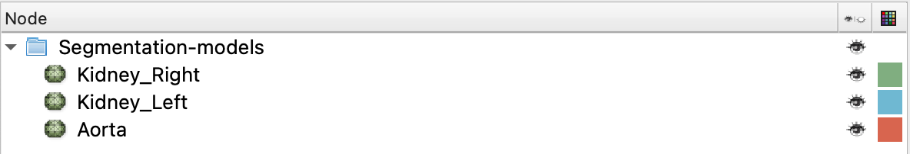{ width="450"}

#### Adjust Model Opacity

1. Select one of the models in th models list (e.g.)
2. In the Display tab, change the opacity to 0.5

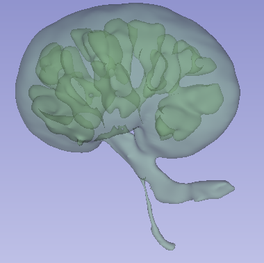{ width="250"}
> Kidney surface model with an opacity of 0.5

#### Other Model rendering settings to try

- **3D Display**: `wireframe` shows the faces and triangles

### Clipping Planes

One nice feature of Models is that you can clip them (shear off edges) using the orthogonal planes. 

1. Display the Red Slice in the 3D viewer
2. Select Aorta in the Models List
3. Under the **3D Display** tab, enable `Clipping`
4. Click **Configure...**
5. In the Clippings Plane, select different options to see the different effects
   1. e.g. Compare "Positive" to "Negative"

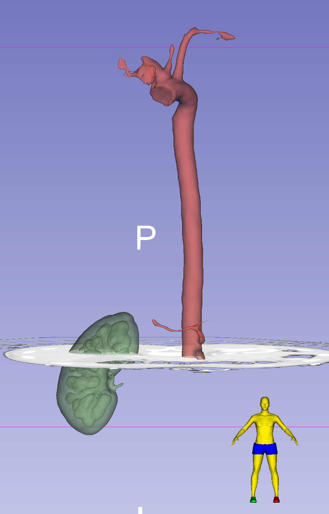{ width="450"}

## Tumor Challenge

How would you create this scene with the [Tumor Segmentations](MRTumorSegment.md)?

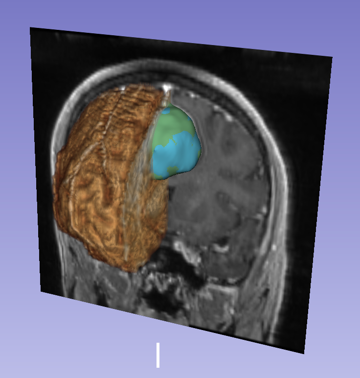{ width="450"}

### Volume Rendering with Tumors

1. Turn on Tumor Segmentations in 3D view
2. Turn on coronal slice view in 3D
3. Render the Stripped Skull volume
4. Crop the volume along the interhemispheric fissure
5. Make sure your tumor model is visible
