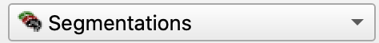

## Surface Models - Tumors dataset

Load the Tumors data set

{ width="250"}

At the top of the Segmentations Module, you can set the **Active Segmentation** node from the pop-up menu

{ width="450"}

#### Create a model of the other segments

Use the similar steps to create a 3D surface of the aorta as you did for the kidney, with the following changes.

1. Hide the Right Kidney in the segmentation table
2. For the Export/import models tab, use the following settings
   - **Operation**: Export
   - **Output type:** Models
   - **Output Node:** Segmentation-models (you created this in the previous step)
   - **Exported Segments:** "Visible" - that way, you don't remake the kidney model, since its not visible (see step 1)
3. Export
4. Switch to the `Models` module
5. There should now be a row for the Aorta
6. Save your work!

### Create Models

Be sure that you have set the segmentation nodes in the **Active Segmentation** pop-up menu at the top of the Segmentation Module (e.g. SegTumor1). Surface Models will be created of those segments found in that Segmentation node (e.g. Tumor1)

In the **Export/import models and labelmaps** section using the following steps:

1. **Operation:** `Export`
2. **Output type:** `Models`
3. **Output node:** Create New node as "MRTumorModels"
4. Click the `Export` button

Switch to the Models Module:

{ width="250"}

You should see a model of the segmentation that you just made under the MRTumorModels Node.

Repeat for the other segments. When you are done, you should see the following in the Models Module.

{ width="450"}

Switch to the Data module

- You should see the MRTumorModels listed there
- Right-click on "MRTumorModels"
- Select "Convert models to segmentation mode"
- A new segmentation node called "MRTumorModels segmentation" will be added to the list

SAVE YOUR WORK!