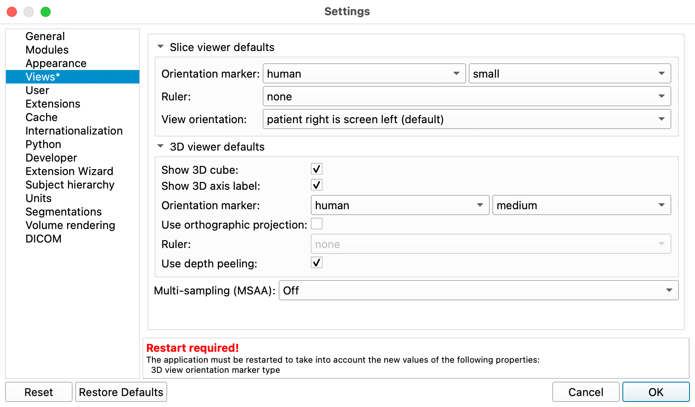

# Customize Slicer

The two main ways to customize Slicer is through the Application Settings and the Extension Manager

## Application Settings

The Application settings contains settings that control Slicer Appearance and performance

### Add Orientation Marker

It is convenient to display the human orientation marker in the viewers at startup.

{ width="50"}

>the Orientation marker makes it much easier to understand the orientational of the orthogonal slices or the current view in the 3D viewer

To set the Slice View defaults:

1. In the Edit menu, select "Application Settings"
2. In the dialog window, select the "Views" tab
3. Use the following settings:

{ width="650"}

>When you make changes to the default settings, Slicer requires that you restart the app. Click OK to restart when prompted

### Modify the Toolbar

The toolbar is broken down into panels, which can be shown/hidden by right-clicking on a blank area of the toolbar to bring up a contextual menu:

{ width="150"}

The favorites panel, to the right of the arrows, can be modified in the Application settings:Modules tab

{ width="450"}

## Install Extensions

Extensions are customized modules to handle a varied specialized tasks.

For this course, we will use the following extensions

1. SegmentEditorExtraEffects
2. TotalSegmentator
3. LungCTAnalyzer
4. HDBrainExtraion
5. PyTorch

{height="300"} {height="300"} { height="300"} {height="300"} { height="300"}

### Add extensions as follows

{ width="100"}

1. Click on the Extension Manager toolbar button to bring up the Manager.
2. On the Side bar, Select a Category, like "Segmentation"
3. Find Extension of interest, like "SegmentEditorExtraEffects"
4. Click the Install Button
5. Repeat
6. When you are finished installing extensions, restart Slicer.

!!! tip "Pro-Tip: If the extension manager isn't working"

    Try Clicking on the "Check for Updates" button and then on "Try again", and see if that fixes things.
