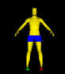

# Customize Slicer

The two main ways to customize Slicer:

1. the Application Settings
2. the Extension Manager

## Application Settings

The Application settings contain settings that control Slicer Appearance and performance

### Modules

The modules tab contains settings for loading extensions (modules), setting the default startup module, and customizing the toolbar

#### Modify the Toolbar

The toolbar is broken down into panels, which can be shown/hidden by right-clicking on a blank area of the toolbar to bring up a contextual menu:

{ width="150"}

The favorites panel, to the right of the arrows, can be modified in the Application settings: Modules tab

{ width="450"}

### Views

#### Add Orientation Marker

It is convenient to display the human orientation marker in the viewers at startup.

{ width="50"}

>the Orientation marker makes it much easier to understand the orientation of the orthogonal slices or the current view in the 3D viewer

To set the Slice View defaults:

1. In the Edit menu, select "Application Settings"
2. In the dialog window, select the "Views" tab
3. Use the following settings:

{ width="650"}

>When you make changes to the default settings, Slicer requires that you restart the app. Click OK to restart when prompted

#### Remove Slice Edge

Slice edges are colored rectangles in the 3D view that indicate the orthogonal planes. To remove these from the display uncheck "Show slice edge in 3D."

### Volume Rendering

If you have issues rendering volumes, try changing the default rendering to "VTK CPU Ray Casting"

## Installing Extensions

Extensions are customized modules to handle specialized tasks. For the Slicer exercises, we will use the following extensions

-   **segEditExtraFX**

    ---

    {width="150"}

-   **LungCTAnalyzer**

    ---

    {width="150"}

-   **TotalSegmentator**

    ---

    { width="150"}

-   **HDBrainExtraction**

    ---

    {width="150"}

-   **PyTorch**

    ---

    { width="150"}

<!-- {width="300" .md-button } -->

### You add extensions as follows

{ width="100"}

1. Click on the Extension Manager toolbar button to bring up the Manager.
2. On the Side bar, Select a Category, like "Segmentation"
3. Find Extension of interest, like "segEditExtraFX"
4. Click the Install Button
5. Repeat
6. When you are finished installing extensions, restart Slicer.

!!! tip "Pro-Tip: If the extension manager isn't working"

    Try Clicking on the "Check for Updates" button and then on "Try again", and see if that fixes things.
