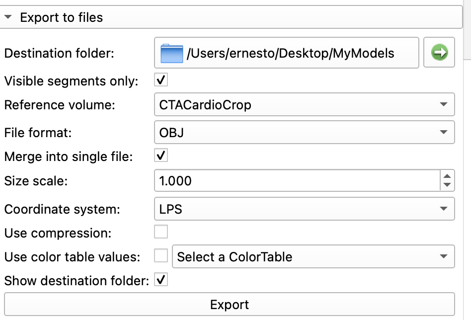
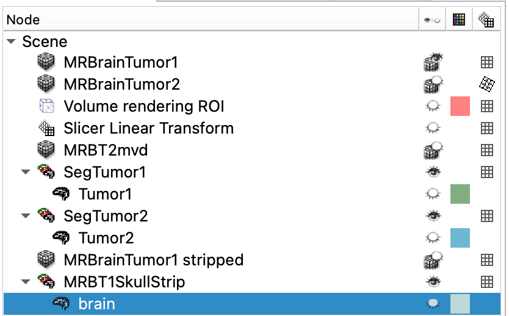

# Export Models to OBJ

An OBJ file is a surface model file format.

## Single Segmentation Node

For this example, we will use the segmentations that we generated for the [CTACardio segmentation exercise.](CTACardioSegment.md)

1. Load you CTACardio project
2. Switch to the **Segmentations** module
3. Set the **Active segmentation** to the `Segmentation` node.
4. Under the **Representations** tab, update the **Closed surface** and ensure the decimation settings are set to 0.5
>{ width="350"}
5. Under the **Export to files**, enter the following settings:

{ width="450"}
- Create a new folder on your desktop called "MyModels"
- Set the **File format** to `OBJ`
- Be sure to Check on `Merge into single file`

###

## Multiple Segmentation Nodes

 When we [segmented the tumors](MRTumorSegment.md), we created multiple segmentation nodes from multiple volumes. If we want to collate all of the segmentations into a single OBJ file, we need to collate the segmentations into one segmentation node.

{ width="450"}
>This screengrab illustrates the multiple volumes (gray cubes) and multiple segmentation nodes (brain icons). Here we have three Segmentation nodes: SegTumor1, SegTumor2, and MRBT1SkullStrip. Each node contains one segmentation: Tumor1, Tumor2, or brain, respectively.

### Collate Segmentations into One Node

1. Switch to the **Segmentations** module
2. For the **Active segmentation**, select `Create New Segmentation as...` and enter "AllSegs" in the pop-up dialog
3. Switch to the **Data** module — you should see the new "AllSegs" mode
4. Clone each segmentation (Tumor1, Tumor2, or brain) by right-clicking on the segmentation and selecting "Clone"
5. Drag the clones to the AllSegs node

### Export Segmentations

1. Switch back to the **Segmentations** module
2. Select the "AllSegs" segmentations
3. Repeat the steps to export the segmentations into a single OBJ file
 
 Before we export these segmentations as models, we need  volume
 The tumor dataset includes multiple volumes, making export a little more complicated.

To have these 

For this exercise, we will export our tumor segmentations created [here](CreateTumorModels.md). Load that project into Slicer.

## Segmentations Module

We manage our segmentations in the segmentations module. Switch to that module.

{ width="250"}

You should see a list of your tumor segmentations

In this step, we are going to export a surface model of the brain and the two tumors as a single obj file. There are other surface model file types, but OBJ is one of the most universal.

You create an OBJ file by the following steps.

1. Switch to the Segmentations Module (![][img-segmentations])

2. Set the **Active segmentation** to "MRTumorModels segmentation" node that you just created

    >You should see your three segmentations in the table:
    >
    >![][img-seg-models]

3. In the **Export to files** section, use the following settings

![][img-MR-tumor-export-to-merged-obj-settings]

[img-MR-tumor-export-to-merged-obj-settings]:https://saldenest.s3.amazonaws.com/slicer/MR-tumor-export-to-merged-obj-settings.png width=400px

[img-MR-tumors-merged-segs-panel]:https://saldenest.s3.amazonaws.com/slicer/MR-tumors-merged-segs-panel.png width=400px

>- Be sure to set the appropriate Destination folder
>- Be sure to click on "merge into single file"

[img-seg-models]:https://saldenest.s3-us-west-2.amazonaws.com/slicer/MRTumors-segmentations-models.png width=400px

SAVE YOUR WORK!

---

## Challenge

How would you create this?

![][img-MR-tumors-cropped-render-with-segs]

### Volume Rendering with Tumors

1. Turn on Tumor Segmentations in 3D view
2. Turn on coronal slice view in 3D
2. Render the Stripped Skull volume
3. Crop the volume along the interhemispheric fissure
4. Make sure your tumor model is visible

[img-MR-tumors-cropped-render-with-segs]:https://saldenest.s3.amazonaws.com/slicer/MR-tumors-cropped-render-with-segs.png 

    
