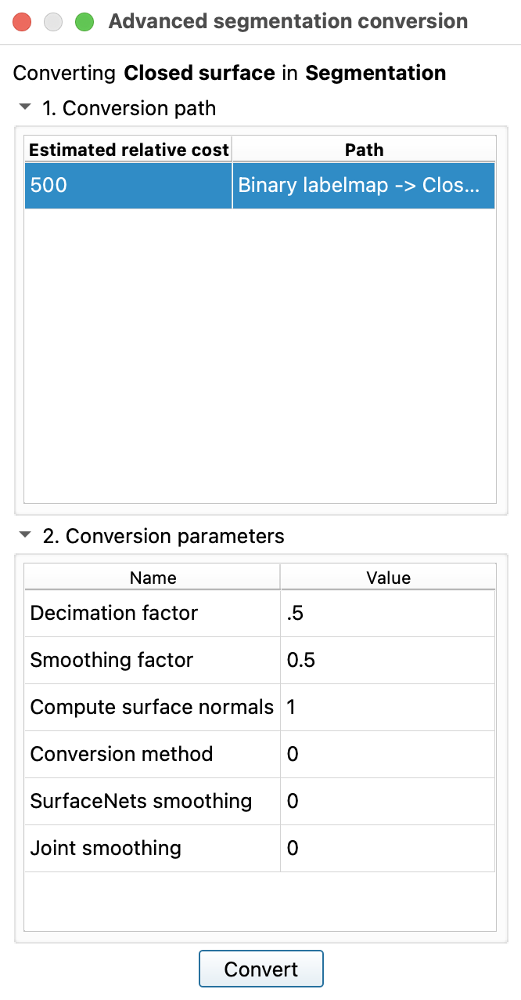

# Export Models to OBJ

An OBJ file is a surface model file format.

## Single Segmentation Node

For this example, we will use the segmentations that we generated for the [CTACardio segmentation exercise.](CTACardioSegment.md)

1. Load you CTACardio project
2. Switch to the **Segmentations** module
3. Set the **Active segmentation** to the `Segmentation` node.
4. Under the **Representations** tab, update the **Closed surface** and ensure the decimation settings are set to 0.5
>{ width="350"}
5. Under the **Export to files**, enter the following settings:

{ width="450"}
- Create a new folder on your desktop called "MyModels"
- Set the **File format** to `OBJ`
- Be sure to Check on `Merge into single file`

## Multiple Segmentation Nodes

 When we [segmented the tumors](MRTumorSegment.md), we created multiple segmentation nodes from multiple volumes. If we want to collate all of the segmentations into a single OBJ file, we need to collate the segmentations into one segmentation node.

{ width="450"}
>This screengrab illustrates the multiple volumes (gray cubes) and multiple segmentation nodes (brain icons). Here we have three Segmentation nodes: SegTumor1, SegTumor2, and MRBT1SkullStrip. Each node contains one segmentation: Tumor1, Tumor2, or brain, respectively.

### Collate Segmentations into One Node

1. Switch to the **Segmentations** module
2. For the **Active segmentation**, select `Create New Segmentation as...` and enter "AllSegs" in the pop-up dialog
3. Switch to the **Data** module — you should see the new "AllSegs" mode
4. Clone each segmentation (Tumor1, Tumor2, or brain) by right-clicking on the segmentation and selecting "Clone"
5. Drag the clones to the AllSegs node

{ width="450"}

### Export Segmentations

1. Switch back to the **Segmentations** module
2. Select the "AllSegs" segmentations
3. Repeat the steps to export the segmentations into a single OBJ file
   - make sure to set the reference volume to MRTumor1

## Sketchfab

Post your models on [Sketchfab](https://sketchfab.com/feed).

[Instructions for posting on Sketchfab](SKETCHFAB-upload-model.pdf)
