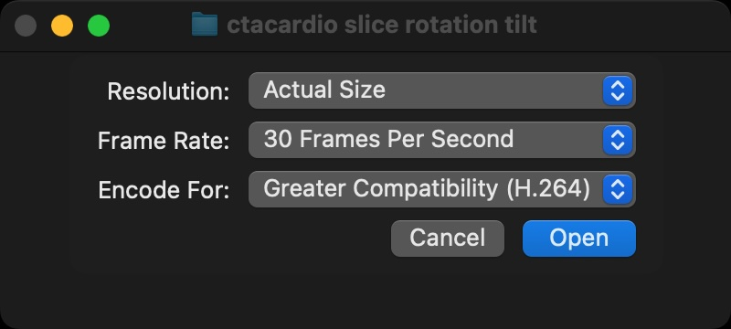

# Creating Video Clips from Image Sequence

!!! note "These instructions are specific to the Mac Operating system"

So, you tried to install ffmpeg on a Mac, and you couldn't get it work. No matter. There's another way.

First, generate image series in Slicer.

## QuickTime Player

{ width="50"}

Once you have created your different folders of image sequences in Slicer, open the Apple QuickTime Player (v10.5 or greater) and follow these steps

1. From the **File** menu, select “Open Image Sequence…”
2. Select one of the folders that you just created that contains a Slicer Image Series
3. Use the following settings in the pop-up dialog
   - Resolution: `Actual size`
   - **Frame Rate:** `30 Frames Per Second`
   - **Encode For:** `Greater Compatibility`

   { width="450"}

Your image sequences should come up in quicktime as a video.

To export the video, select the “File:Export As…” menu item and select `1080p`.

Import these saved video clips into iMovie.
