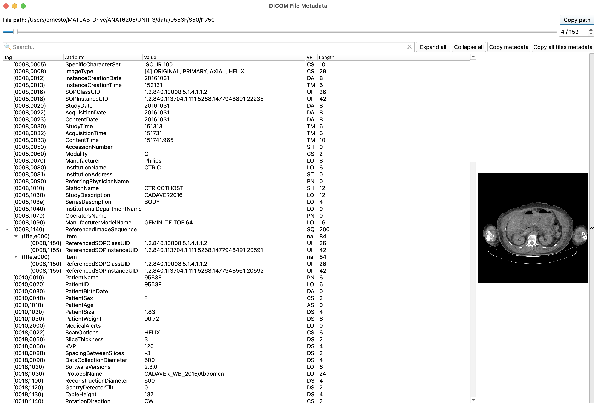
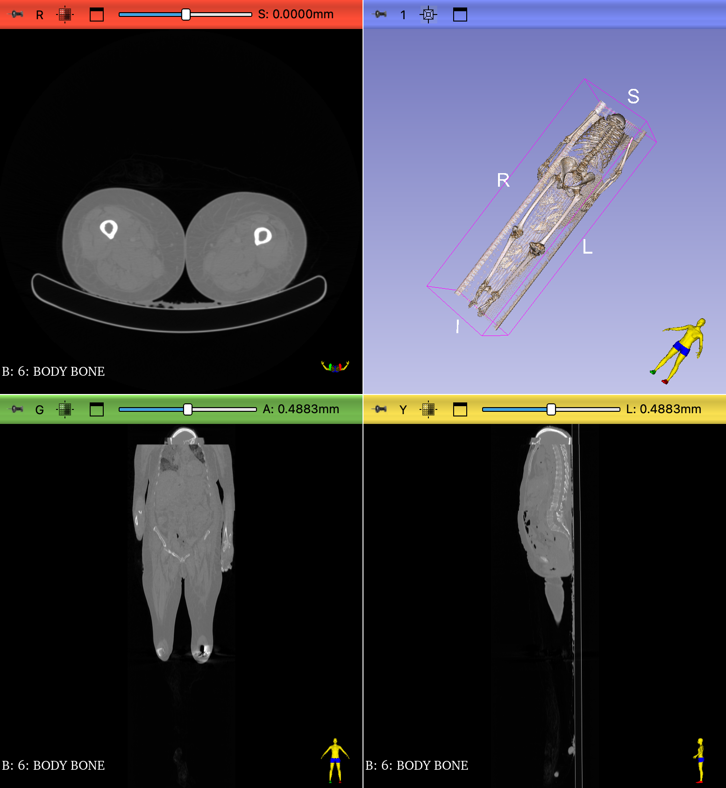

## DICOM

DICOM is one of the main file format standards for handling, storing, printing, and transmitting information in medical imaging. In a DICOM dataset, the image stacks are typically saved as individual image files. Each image contains the metadata for the entire stack.

DICOMs are notoriously difficult to work with. In this module, we will learn to work with them

## Objectives

- Learn about the DICOM file format
- Learn how to segment a femur from the cadaver dataset series
- Learn how to separate fused segmentations (ie femur head from pelvis)

## CT DICOM Dataset

You can find a DICOM dataset called **9553F** in the Unit 3/Data folder. This is a dataset from a CT scan of one the MHA cadavers from 2016.

It is a folder in which there are are four more folders:

- S30
- S40
- S50
- S60

And inside each of these folders are the actual DICOM image files.

- I20
- I30
- I40
- I50
- I60
- I70
- I80
- I90
- ...

Notice the unhelpful names and lack of file extensions. It is difficult to sort out what volumes are contained in this dataset. For the record, there are 4 different volumes.

### Import dataset into slicer

#### DICOM Database

Slicer includes a DICOM database. This database contains a repository of information specific to the image files in a DICOM dataset. This database helps load frequently accessed datasets quickly. Every time you load a DICOM dataset, the location of this dataset is stored in the database.

Next, bring up the `Add DICOM Data` module by clicking on the corresponding icon:

{ width="100"}

In the `Add DICOM Data` module, click on the **Import DICOM files** button.

{ width="250"}

Browse your computer and select the 9553F folder from the data folder.

Your DICOM browser window should now have some data, like this:

This browser contains three, semi-hierarchal fields:
1. The **top** field lists the studies that have been imported. In this case, you should have one study: 9553F.
  - Select that study by clicking on it.
2. The **middle** field contains information about the selected study in the top field
   - "Cadaver2016"
3. The **bottom** field contains the volumes in the study. In this case there are 4 volumes
  - HEAD: Optimized for tissue in the head
  - HEAD BONE: Optimized scan for the skull
  - BODY: Optimized scan for the tissue
  - BODY BONE: Optimized scan for the skeleton

To inspect the metadata, right-click on "Head" to bring up the contextual menu...

{ width="200"}

…and select "View DICOM metadata"

>This new window is a browser for the metadata of each file in the folder

Notice the:

- Scroll bar at the top: There are 159 different images, so 159 different metadata headers. As you drag the slider back and forth, you will see that most of the metadata is the same, except for a few image specific fields. Also notice the slider does not  necessarily in reveal the files in sequential order
- The left column is populated Tag IDs: (0008, 0005)? These are the weird DICOM specifications.
- Use the search field at the top for the following Values:
  - **Modality**: CT
  - **AcquisitionDate**: 20161031 (YYYYMMDD)
  - **Manufacturer**: Philips (this is for the CT machine)
  - **ManufacturerMOdelName**: Gemini TF TOF 64 (The model name: The imager looks something like [this](https://www.philips.co.in/healthcare/product/HC882476/gemini-tf-big-bore-pet-ct-scanner). It is also capable of performing PET)
  - **InstitutionName**: CTRIC ([Colorado Translational Research Imaging Center](https://medschool.cuanschutz.edu/curic). Now called the CU Research Imaging Center, this CT was scanned here on campus)
  - **ScanType**: Helix (the method of scanning used on the cadaver - see lecture on CT)
  - **ImageComments**: Head
  - **BitsAllocated** vs **BitsStored**: 12-bit image
  - **PixelSpacing**: 0.58, 0.58
  - **SliceThickness**: 1

And there is lots more metadata to browser through, a lot of which is incomprehensible.

Close the metadata window and then open the **Head Bone** and **Body Bone** metadata to compare

- Compare the number of slices for **Head Bone** vs **Body Bone**
- Note the difference in Voxel Size

## Load Body Bone Dataset  

1. Select "Body Bone"
2. Click **Load**
3. You will get a Warning, Click "OK" to load anyway
4. And...

    { width="450"}
    >The volume is all messed up. The top part of the Head data was accidentally added to the Body Bone data. And then there was a huge gap in the volume between the top of the head to where the actual Body Bone data starts (around the shoulders). So, slicer tried to fill in that gap, Turns out that the files I1-I400 (basically anything below I1000) in folder s60 are actually part of the head data. If you scrub through the metadata of BODY BONE, you can see those files.

There are two ways to tackle this issue of a messed up looking volume:

1. Switch to the `Volumes` module
2. In **Volume Information**, click on the **Center Volume** button
3. And the distortion is removed

or...

1. Switch to the `Data` module
2. You should see the following:
  { width="450"}
  >In addition to the Body Bone volume, there is an "acquisition transform". This is how the importer tried to fix the volume, but instead just ended screwing it up.
2. Right-click on "BODY BONE acquisition transform" and delete.
3. If there is a "BODY BONE centering transform", which appears after you click on the **Center Volume** button in the `Volumes` module, right-click to delete that too.
   - NOTE: This is not common. Not all DICOM datasets load in all messed up.

At any rate, you should end up with a "fixed" volume that looks like this:

{ width="450"}
>Notice the little piece of skull at the top of the volume.
  
### Inspect volume

1. Switch to the `Volume` module
2. Inspect the volume information
   - the Image dimensions and Spacing should match what you saw in the DICOM metadata
   - Notice that the Scalar range is 12-bit (~4000 dynamic range)
3. Select the Abdomen Preset

### Volume Render

1. Switch to the `Volume Rendering` module
2. Turn on Volume Rendering
3. Use the CT-AAA Preset
4. Inspect the volume
