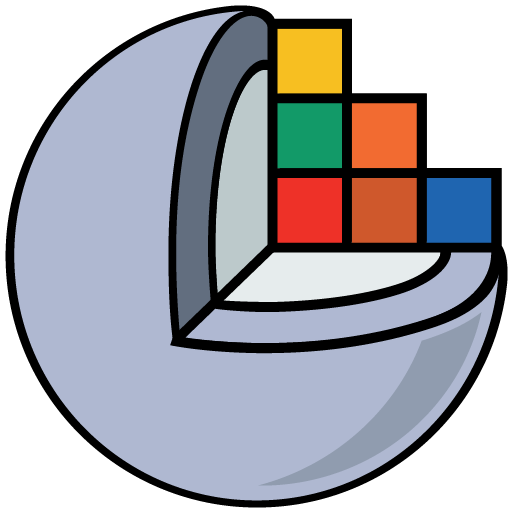
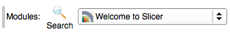
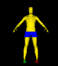
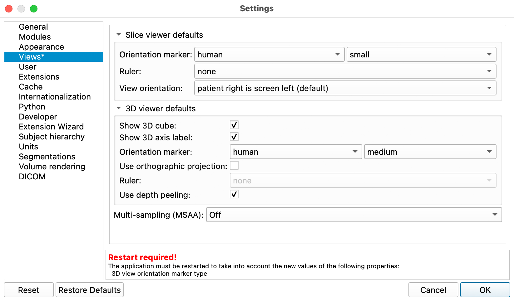

# 3D Slicer

{ width="150"}

3D Slicer is an application used to visualize and analyze medical image datasets like CT scans or MRI dataset. In this course, we will use also use Slicer to segment and render anatomical objects in these datasets.

3D Slicer has a documentation site [here](https://slicer.readthedocs.io/en/latest/index.html).

## Useful Slicer Documentation

- [Getting Started](https://slicer.readthedocs.io/en/latest/user_guide/getting_started.html#using-slicer)
- [User Interface](https://slicer.readthedocs.io/en/latest/user_guide/user_interface.html)
- [Coordinate Systems](https://slicer.readthedocs.io/en/latest/user_guide/coordinate_systems.html)
- [Data Loading and Saving](https://slicer.readthedocs.io/en/latest/user_guide/data_loading_and_saving.html)

## Interface

{ width="750"}

### Application Menu

Slicer has four fairly simple menus

### Toolbar

Much of the control of Slicer happens in the Toolbar and modules section the application

The Toolbar provides quick access to commonly used functions. Individual toolbar panels can be shown/hidden using menu: View / Toolbars section.

### Viewers

There are two types of viewers in 3D Slicer

- **2D Viewers**: Display orthogonal cross-sections of the volume data
- **3D Viewers**: Displays 3D Renderings and/or orthogonal slices in 3D space.

In the default view, there are three 2D slice viewers: Red, Yellow, and Green, which typically correspond to, axial, sagittal, and coronal anatomical plane (see The Red, Yellow, and Green Slice viewers shown above) and one 3D viewer which shows anything being rendered in 3D.

#### Changing the Viewer Layout

You can change the layout of the Slice Viewers using the layout menu in the toolbar:

![layout menu][layout menu]

[layout menu]: images/layout-menu-4up.png

#### Viewer Controls
You can change what's displayed in the viewers by clicking on the **pushpin** icon in the top left corner of each 2D viewer to display the following controls:

{ width="650"}

<!--
![][img_slice_viewer_controls]
[img_slice_viewer_controls]: http://wiki.slicer.org/slicerWiki/images/f/fc/SliceViewerController-4.1.png-->

### 2D Slice View Controller Top row
Clicking on the push-pin only reveals the top row of controls:

- **Link** - change the settings across all viewers
- **Eye Icon** - display the orthogonal slice in the 3D viewer
- **Orientation** - select which orthogonal plane to display (e.g. coronal, sagittal, etc.)
- **Background layer** - choose the main volume to display in the viewer

### The rest of the 2D controllers
To reveal the additional settings, you need to click on the `>>` icon

For the 2D viewers, you should now see more controls with some pop-up labels
- **Label** - show the segmentation data in the label layer
- **Foreground** - You can overlay to volumes on top of each other. One is set to the foreground layer and one to the background layer
- **Background** - The background layer for the volumes
- **Opacity** - sets the amount of mixed opacity for the foreground and background layers

## Modules

The modules contain all of the fine-toothed controls for Slicer.

You set the current module by selecting its name from the Modules menu in the Toolbar:

{ width="250"}

### Welcome Module

The default module is the welcome module which contains key controls for loading data, customizing slicer, and downloading sample data. It also contains several panels of information about using Slicer.

![][img_welcome]

[img_welcome]: https://c1.staticflickr.com/5/4466/38062009576_89397fa510_o.png

#### Welcome Module Main Buttons

- **Add DICOM data** - loading DICOM datasets

- **Add Data** - load Slicer data

- **Download Sample Data** - download and display sample datasets

- **Customize Slicer** - Opens Slicer preferences

- **Explore Added Data** - Brings up the data module, which shows any data that has been loaded into Slicer

#### Welcome Module Collapsing Tabs

Each panel (indicated by a black triangle) contains basic information on how to interact with the software

- **The Main Window** - information about the interface

- **Loading and Saving** - how to load and save stuff

- **Display** - Display different types of data (like Volumes versus rendered volumes)

- **Mouse and Keyboard** - info about using the mouse

- **Documentation & Tutorials**

- **Data Probe**: This panel is available in most module interfaces. It contains pixel information  when the mouse is hovering over a pixel in one of the 2D viewers

## Customize Application Settings

It is convenient to display the human orientation marker in the viewers at startup.

{ width="50"}

>the Orientation marker makes it much easier to understand the orientational of the orthogonal slices or the current view in the 3D viewer

To set the Slice View defaults:

1. In the Edit menu, select "Application Settings"
2. In the dialog window, select the "Views" tab
3. Use the following settings:

{ width="650"}

>When you make changes to the default settings, Slicer requires that you restart the app. Click OK to restart when prompted

<!--
### Cache

You can change the location of the cache so you can download the sample data on the class computers:

Edit:Application Settings:Cache

![][img_cache]

[img_cache]:https://www.dropbox.com/s/z2ztcx5cvmsesrc/cache_location.png?dl=1
-->