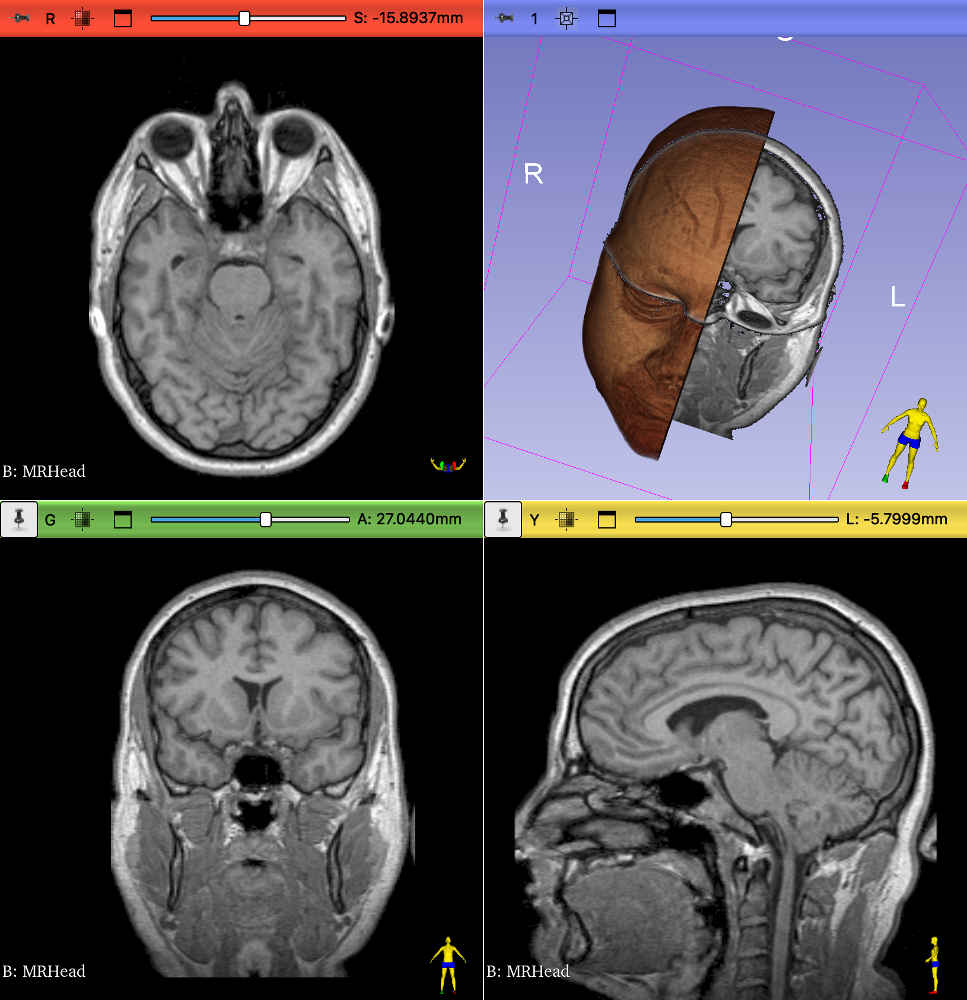

# Explore the MRHead dataset

In this exercise, we will explore the MRHead Volume

1. Switch to the `Sample Data` module (File:Download Sample Data)
2. Select MRHead
3. Display the red viewer slice in 3D
4. Display the yellow viewer slice in 3D

## Volume Render

Switch to the `Volume Rendering` module.

   1. Render MRHead in 3D
   2. Select the "MR Default" preset
   3. Crop the render Sagittally along the midline
   4. Can you remove the black surrounding the volume from being displayed in 3D?

{ width="450"}

??? question "Is this a T1 or T2 dataset?"

    likely T1

??? question "How Large is the volume?"

    $256 * 256 * 130 = 8,519,680$ voxels

??? question "How large is a voxel in this dataset?"

    $1 * 1 * 1.3 = 1.3mm^3$

### ID STRUCTURE

1. Lobes and Sulci
    - temporal lobe
    - occipital lobe
    - Parieto occiptal sulcus
    - Calcarine Sulcus
    - Uncus
    - Cingulate Gyrus
2. Brainstem
    - Midbrain, pons, medulla
    - Tectum
    - Spinal Cord
3. Ventricles
    - Lateral
    - 3rd
    - Cerebral aqueduct
    - 4th
    - Falx Cerebri
    - Septum pellucidum
4. Cisterns
    - Magna
    - Quadrigeminal
    - Interpeduncular
5. Cerebellum
7. Mammillary Bodies
8. Corpus Callosum
9. Fornix
10. Auditory Nerve
11. Pituitary Gland
12. Basal Ganglia
13. Thalamus
14. Hippocampus
15. Choroid Plexus