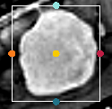
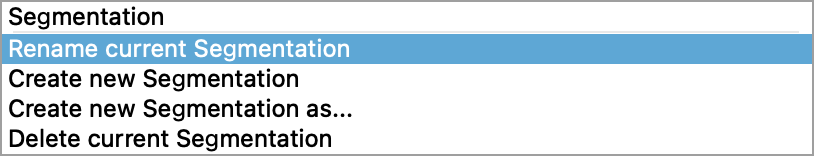
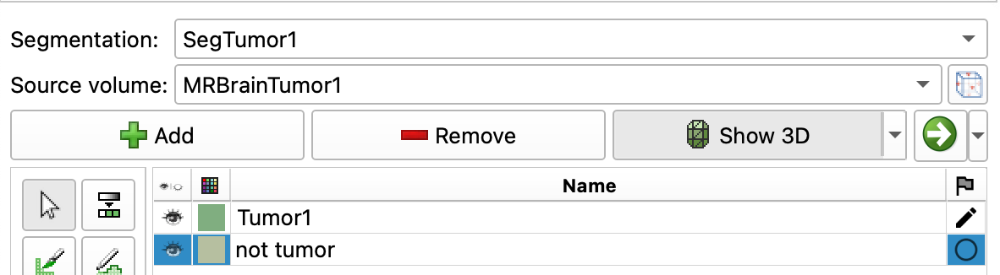

# Exercise: Segment a Brain Tumor

## Overview

This exercise is based on the following Slicer tutorial: [pdf](https://www.dropbox.com/s/bf2tcav3v9z8fss/FalcineTumorOverview.pdf?dl=1)

### What is a meningioma?

- The most common type of primary brain tumor: ~30% of all brain tumors
- These tumors originate in the Meninges
    - Three protective layers that surrounds and supports the brain
    - Dura, Arachnoid, and Pia mater
-  Meningiomas grow out of the arachnoid (the middle layer of the meninges). 
    -  Their growth can press against the brain or spinal cord and cause serious problems. 
- Meningiomas are named by their location:
    - e.g. Falcine meningiomas form *in* the falx, whereas parasagittal meningiomas form *near* the falx (The  falx is  a very thin layer of tissue between the two sides of the brain.)

{ width="650"}
>Localization of intracranial meningiomas. Left: Axial view of meningiomas at the base of the skull. Right: Coronal view of meningiomas in the cranial dome, the falx cerebri, and intraventricular. For more information on meningiomas, click [here.](https://neurochirurgie.insel.ch/en/what-we-treat/brain-tumor/meningioma) *Image: University Department of Neurosurgery, Inselspital Bern.* 

### What is gadolinium?

- Gadolinium (Gd) is a malleable and ductile rare-earth element
- It can be used as a contrast agent for MRI.
  - When injected intravenously into the body, gadolinium enhances and improves the quality of the MRI images. 
  - This helps improve the visibility of inflammation, tumors, blood vessels, and—for some organs—blood supply.
- Gd is eliminated from the body through the kidneys.

#### How does Gadolinium improve contrast in MRIs?

- Gadolinium is **paramagnetic** at room temp
    - helps with contrast by increasing nuclear spin relaxation rates
- Gd does not readily cross the blood-brain barrier
    - But, brain tumors degrade the BBB, allowing Gd to penetrate

## Required Extension

This exercise requires the following extensions:

- [HDBrainExtraction](https://github.com/lassoan/SlicerHDBrainExtraction#hdbrainextraction).
- PyTorch

Be sure to [install those extensions](CustomizeSlicer.md) before continuing.

## Load the Tumor datasets

1. Select the `Sample Dataset` module
2. Select **MRBrainTumor1** and **MRBrainTumor2**
3. Explore the volumes.
4. Notice the tissue contrast in the brain.

### Inspect Volume

Bring up the Data module { width="25"}

You should see two volumes:

1. MRBrainTumor1
2. MRBrainTumor2

Hover over the names of these volumes. Notice that you get some information on the volumes themselves.

??? question "Do the volumes have the same dimensions and voxel sizes?"

    No.

### Volume Module

Bring up the Volume module { width="50"}

The volume module gives you more detailed information on the volumes and allows you to change the display properties of the volumes.

??? question "What are the dimensions of the volume (Image Dimensions) and voxels (Image Spacing)? What is the Scalar type and Range?"

    - **MRBrainTumor1**
        - Image Dimensions: 256 X 256 X 112 
        - Image Spacing: 0.94 X 0.94 X 1.4 mm
        - Scalar Range: 0 to 695
        - Scalar Type: short (16-bit)
    - **MRBrainTumor2**
        - Image Dimensions: 256 X 256 X 130 
        - Image Spacing: 0.94 X 0.94 X 1.2 mm
        - Scalar Range: 0 to 986
        - Scalar Type: short (16-bit)

## Inspect the Tumors

Starting with MRBrainTumor1, find the tumor and get all three slice viewers aligned onto the tumor.

Then inspect Tumor 2.

**Baseline radiologist's clinical impression:**

- large falcine lesion is identified.
- measures 3.10 cm anteroposteriorly and 3.51 cm in height.
- enhances moderately on post gadolinium imaging.

### volume Render the Tumors

In this step, we will render the MRI volume in 3D and then use the crop tool to crop the volume down to the tumor.

1. Bring up the **Volume Rendering** Module
2. Set **Volume:** to `MRBrainTumor1`
3. Click open Eye Icon next to Volume to render {width="150"}
4. Select the `MR-Default` display preset
5. Enable **Crop** and **Display ROI**
6. In the 2D Viewers, drag the  ROI so that it captures just the Tumor.
   - Make sure to scrub through the slices in all three planes to verify that you captured the tumor.
   

7. When you're done sizing the ROI, hide it by closing the eye next to "Display ROI".
8. Adjust the display by sliding the **Shift** slider

### Overlay Volumes

{width=50%}

- Use the Slice controllers to overlay the volume.
    - **Foreground**: `Tumor2`
    - **Background**: `Tumor1`
- Change the transparency between the 2 volumes to 50%
- Are the volumes aligned?

## Register the Volumes

In the previous step, we saw that the two brains (from the same human) are not aligned. This is due to the fact that the MRIs were captured at two separate time points and the subject wasn't precisely positioned in the same location in the machine. In this step, we will register the brains, which means we will align their positions.

Under the Registration Modules Menu, choose the "General Registration (BRAINs)"

Change the following settings:

1. **Fixed Image Volume:** `MRBrainTumor1`
2. **Moving Image Volume:** `MRBrainTumor2`
3. **Slicer Linear Transform:** Create New Linear Transform
4. **Output Image Volume:** Create new volume as "MRBT2mvd"
5. **Initialize Transform Mode:** `useMomentsAlign`
6. **Registration Phases:** `Rigid (6 DOF)`
7. **Click apply.**  Should take about 1 minute.

{ width="450"}

### Check registration

In the Volumes Module, change the colormap of the newly created "MRBT2mvd" volume to a different color like shades of magenta (CoolShade3) or inverse gray

Use the Slice controllers to overlay Tumor1 with MRBT2mvd.

- **Foreground**: `MRBrainTumor1`
- **Background**: `MRT2mvd`
- Adjust LUT for MRT2mvd (so its not so overexposed)
- Set transparency to 50%

Are they aligned?

Yes? Good.

SAVE YOUR WORK!

## Segmentation

Next, we'll segment the tumors using the segmentation tool. 

### Segment Tumor1

We will use the Grow-from-seeds method to segment the Tumor in the MRBrainTumor1 volume. First, though, we need to segment three orthogonal sections from the tumor (and sample the background). 

#### 2D Slice Viewers

1. Find the largest cross-section of the tumor in the Sagittal viewer (yellow viewer).
2. Ensure that the slice includes some of the bright white meninges layer as well.
3. Align 2D viewers (Hold the shift button and hover the mouse) so all three viewers are aligned with the Yellow viewer
4. Compare with the image below for an example of how the 2D viewers (in the 4up layout) should look (but without any green label yet)

#### Segment Editor

Bring up the Segment Editor and use the following settings:

1. **Segmentation:** Rename new segmentation as `SegTumor1`
   { width="450"}
2. **Master Volume:** Set to `MRBrainTumor1`
3. Create a new Segmentation called Tumor1
4. Create another segmentation called Not_tumor

{ width="450"}

#### Threshold

{ width="50"}

The threshold tool allows you to select a range of intensities to segment. Here, we will use the threshold tool for masking.

1. Bring up the threshold tool to set the masking range
2. Move the cursor over to the center of the tumor cross-section in one of the slice viewers
3. Notice that the cursor has the icon of the Threshold tool in one corner
4. Click and hold on the center of the tumor
5. A yellow circle will appear. As you drag, the circle gets larger
6. Drag to the edge of the tumor to to capture the intensities in that tumor
7. Release the mouse button
8. Notice that you have just set the Threshold Range in the Threshold module.
    { width="450"}
9. Adjust the range to 125-500 if needed
   - *The flashing color in the view slicers indicates what will be segmented if you were to click `Apply` (but don't do that)*
10. Click on the `Use for masking` button.
    - This will restrict the paint tool to only paint voxels with an intensity that falls in the intensity range (125-500)

#### Paint Tool

{ width="50"}

After clicking on the `Use for masking` button, Slicer should have automatically switched over to the paint tool. If not, do so now by clicking on the paint tool button.

In the Masking settings of the paint tool, the "Editable intensity range" should now be turned on:

{ width="450"}
>Now when you paint, you will only be able to paint inside the tumor and other bright areas, like the meninges, where the intensities fall inside of the editable intensity range.

Go ahead and paint the three orthogonal slices of the tumor, as follows:

{ width="450"}

Next, in the Paint tool, change the masking to the following settings:

{ width="450"}

>Notice that we have un-checked the "Editable Intensity range". With these settings, you will be unable to overwrite the tumor labels you have already drawn, but you should be able to paint everywhere else.

Select the "Not_Tumor" label in the segmentations table and paint the background surrounding the tumors, as follows:

{ width="450"}

#### Grow-From-Seeds

{ width="50"}

1. Select the "Tumor1" label in the segmentations table and then bring up the Grow From Seeds tool
2. Use the following **Masking** settings:
    - **Editable Area:** `Everywhere`
    - **Modify other Segments:** `Overwrite all`
3. Click on the `Initialize` button
4. Scrub through the slices and ensure that the two labels are properly labeled. If not, use the paint tool to correct any label errors, making sure you select the right segmentation in the segmentation table before painting
5. Click `Apply` and wait.
6. Enjoy segmented tumor (Be sure the Show 3D button is selected in the segment editor tool)
7. Clean-up tumor noise using the **Smoothing** tool
8. Enjoy a freshly segmented tumor!

{ width="450"}

SAVE YOUR WORK!

### Tumor2

Ok, repeat the segmentation for Tumor2, with the following changes:

1. Create a New Segmentation as `SegTumor2`
2. Change the Master Volume to `MRBT2mvd`
3. Create a new Segment called Tumor2. Change the color of this segment to Blue (or a different color from the original tumor)

{ width="450"}

### Final Comparison

Go to the **Data Module.** You should see the following in your Node list:

> - MRBrainTumor1 (Volume)
> - MRBrainTumor2 (Volume)
> - Slicer Linear Transform (LinearTransform)
> - MRBT2mvd (Volume)
> - SegTumor1 (Segmentation)
>     - Tumor1 (Segment)
> - SegTumor2 (Segmentation)
>     - Tumor2 (Segment)

Review how slicer organizes the data.

1. Each Segmentation contains segments that are specific to a volume (MRBrainTumor1 or MRBT2mvd, in this case)
2. Click on MRBrainTumor1
    - Notice how other items in the Data table light up - these are connected to Tumor1 in some fashion
3. Hover over one of the Segmentations (Like Tumor1). After a beat, you get information about that volume:
    >Segment - ID, Segment_1, Representations: Binary labelmap, Closed Surface, Colol: (128, 174,128)
4. Compare that information to the information that you get for the volumes, like "MRBrainTumor1"
    >Volume (Dimensions: 256 X 256 X 112 Spacing: 0.938 x 0.938 x 1.42mm )
  
#### Review Segments

1. Display only the MRBrainTumor1 volume to slice viewers (add to the background). Hide any other volumes
2. Display the Tumor1 segment and the Tumor2 segment by opening the eye icons in the Data hierarchy
3. Compare their dimensions. Do they look the same size?

{ width="450"}

## Region Properties

So, have the tumors changed in size?

### Manually Measure Tumor With Ruler

You can measure objects in Slicer using the Markups tools, which includes a points list, line, angle, curve, closed curve, plane, ROI etc. To reveal the Markups toolbar, click on the Markups Toggle Button { width="30"}

{ width="450"}

Switch to the **Markups** module to keep track of your markup measurements.

{ width="250"}

#### Measure the tumor using the Line tool

1. Scrub the viewers so that you see the widest aspect of the tumor in each view.
2. Select the Line Markup tool (the second button from the left)
3. Measure the tumor by click on one side of the tumor and then on the other side
   - Each time you click, Slicer adds a control point (red dot) to the viewer
   - Slicer measures the distance between two sequential control points.
   - Be consistent how you make your measurements
   - Be sure to measure all three anatomical axes of the tumors: A-P, L-R, S-I
   - Make sure that you measure across the widest part of the tumors in each plane.

??? tip "Making Multiple Sequential Line Measurements"

    You can make several measurements at the same time by turning on the "Place Multiple Control Points" setting. In the Markups tool bar, bring up the **Place Control Points** menu by clicking on the triangle next to this icon: 

    { width="50"} { width="350"}

    Now when you are done with one line measurement, you can go on to the next. Double-click the last control point when you are done. If you accidentally get an extra measurement point in the Markups table, just delete that measurement.
  
#### Label and Organize each measurement

1. As you measure each length, an entry will be added into the Markups table, prefaced by an "L" (for length)
2. Double-click on that name and rename it to indicate tumor number and Anatomical Axes, e.g. `T1-LR`
3. Also, for each measurement, under the **Display:Advanced tab**, uncheck `Properties Label` to remove text from the slices
4. When you are ready to Measure the second tumor, hide all of the first tumor markups by closing the eye icons for each measurement in the Markups table
5. Finally, when you have made all of your measurements, create a new folder in the Markups module called Line Measurements and drag all of your measurements into this folder

You should end up with something that looks like this:

{ height="450"} {height="450"}

### Segment Statistics

You can calculate properties like volume and surface area using the **Segment Statistics Module**

Switch to the **Modules:Quantification:Segment Statistics** module and enter the following settings

{ width="450"}

#### Inputs

Set the inputs as follows:

- **Segmentation:** Select a Segmentation node (e.g. "SegTumor1" or "SegTumor2")
- **Scalar Volume:** Should automatically update to the appropriate volume

#### Advanced

Under the advanced tab, there are several statistics that can be calculated: **Labelmap Statistics**, **Scalar volume statistics**, and **Closed Surface Statistics.** **Labelmap** and **Scalar** will likely give you very similar results. **Closed Surface** stats will assume that the volume is completely sealed and give you slightly different results. You can add or remove stats by clicking on the relevant `Options` button next to the statistics.

Choose the following options:

- **Labelmap Statistics**
    - Voxel Count
    - Volume cm3
    - Feret Diameter mm
    - OBB diameter mm (oriented bounding box)
    - Surface mm2
- **Scalar volume statistics**
    - Minimum
    - Maximum
    - Mean
    - Median
    - Standard deviation
- **Closed Surface:** uncheck (don't calculate)

Once you have set-up all of the options, click **Apply**

1. A table should appear under the slice viewers. You will get one row for each segment in the segmentation (in our case, 1 row).
    { width="750"}
2. Highlight the row
3. Copy
4. Open Microsoft Excel
5. Paste

Repeat the steps for "Tumor2".

### Follow-up radiologist's clinical impression

- left frontal lobe mass appears unchanged on all series.
- measures 3.3 x 3.2 cm in maximum dimension.
- enhances moderately on post gadolinium imaging.

## Skull Stripping

In this step, we will remove the skulls from the volumes using the **HD Brain Extraction tool.**
This is not strictly necessary to segment the tumors but it does highlight a cool new technique.

Select the HD Brain Extraction tool from the Modules Menu

{ width="350"}

And set:

1. **Input volume** to `MRBrainTumor1`
2. **Skull-stripped volume** to `Create New Volume`
3. **Brain Segmentation** to `Create New Segmentation` as "MRBT1SkullStrip"
    { width="450"}
4. Click **Apply**.
    - You may get a notice that PyTorch will be installed. Just wait...

Eventually, you should get something awesome, like the following:

{ width="450"}

### Review Stripping Results

Switch to the **Data** Module and notice that:

- There is a new Volume: "MRBrainTumor1 stripped"
- A new segmentation node has been added called `MRBT1SkullStrip` and it contains one segment: "brain"

Go to the Segment Editor and turn on the 3D view to see the brain in 3D

## Challenge

How would you create this scene?

{ width="450"}

### Volume Rendering with Tumors

1. Turn on Tumor Segmentations in 3D view
2. Turn on coronal slice view in 3D
3. Render the Stripped Skull volume
4. Crop the volume along the interhemispheric fissure
5. Make sure your tumor model is visible
