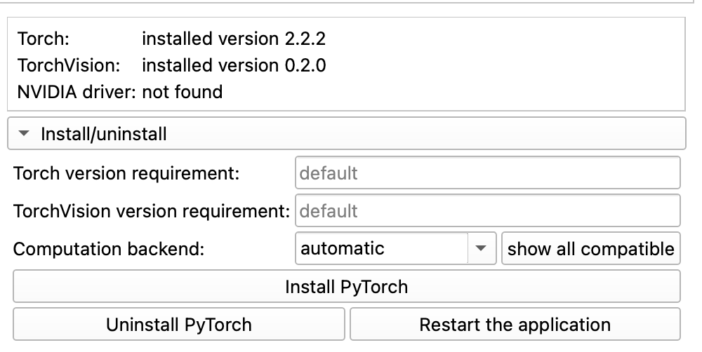
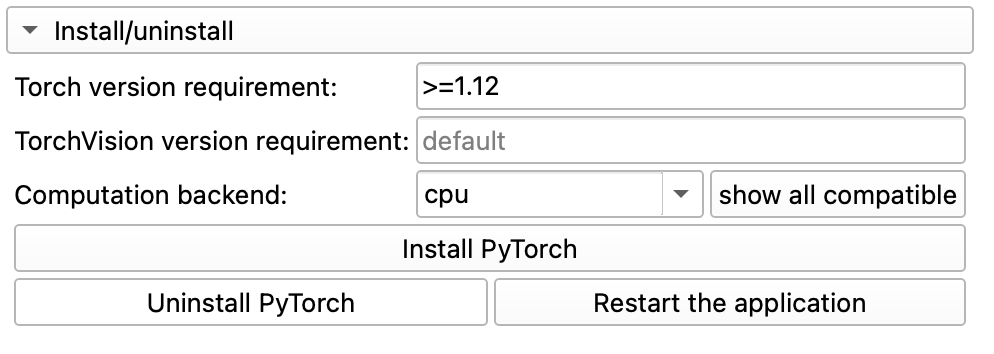
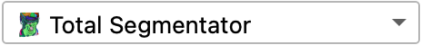
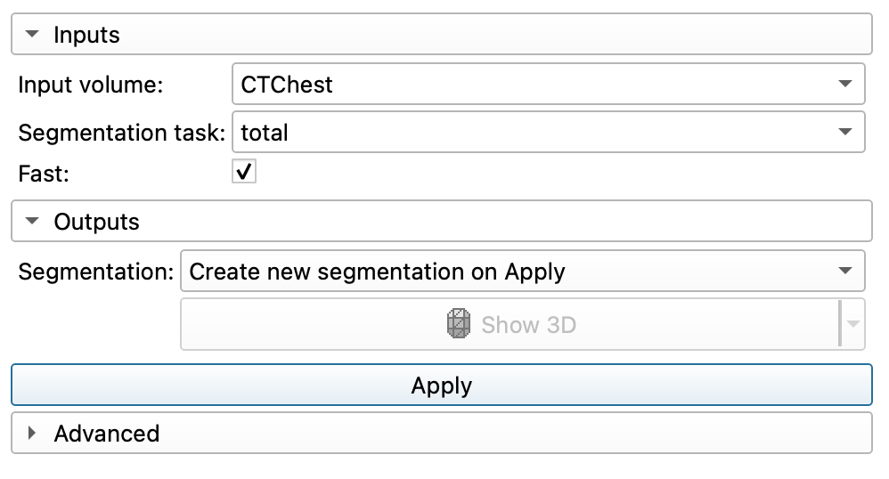
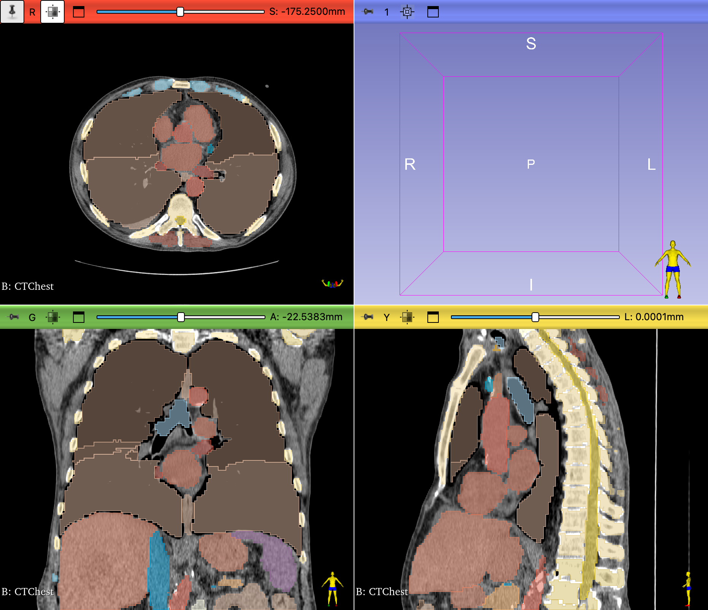
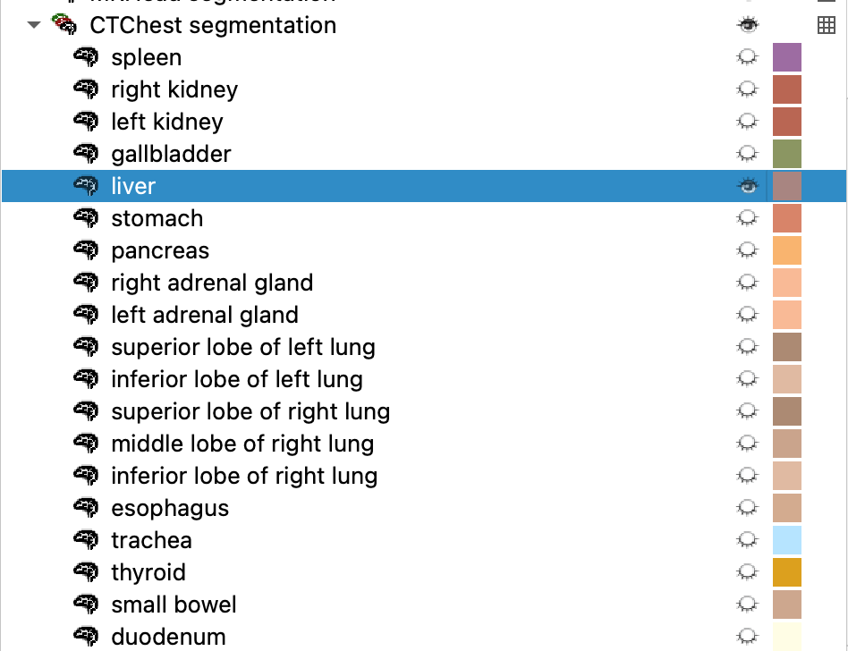

# Automated Segmentation using Total Segmentator

[Total Segmentator](https://github.com/lassoan/SlicerTotalSegmentator) is a 3D Slicer extension for fully automatic whole body CT segmentation using the [TotalSegmentator AI model](https://github.com/wasserth/TotalSegmentator). Computation time is less than one minute.

## Required extensions

- TotalSegmentator
- PyTorch

## Pytorch

{ width="50"}

PyTorch is a python library for machine learning. Slicer uses this library to run Total Segmentator. Sometimes, this library needs to be updated to be compatible with the latest version of Total Segmentator.

The latest version of Total Segmentator requires a version Pytorch greater than 2.0. Bring up the PyTorch Utils module to check what version of PyTorch you have installed.

{ width="450"}

{ width="450"}

>If the Torch version is 2.2.2 or greater, you should be good to go.

If your Torch version is < 2.0

1. `Uninstall PyTorch`
2. `Restart the application`
3. Bring up PyTorch Utils again.
4. Set the **Torch version requirement** to: `>=1.12`
5. If you have a Mac or and AMD Windows machine, set the **Computation backend** to `CPU`. Otherwise, if you have a NVIDIA graphics card, leave as `automatic`
6. `Install PyTorch`

{ width="450"}

## Total Segmentator Module

For this example, we will use the CTChest volume from the Sample Data module. Load that volume into Slicer

Bring up the **Total Segmentator** module

{ width="250"}

1. Set the **Input volume** to `CTChest`
2. Set the **Segmentation task:** to `total`
3. Check **Fast** on
4. Create new segmentation on Apply
5. Click `Apply`

{ width="450"}

- You may get a notification that certain python items are being installed. Just wait.
- You should get a notification that module is "Creating segmentations with the TotalSegmentator AI". Just wait.
- Just wait.

Finally, you should get some segmentations.

{ width="450"}

## Review segmentations

### Show the Segmentations in 3D

1. Switch to the **Segmentation Editor**
2. Click on **Show 3D**

### Hide some Segmentations

1. Switch to the **Data** Module
2. There should be a new Segmentation Node called "CTChest segmentation"
3. There should be a *lot* of segmentations in that node.
4. Select all of the Segmentations
5. Right-Click and select "Hide" - the eye icons should close for all of the segmentations
6. Selectively click open the eye icons of those segmentations that you want to visualize

{ width="450"}