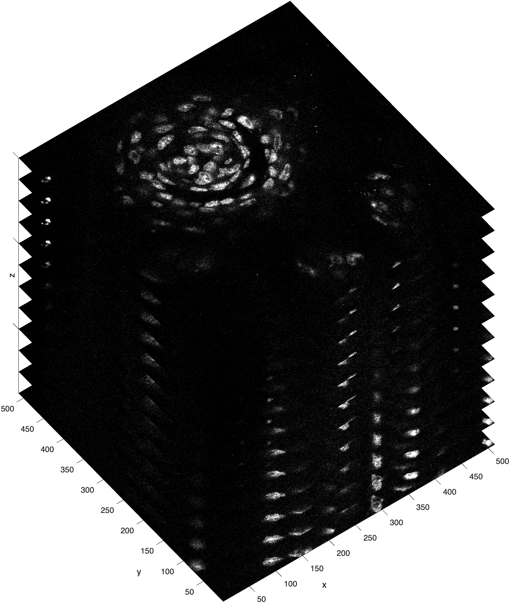

# Image Stacks

An image stack is exactly what it sounds like: a stack of images. Think sheaf of paper or deck of cards :material-cards-playing:.

<!-- { width="250"} -->

Image stacks have three (or more) dimensions. In a stack, images are typically stored in the xy-plane and then stacked along the z-dimension. In this configuration, the z-dimension usually represents either time or distance. If time, then the image stack is a movie strip. If distance, then the image stack represents the volume of something, like the volume of a tissue section.

For example, the following is a visualization of a taste bud from a mouse, cross-sectioned into very thin slices.  

{ width="450"}

>This image stack was created by a confocal microscope, which captured each image by [raster-scanning](https://en.wikipedia.org/wiki/Confocal_microscopy) in the xy-plane, adjusting the focal plane along the z-axis, and then raster-scanning the next image. Because depth is captured by adjusting the focal plane, each image in this stack is also called an optical slice. As you can see, there are 12 optical slices in this confocal stack. Each optical slice has 512 rows and 512 columns (height and width). Note, in this visualization, the slices along the z-dimension are artificially separated to clearly show all 12 slices.

## Loading 3D Image Stacks

To load an image stack saved in the .TIF file format, you first need information about that stack.

The function **imfinfo** returns the metadata for an image stack.

```matlab linenums="1" title="Load the metadata"
meta = imfinfo("TasteBud3D.tif")
```

```matlab title="Output from imfinfo"
meta = 

  12×1 struct array with fields:

    Filename
    FileModDate
    FileSize
    Format
    FormatVersion
    Width
    Height
    ⋮
```

…For this file, we get a lot of metadata (more than 39 fields). Notice that *`meta`* is a `12X1` structure, so in fact, you get a metadata structure element for *each* slice in the image stack. This is one way to determine the number of slices in the image stack. Most of the data is repeated for each slice, so we can examine the metadata for the first image slice to get information about the image slices:

```matlab title="Review element 1 of the metadata structure"
numel(meta) % number of slices

ans = 

    12

meta(1).Width % number of columns

ans =

   512

meta(1).Height % number of rows

ans =

   512
meta(1).BitDepth % bit depth

ans =

     8
```

…Here we review the first element in the metadata structure and we find that each slice in the image stack is an unsigned 8-bit image with 512 rows (Height) and 512 columns (Width). So, the size of our image stack is `512 X 512 X 12`.

The function **`imread`** can read slices from a .TIF image stack. To read in a slice, you call **`imread`** as you would for a 2D image. The following code loads the first slice from a 3D Image stack, like the one shown [above](#image-stacks).

```matlab linenums="1" title="Read a single slice using imread"
slice = imread("TasteBud3D.tif") % read in the first slice
```

If you want to load a different slice, you indicate the slice number as a second input in **imread**

```matlab linenums="1" title="Indicate which slice to read using imread"
slice3 = imread("TasteBud3D.tif",3) % read in the third slice
```

If you want to load the whole stack using **`imread`**, you need a **`FOR LOOP`**.

```matlab linenums="1" title="Load a TIF image stack using imread"
% preallocate variable
num_rows = meta(1).Height; % number of rows
num_cols = meta(1).Width; % number of columns
num_slices = numel(meta); % number of slices in the image stack
STACK = zeros(num_rows, num_cols, num_slices,'uint8'); % preallocate the variable as a uint8 3D array

% load image stack slice by slice
for n=1:num_slices
    slice = imread("TasteBud3D.tif",n); % read slice from file
    STACK(:,:,n) = slice; % add slice to incrementing location in stack
end
```

…When loading large datasets, it is always a good idea to [preallocate the variable](https://www.mathworks.com/help/matlab/matlab_prog/preallocating-arrays.html) prior to running the **`FOR LOOP`**. Notice how we match the bit depth of the preallocated variable to the bit depth of the image stack. Failure to do so results in bit depth mismatching and much gnashing of teeth.

Reviewing the image stack in the workspace shows the following:

```matlab title="Output from whos"
  Name               Size                    Bytes  Class     Attributes

  STACK            512x512x12              3145728  uint8               
```

…The image stack is loaded into MATLAB just like any other numeric array.

## Volume and Voxels

{ width="250"}

An image stack can also be visualized as a Rubik's cube or a cube of smaller cubes. In this visualization, each small cube is called a **voxel**, the 3D version of a pixel. Like pixels, voxels are point samples and have dimensionality.

### Isotropic vs Anisotropic

When the length, width, and height of the sides of a voxel are identical, the voxel is **isotropic**; when they are not, the voxel is **anisotropic**.

In the taste bud image stack, the voxel dimensions are 0.3 x 0.3 x 0.75 µm. So, the voxels in this image stack are not perfect little cubes (aka isotropic), but are instead *cuboidal* (aka anisotropic).

{ width="200"}

>The sides of the isotropic voxel are equal along all dimensions, while the sides of anisotropic voxel are equal along the x & y dimensions, and different along the z-dimension.

### Calculating Volume

To calculate the volume of an image stack, you first calculate the volume of a single voxel and then add up the volumes of all the voxels in the stack.

You can get the size of a voxel by referencing the metadata. In our STACK example of a taste bud, the pixel dimensions are 0.3 X 0.3 in the xy plane and 0.75 in the z-plane. So to calculate the volume of a single voxel, you multiply the lengths of the sides of the voxel:

$$
0.3 * 0.3 * 0.75 = 0.0675 µm^3
$$

>The volume of this voxel is very small—smaller than an E.coli bacterium!

To get the volume of the entire image stack, you multiply the volume of a voxel by the total number of voxels in the stack:

$$
512 * 512 * 12 = 3,145,728 \, voxels
$$

…which converts to

$$
3,145,728 \times 0.0675 \, \mu\text{m}^3 = 212,336.64 \, \mu\text{m}^3
$$

>So the total volume of the image stack is 212,336.64 $µm^3$ — still very small!

## Viewing Image Stack Slices

To view the slices in an image stack, you need a special viewer—**`imshow`** won't work.

### Montage

A simple way to see all the slices is to use the function **`montage`** which reformats all the slices into a 2D matrix of images.

```matlab linenums="1" title="View slices as a montage"
montage(STACK)
```

{ width="450"}

>A `4X3` montage of all the slices from the image stack. The number of each slice has been added to the top left corner of each cross-section for clarity.

### Course Function - mmSliceView

The [course function](../courseFunctions/index.md) **mmSliceView** is a custom MATLAB function designed to display slices from an image stack interactively. You can find more details about its usage and features in the [documentation](../courseFunctions/mmSliceView.md).

```matlab linenums="1" title="mmSliceView"
mmSliceView(STACK)
```

{ width="450"}

…You can quickly scrub through the slices using the mouse scroll wheel.

### volumeViewer

The  MATLAB app **`volumeViewer`** shows orthogonal cross-sections of an image stack and can Volume Render.

```matlab linenums="1" title="Volume Viewer"
volumeViewer(STACK)
```

{ width="650"}

>Screen grab of Volume Viewer showing *`STACK`*. Notice that the orthogonal slices are not very thick — this is a very short stack (only 12 cross-sections vs 512 rows and columns).
