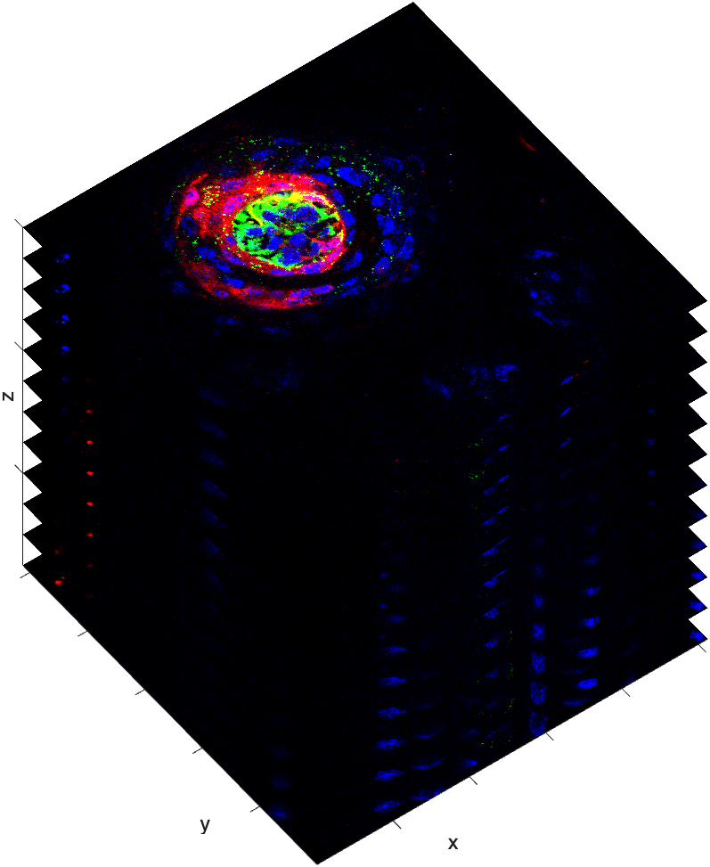

# Multidimensional Image Stacks

In addition to depth, image stacks can also contain color or time information.  This organization of information is often denoted as `XYCZT`

- **X:** the number of columns in the image slice
- **Y:** the number of rows in the image slice
- **C:** the number of color channels in the image stack
- **Z:** the number of z-slices (or depth) in the image stack
- **T:** the number of time frames in the image stack

{ width="450"}

>In the above image stack, the dimensions are organized as `XYCZ`. Notice that the Z information is in the fourth dimension, while the Channel information is in the 3rd dimension (similar to an RGB image).

##

For color image stacks, the dimensions are organized a little differently. Image planes are still stored in the xy-plane. Color information  is stored in the 3rd Dimension. Depth information is stored in the 4th Dimension, and Time in the fifth dimension (if any time information was captured).

Similar to RGB images, color information is stored in the 3rd Dimension. Sometimes it helps to visualize a color 3D stack as 3 separate stacks as follows