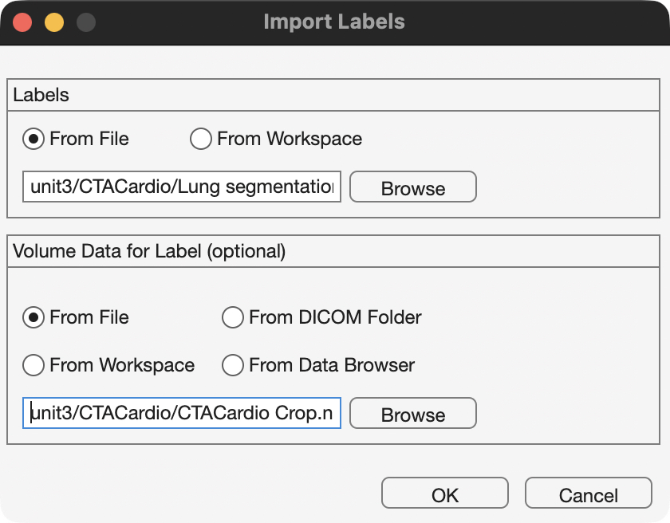

# Medical Volume Viewer

The Medical Volume Viewer can be used to visualize 3-D medical image volumes, including label maps and multimodal overlays. It is included with the Medical Imaging Toolbox (as of 2026a). Note, the Image Processing toolbox contains a separate app called Volume Viewer, which is designed to view other types of volumes, like confocal datasets or EM dataset.

## Volume Rendering

We can explore internal structures in volumetric datasets, like CT or MRI volumes, using Volume Rendering. For this example, we load a CT Chest DICOM volume from the unit3 data folder (1) into the Medical Volume Viewer app.
{ .annotate }

### Alphamaps

An Alphamap is a look-up table that sets the opacity for voxels that fall within a certain intensity range. For example, voxels with low intensity (where there is basically no data), can be set to have an opacity of 0 (or basically transparent). Conversely, voxels with intensities that corresponds to an anatomical structure (like bone), can be set to have a high Opacity Setting (so these voxels are not transparent) and the anatomical structure of interest can be visualized. This is more easily set with CT data, where intensity values are standardized to Hounsfield Units.

!!! note "Hounsfield Units (HU)"
    
     { width="350"}
    > Hounsfield units (HU) are a quantitative measurement of the radiodensity of a substance as seen on a Computed Tomography (CT) scan, ranging from -1000 for air to +1000. [Radiopaedia](https://radiopaedia.org/cases/hounsfield-scale-diagram)

1. This data is included with the MATLAB Medical Toolbox and discussed in this [example](https://www.mathworks.com/help/releases/R2026a/medical-imaging/ug/display-3-d-medical-image-data-in-patient-coordinate-system.html){target="_blank"}.

### Loading data into the Medical Volume Viewer

We can load a medical volume in the Medical Volume Viewer programmatically as follows:

```matlab linenums="1" title="Load and display medical volume using the Medical Volume Viewer"
mmSetUnitDataFolder(3) % set current folder to unit3 data folder
mV = medicalVolume("MedicalVolumeDICOMData/LungCT02") % load DICOM as a medicalVolume
medicalVolumeViewer(mV) % display volume in Medical Volume Viewer app
```
{ width="550"}
>**Default Volume Render.** Lung CT (`LungCT02`) loaded into the Medical Volume Viewer app. Notice the medical volume is automatically rendered in Anatomical Space (LPS axis), in millimeters. Here, we maximize the 3-D volume panel containing the volume render (left panel).  We also open the Render Editor (right panel) to visualize the alphamap. As you can see, the default alphamap is a linear gradient of transparencies where low intensity values are transparent and high intensity values are opaque. The effect is a translucent volume render of the dataset.

The Medical Volume Viewer app includes several useful alphamap presets for medical datasets, like CT-Lung and CT-Bone, or you can manually adjust the alphamap for even more renders.

<div class="grid cards" markdown>

-   **All Voxels Opaque**

    ---

    { width="450"}
    
    If we drag the left vertex in the linear alphamap to an opacity setting of 1, we set all voxel opacities to 100%. With all voxels opaque, we can now see that our data is cylindrical (matching the shape of the CT bore). In reality, the data is stored as 3D rectangular prism, with intensity values outside the cylinder all set to an arbitrary minimum value (like -3024). The Medical Volume Viewer excludes these voxels from display as they are not part of the captured dataset.

- **CT Lung Preset**

    ---
    { width="450"}
    
    In the Lung preset,  the alphamap is semi-opaque (15%) for only a small subset of voxel intensities (ranging from -600 to -400), which corresponds to the hounsfield scale for Lung (see above)

- **CT Bone Preset**

    ---
    { width="450"}
    
    The alphamap here ramps up from an opacity of 0 at a voxel intensity of -16 to an opacity of 72% at voxel intensities of 641 and greater.

- **Manual Render focusing on Bone**

    ---

    { width="450"}
    
    If you want focus on the bones of the dataset, which have a higher HU intensities, you can manually  shift the ramp further to the right, as shown above. Here the alphamap ramps up from a voxel intensity of 350 to a voxel intensity of 1000.  If you review the HU scale, you can see that trabecular Bone intensities start at ~ 300 HUs.

</div>

So, as you can see, we can reveal different internal structures from the exact same volumetric dataset by simply adjusting the alphamap.

## Overlaying Label and Intensity Volumes

Label Maps (aka segmentation volumes) can be added as additional elements to the volume rendering. To overlay the label map on the intensity volumes, you need to load both the intensity volume and the label map into the Viewer App.

### Add volumes

For this example, we will load 3D Slicer data from the `unit3/CTACardio` folder.
If you still have the LungCT02 volume displayed in the medical volume viewer, click on the "New Session" to clear the volume.

{ width="45"}

>You should get a pop-up window that states "Starting a new session will clear all the data present in the app. Do you want to continue?" Click OK to continue.

Next, Click on the Import Button to bring up the Import menu and select "Labels."

{ width="150"}

This will bring up the Label Load Dialog.

{ width="450"}

Use the following settings:

- **Labels:** Click "From File", then "Browse" and select the '/CTACardio/Lung segmentation.seg.nrrd' file
- **Volume Data for Label**: Click "From File", then "Browse" and select the `/CTACardio Crop.nrrd` file

After you click OK, you should see the following in the Viewer:

{ width="650"}
>Notice that the Lung segmentation is added to the CTACardio hierarchy in the Data Tree panel. To view the Labels, click the eye icon to "open the eye". If you select the Lung segmentation node in the Data tree, you can see a list of the Labels in the Labels panel. Each label can be shown/hidden using the eye icons in that panel

To create the 3D Volume render shown in the above example, with the ribs clearly visible, select the CT Bone preset in the Render tab, and then adjust the alphamap as shown in the above example ("Manual Render focusing on Bone"). Also be sure to set the background to white and uncheck "Use Background gradient."

## Surface Rendering

The **medicalVolumeViewer** app can render volumes as surfaces by switching the Rendering Engine to "Isosurface".

{ width="550"}

>Here we have created two different Surface Renders by adjusting the position of the "Isosurface Value" slider. With this setting, the renderer connects voxels with similar intensities.

Read more about surface rendering and `isosurface` in the [Surface Rendering section of the documentation](surfaceModels.md).
