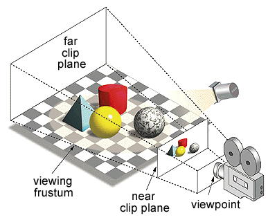

# Volume and Surface Rendering

For volume processing, it is often useful to see "inside" a volume — that is, to construct 3D representations of internal structures inside that volume. The term **3D rendering** refers to the computer graphics process of converting 3D models into 2D images for display on a screen. This process considers the positioning of the objects in a 3D scene and creates a 2D image based on this perspective. Any change in the view—such as rotating the scene—generates a new render that reflects this new perspective, as shown below.

{ width="250"}

>In 3D graphics, a **viewing frustrum** is the computed view from a virtual camera, represented as a truncated pyramid lying on its side. Notice the smaller end of the pyramid is closest to the camera, while the larger end is farther away, representing foreshortening. Everything between the near and far clip planes is the viewing area, and will be rendered. Here, the "near clip plane" represents what is rendered in the 3D Scene. Moving the camera changes the position of the viewing frustrum and renders a different image. For example, if you rotate the camera to the right, the red cylinder would appear in front of the yellow sphere.

There are two main types of rendering that we deal with in this course: **Volume** and **Surface Rendering**.

## Volume Rendering

With Volume Rendering, you visualize 3D structures by adjusting the transparency of voxels in a 3D volume. Often in this type of rendering, outer edge and background voxels are made completely transparent to allow viewing inside the volume. Voxels within structures of interest are set to varying opacity levels to reveal these structures.  In effect, each voxel in the volume has an opacity setting based on its intensity value. These opacity values are set using a lookup table called an **alphamap**, which maps intensity values to opacity levels.

In this way, volume rendering can be used as a quick and easy way to explore the internal structures of a volume. By simply adjusting the alphamap, you can visualize different structures in the volume.

{ width="350"}
>Volume Render of a CT Volume

## Surface Rendering

With Surface Rendering, you first need to create a 3D surface model, which is made up of vertices and faces (not voxels). Other pre-processing steps may be required, often making surface rendering more time-consuming than volume rendering, but the final result can appear more realistic and detailed. In this method, only the surface is rendered while the rest of the volume is ignored.

Surface Rendering is useful when you want to:

- Visualize a segmented internal structure (e.g. like an aorta or the kidneys)
- Rotate or translate the surface in 3D space
- Measure the extent of your 3D surface (e.g. the length of a femur)
- Compare the morphology of two different surfaces
- 3D print a surface

{ width="250"}
>Surface render of an Aorta and Kidneys
