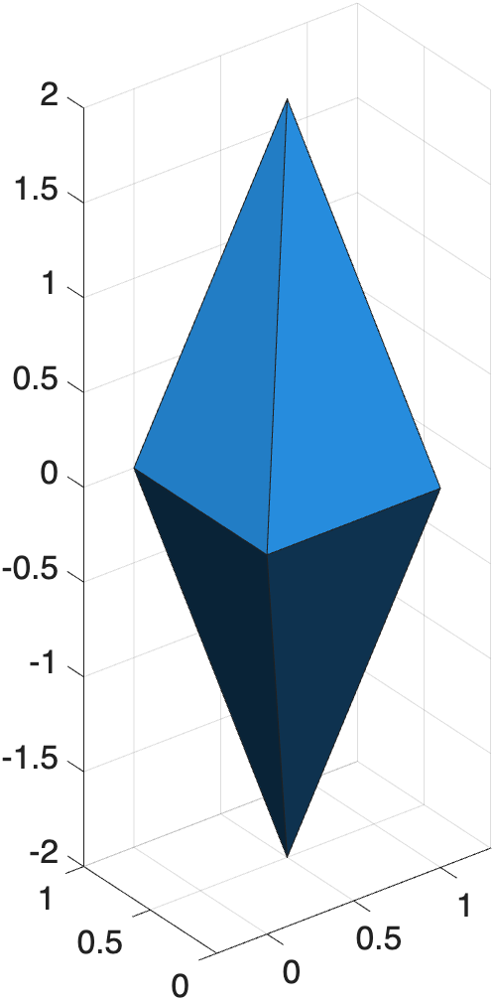
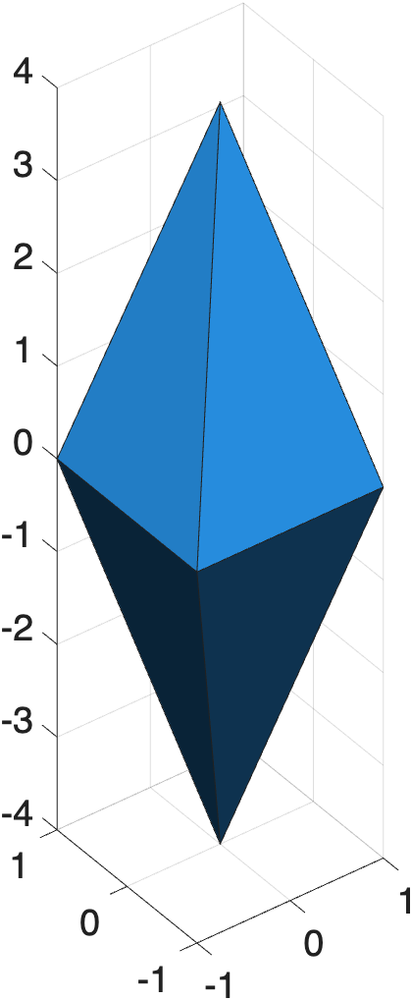
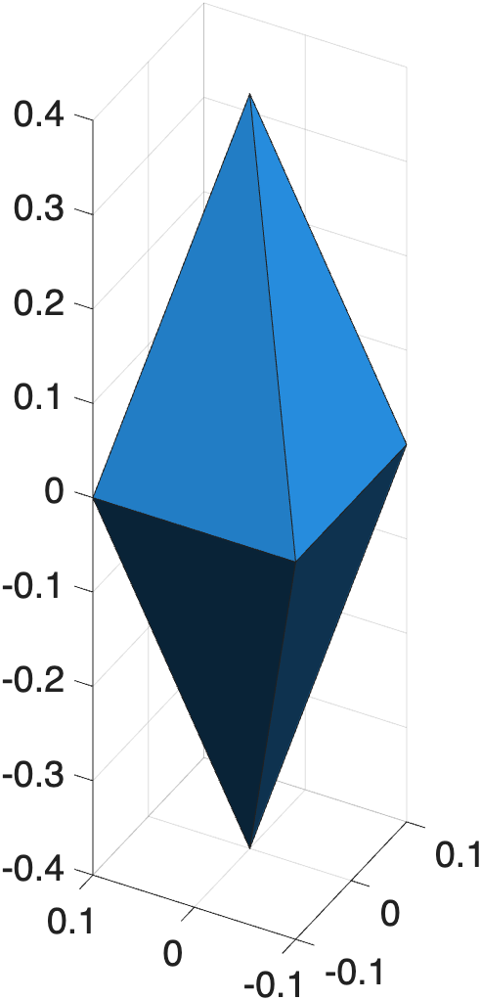

# Transforming Surface Models

Since surface models are just points in 3D space, it is very easy to manipulate the position and size of these models using some basic mathematical operations. These operations are collectively known as **transformations** and they can be broken down into separate categories like:

- **Translation**: movement along the x,y,z axes (addition or subtraction)
- **Rotation:** Rotation around a given vertex (multiplication or division)
- **Scale:** increasing or decreasing the size of the model (transformation matrix and linear algebra)

You can also warp and shear a model, but we won't get into that here.

## Translating Surface Models

One of the simplest things to do with a surface model is to move the model in 3D space. For this example, we first create a surface model of a diamond.

```matlab linenums="1" title="Create Diamond Surface model"
V = [0.5 0.5 2.0;... %  vertices for the surface
    0 0 0;...
    1 0 0;...
    0 1 0;...
    1 1 0;
    0.5 0.5 -2.0];
F = boundary(V); % faces for the surface 
```

We render the surface using the function `patch`.

```matlab linenums="1" title="Render Surface"
figure;
hp = patch("Faces",F,"Vertices",V, ... % render surface
    "FaceColor",'flat', ...
    "FaceVertexCData",abyss(8)); % blue face colors
axis equal; view(3); grid on; % figure properties
xlabel('X'); ylabel('Y'); zlabel('Z'); % label axes
```

{ width="150"}
>Render of a diamond surface model

To translate a surface, you simply add (or subtract) the distance to the vertices.

```matlab linenums="1" title="Create new surface and translate"
V2 = V+2; % translate vertices +2
hp2 = patch("Faces",F,"Vertices",V2, ... % render new surface 
    "FaceColor",'flat', ...
    "FaceVertexCData",abyss(8));
set(hp,"FaceAlpha",0.5, "EdgeAlpha", 0.5); % increase transparency of original diamond

axis equal % 2nd call helps zoom in on renders
```

In the above following code, we created a new vertices matrix, `V2`, by adding 2 to all vertices in `V`. Notice we didn't need to change the Faces matrix, `F`. We just modified the vertices. By adding `2` to each vertex, we translated the surface `+2` in the x,y, and z directions.

{ width="250"}
>Side-view render of the original (more transparent) and translated diamond (here, the z is the vertical axis)

{ width="250"}
>Aerial view of the same render. Bottom left render is original diamond, while top left is the translated diamond.

```matlab linenums="1" title="Translate render using handle"
hp2.Vertices = hp2.Vertices - [0 0 6]; % translate vertices
axis equal
```

Since the patch handle (`hp`) contains the faces and vertices, we can modify the vertices directly in the handle and instantly translate the render.

{ width="250"}
>Diamond translated -6 along just the z-axis


```matlab linenums="1" title="Center surface to 0,0,0"
hp2.Vertices = hp2.Vertices-mean(hp2.Vertices); % center surface
```

Sometimes, it is useful to center a 3D surface at 0,0,0. Here we center the surface by subtracting the mean of the vertices from all vertices. This works because the mean returns the centroid of the surface (its center of mass).

{ width="150"}
>The surface is now centered at 0,0,0

## Scaling

While translation is addition and subtraction, scaling is multiplication and division.

```matlab linenums="1" title="Scale Diamond"
hp2.Vertices = hp2.Vertices * 2 % double vertices
```

The surface model is now doubled along all dimensions.

{ width="150"}

**Challenge:** How would you make the diamond 10x smaller?

{ width="150"}

??? question "Make Diamond Tiny"

    ``` matlab linenums="1" 
    hp2.Vertices = hp2.Vertices / 10
    ```

## Rotation

To rotate a surface, you need a [transformation matrix](https://www.mathworks.com/help/images/matrix-representation-of-geometric-transformations.html), our old friends `sine` and `cosine`, and some linear algebra. For those who prefer not to perform linear algebra on the fly, the required steps are encapsulated in the course function **`mmRotateSurfaceVertices`**:

```matlab linenums="1" title="Rotate surface 90˚ around the y-axis"
hp2.Vertices = mmRotateSurfaceVertices(hp2.Vertices,'y',90)
```

{ width="350"}