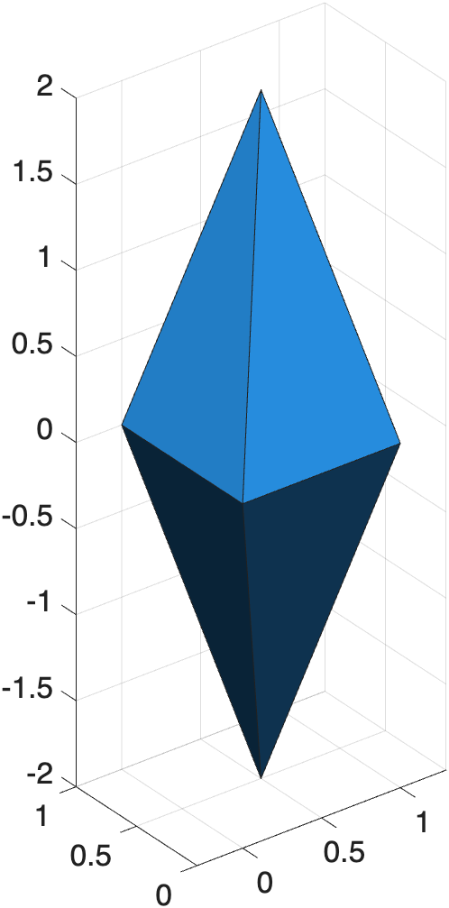
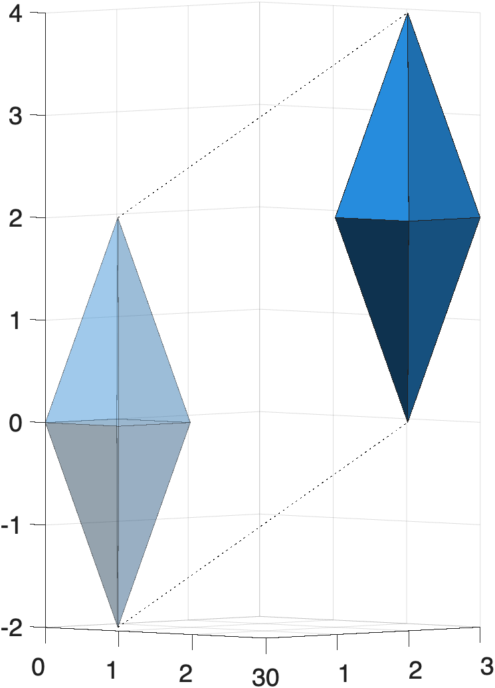
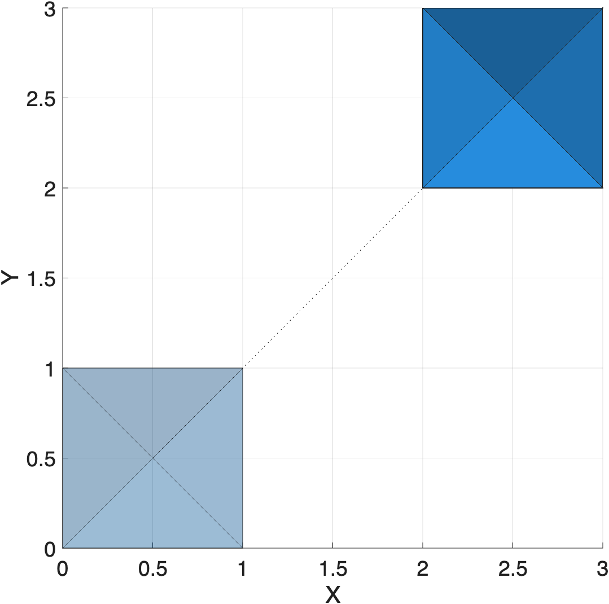
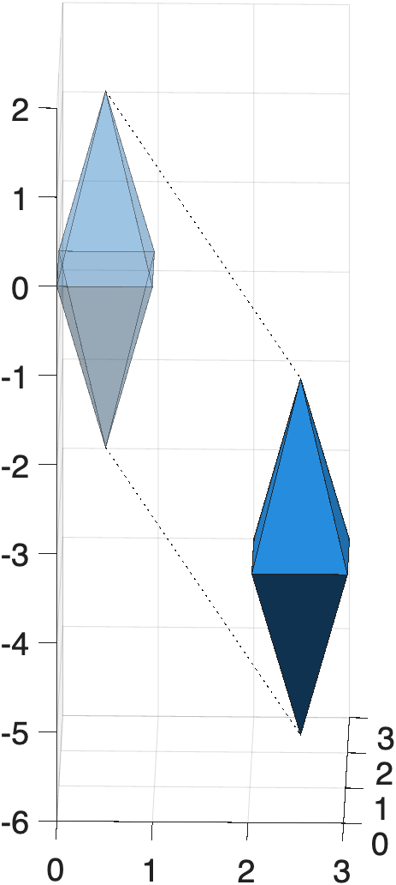
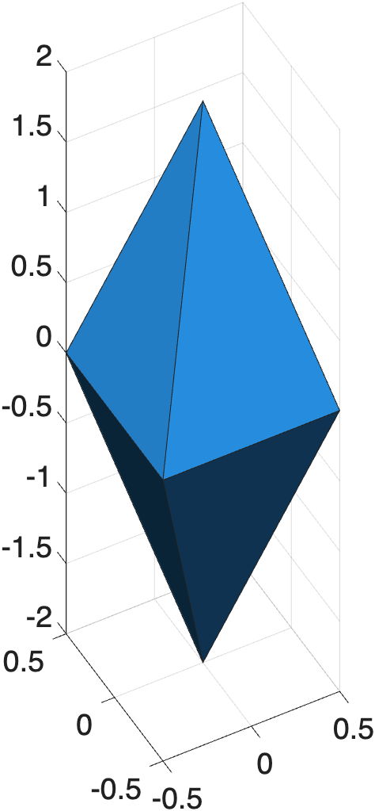
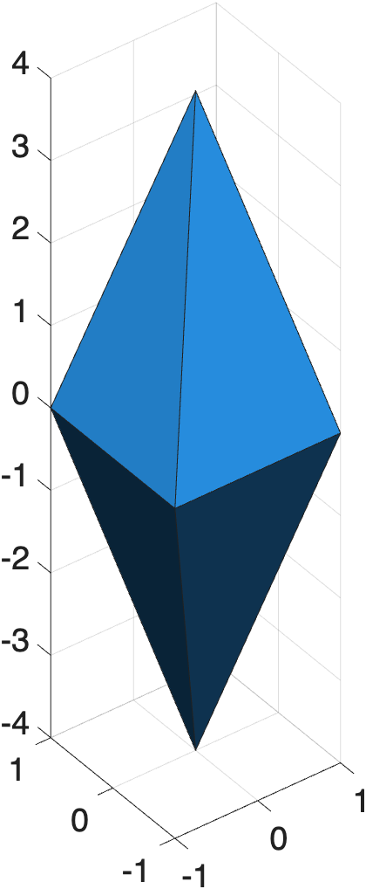
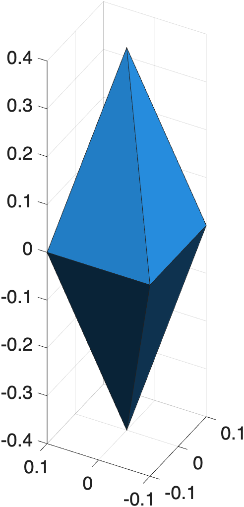
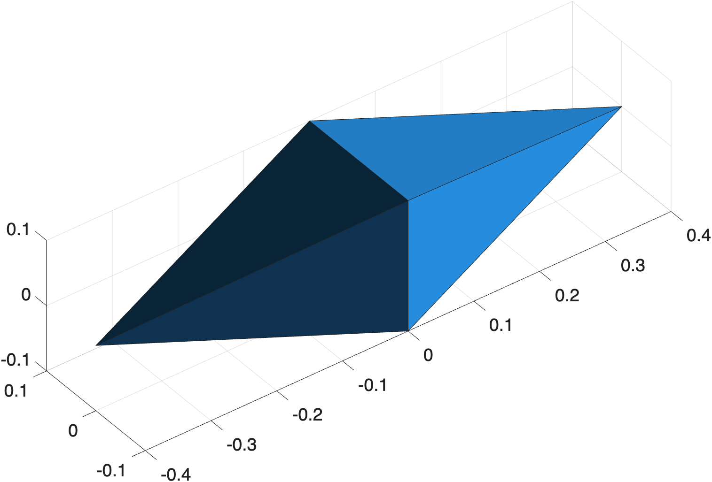

# Transforming Surface Models

Since surface models are just points in 3D space, it is very easy to manipulate the position and size of these models using some basic mathematical operations. These operations are collectively known as **transformations**.

!!! note "Transformation Categories"

    Transformations can be broadly categorized as:

    - **Translation:** movement along the x,y,z axes (addition or subtraction)
    - **Scale:** enlarging or shrinking the model (multiplication or division)
    - **Rotation:** rotation around a given axis (transformation matrix and linear algebra)

    Often, these transformations are combined.  You can also warp and shear a model, but we won't get into that here. 

## Translating Surface Models

One of the simplest things to do with a surface model is to move the model in 3D space. For this example, we first create a surface model of a diamond.

```matlab linenums="1" title="Create Diamond Surface model"
V = [0.5 0.5 2.0;... %  vertices for the surface
    0 0 0;...
    1 0 0;...
    0 1 0;...
    1 1 0;
    0.5 0.5 -2.0];
F = boundary(V); % faces for the surface 
```

We render the surface using the function `patch`.

```matlab linenums="1" title="Render Surface"
figure;
hp = patch("Faces",F,"Vertices",V, ... % render surface
    "FaceColor",'flat', ...
    "FaceVertexCData",abyss(8)); % blue face colors
axis equal; view(3); grid on; % figure properties
xlabel('X'); ylabel('Y'); zlabel('Z'); % label axes
```

{ width="150"}
>Render of a diamond surface model

To translate a surface, you simply add (or subtract) the distance to the vertices.

```matlab linenums="1" title="Create new surface and translate"
V2 = V+2; % translate vertices +2
hp2 = patch("Faces",F,"Vertices",V2, ... % render new surface 
    "FaceColor",'flat', ...
    "FaceVertexCData",abyss(8));
set(hp,"FaceAlpha",0.5, "EdgeAlpha", 0.5); % increase transparency of original diamond

axis equal % 2nd call helps zoom in on renders
```

In the above code, we created a new vertices matrix, `V2`, by adding 2 to all vertices in `V`. Notice we didn't need to change the Faces matrix, `F`. We just modified the vertices. By adding `2` to each vertex, we translated the surface `+2` in the x,y, and z directions.

{ width="250"}
>Side-view render of the original (transparent) and translated diamond (solid). Here, the z is the vertical axis.

{ width="250"}
>Aerial view of the same render. Bottom left render is original diamond, while top right is the translated diamond.

```matlab linenums="1" title="Translate render using handle"
hp2.Vertices = hp2.Vertices - [0 0 6]; % translate -6 in the z-direction
axis equal
```

The patch handle (`hp2`) contains the faces and vertices of the surface. When we modify the vertices in the handle, the render is instantly transformed:

{ width="250"}
>Diamond translated -6 along just the z-axis

```matlab linenums="1" title="Center surface to 0,0,0"
hp2.Vertices = hp2.Vertices-mean(hp2.Vertices); % center surface
```

Sometimes, it is useful to center a 3D surface at 0,0,0. Here we center the surface by subtracting the mean of the vertices from all vertices. This works because the mean returns the centroid of the surface (its center of mass).

{ width="150"}
>The surface is now centered at 0,0,0

## Scaling

Scaling changes the size of the surface model. As we just saw, to move a surface, you add or subtract values from the vertices. To scale a surface, you multiply or divide values from the vertices. Multiplying enlarges the model, while dividing shrinks the model.

```matlab linenums="1" title="Double the size of the Diamond"
hp2.Vertices = hp2.Vertices * 2 % double the size
```

{ width="150"}
>The surface model is now doubled along all dimensions.

**Challenge:** How would you make the diamond 10x smaller?

{ width="150"}

??? question "Make Diamond Tiny"

    ``` matlab linenums="1" 
    hp2.Vertices = hp2.Vertices / 10
    ```

## Rotation

To rotate a surface, you need a [transformation matrix](https://www.mathworks.com/help/images/matrix-representation-of-geometric-transformations.html) and some linear algebra. For those who prefer not to perform linear algebra on the fly, the required steps are encapsulated in the course function **`mmRotateSurfaceVertices`**:

```matlab linenums="1" title="Rotate surface 90˚ around the y-axis"
hp2.Vertices = mmRotateSurfaceVertices(hp2.Vertices,'y',90)
```

The function takes three arguments:

1. **Vertices** — the Nx3 matrix of vertices to rotate
2. **Axis** — the axis of rotation: `'x'`, `'y'`, or `'z'`
3. **Angle** — the angle of rotation in degrees

{ width="350"}
>Diamond rotated 90° around the y-axis

You can chain multiple rotations together by passing the result of one rotation into the next:

```matlab linenums="1" title="Rotate 45˚ around x, then 30˚ around z"
V_rot = mmRotateSurfaceVertices(hp2.Vertices,'x',45);
hp2.Vertices = mmRotateSurfaceVertices(V_rot,'z',30);
axis equal
```

**Challenge:** How would you rotate the diamond 180° around the z-axis?

??? question "Rotate 180° around z"

    ```matlab linenums="1"
    hp2.Vertices = mmRotateSurfaceVertices(hp2.Vertices,'z',180)
    ```

!!! note "Under the Hood"

    Rotation is performed by multiplying the vertices by a **rotation matrix** — a 3×3 matrix built from sine and cosine values of the rotation angle. Unlike translation and scaling, rotation order matters when combining rotations around different axes.
