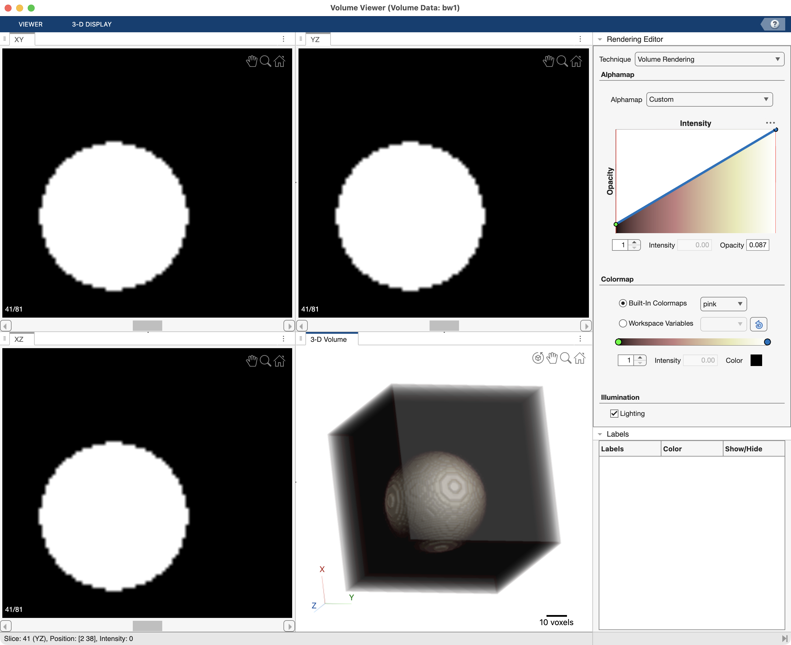
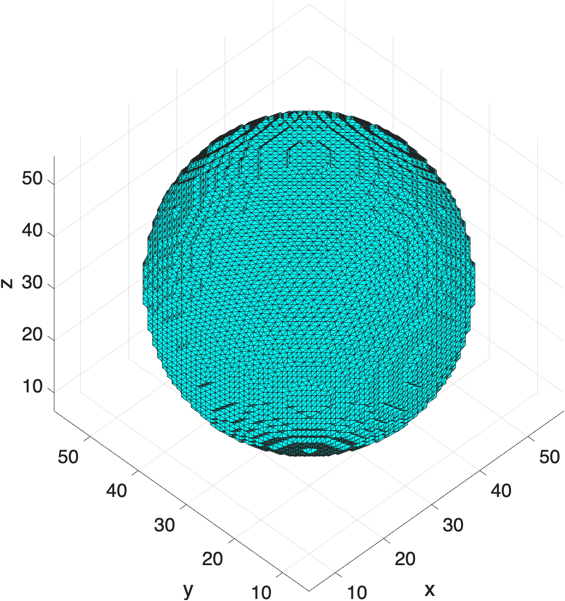

# Surface Models

A 3D Surface (or manifold or mesh) is a digital representation of a 3D object (like a sphere or prism). These digital surfaces are made up of Vertices and Faces (1). This differs from a digital volume which is essentially a [cuboid](https://en.wikipedia.org/wiki/Cuboid) made up of smaller cuboids (voxels).
{ .annotate }

1. There are edges, too, but we won't worry about the edges right now.

!!! abstract "Vertices and Faces :material-pyramid: "

    - **Vertex**: a point in space with an x, y, and z coordinate
    - **Face**: a flat surface bound by a set of vertices (typically a triangle bound by 3 vertices)

## Vertices and Faces

Consider the following vertices, organized in a matrix, `V`:

```matlab linenums="1" 
V = [0.5 0.5 1.0;... % vertex 1
    0 0 0;... % vertex 2
    1 0 0;... % vertex 3
    0 1 0;... % vertex 4
    1 1 0]    % vertex 5
```

In this matrix, `V`, each column contains the x,y, or z coordinate, respectively, and each row contains a single vertex (i.e. the x,y, and z coordinates for a given vertex). So, in this example, Vertex 1 has the x,y,z coordinates of `0.5, 0.5, 1.0`, had  Vertex 2 has the coordinates `0,0,0`.

We can plot these vertices as a 3D scatter plot using `scatter3`.

```matlab linenums="1" title="Plot vertices as 3D Scatter "
figure;
scatter3(V(:,1),V(:,2),V(:,3),"filled")
axis equal
```

{ width="250"}

This 3D plot is not a surface — its a scatter plot or a point cloud. To create a surface model, we need to create planar shapes from the vertices. The most common way to do this is to group vertices into triangles. These connected shapes are called "faces."

The boundary `function` creates a set of faces from a series of vertices that together makes a surface of the exterior boundary of the vertices.

```matlab linenums="1" title="Create faces from vertices"
F = boundary(V)
```

```matlab title="result"
F = 6×3
     2     4     3
     1     2     3
     1     4     2
     5     1     3
     4     5     3
     4     1     5
```

As you can see, the function `boundary` returns a matrix, `F`. In this matrix, each row represents one face. And each *value* in `F` points to a row in the vertices matrix, `V`. So the value `1` in `F` means "row `1` in `V`", or the vertex coordinate `0.5, 0.5, 1.0`. Since there are 3 columns in the matrix, there are 3 vertices per face, meaning each face is a triangle. In this example, the first face in `F` (row 1) is made up of the vertices found in rows 2, 4, and 3 of `V` — or, vertices `0,0,0`, `0,1,0`, and `1,0,0`. If you had four columns in `F`, you would have four vertices per face, and each face would subsequently be a little square. This is less common.

## Surface Rendering

To render the faces and vertices as a surface, you use the function `patch` (1)
{ .annotate }

1. Patch is just another name for face.

```matlab linenums="1" title="Surface Render" 
hp = patch("Faces",F,"Vertices",V); % render surface

% stylize render
hp.FaceColor = 'flat'; % make FaceColor dependant on the FaceVertexCData property
hp.FaceVertexCData = parula(6); % set each face to a different color from the parula colormap 
axis vis3d % make axis 3D
xlabel('x'); ylabel('y'); zlabel('z') % add axis labels
view([-129.28 -17.03]) % position camera
grid on % turn grid on
```

{ width="450"}

In this example, you get pyramid. Notice that each side of the pyramid is a triangle, while the square bottom of the pyramid is made up of two triangular faces:

{ width="300"}
>View of the bottom of the pyramid. Notice the square surface is made up of two triangles (dark blue and yellow).

## Creating a 3D Surface from a Volume

To create a surface render from a volume of data (and not from an array of vertices), you first need to identify a series of voxels inside the volume with a similar range of intensities, like bone in a CT scan. You can then create a 3D surface from the outer boundary of those voxels.

Consider the following volume:

{ width="450"}
>Volume render and the corresponding orthogonal slices of a cube with an embedded sphere. The volume is a logical array where the sphere comprises `trues` while the rest of cube comprises `falses`.

??? abstract "Code to generate above figure"

    ```matlab linenums="1" title="Create logical volume with sphere inside" 
    center1 = -10;
    center2 = -center1;
    dist = sqrt(3*(2*center1)^2);
    radius = dist/2 * 1.4;
    lims = [floor(center1-1.2*radius) ceil(center2+1.2*radius)];
    [x,y,z] = meshgrid(lims(1):lims(2));
    Vol = sqrt((x-center1).^2 + (y-center1).^2 + ...
        (z-center1).^2) <= radius;
    volumeViewer(Vol); % display with Volume Viewer
    ```

    Adapted from this [Mathworks example](https://www.mathworks.com/help/images/ref/watershed.html).

In the above example, we use the `falses` to represent empty signal surrounding the sphere, like air in a CT scan. The sphere itself is composed of the `trues` and represents a segmented structure, like a bone inside a tissue. So, we don't really need to render the outer cube, we just want to render the sphere. And we actually don't need to render the `trues` inside the sphere to visualize the sphere. They would just be hidden inside the surface. So, we really need to create a surface model of the the outer boundary of the sphere.

To capture that outer spherical boundary between the `trues` and the `falses`, we use the function `isosurface`, which creates a 3D surface (replete with vertices and faces), at the boundary:

```matlab linenums="1" title="Create Surface from volume" 
fv = isosurface(Vol, 0.5)
```

```matlab title="result" 
fv = struct with fields:
    vertices: [11166×3 double]
       faces: [22328×3 double]
```

Notice `isosurface` returns a structure, `fv`, with both a "vertices" and a "faces" field. This is the generated surface. The second input into `isosurface` (0.5) indicates the intensity boundary between with the surface should be generated. Since we inputted a logical volume, the surface will be created at the boundary between the `0` and `1`'s in the volume, which in this case is the boundary of the sphere. So, we are not indexing out the voxels at the boundary, we are creating a 3D surface that contains the sphere.

To visualize the 3D surface, we can use the function `patch`, with the `fv` struct as first input.

```matlab
figure
hp = patch(fv,"FaceColor",'cyan'); %  set all Faces to cyan
axis vis3d
xlabel('x'); ylabel('y'); zlabel('z') % label axes
grid on
```

{ width="250"}
>Surface render of the 3D surface

If you zoom in on the sphere, you can see the surface of the sphere is made up of many, many, triangles.

{ width="250"}

In fact, the surface is probably made up of too many triangles. Often `isosurface` will go a little too wild with the triangles. If the surface is very large, too many triangles might make the surface too unwieldly to display (rendering becomes excruciatingly slow). Luckily, we can easily reduce the number of triangles using the function `reducepatch`.

```matlab linenums="1" title="Decimate 3D surface" 
reducepatch(hp,0.1) % input the patch handle
```

{ width="250"}

Here we have the same surface but with fewer triangles. This is called `decimating` the surface. Reducing the number of triangles reduces the computational power required to render the surface, but don't over-decimate, or you may affect the shape of the surface.
