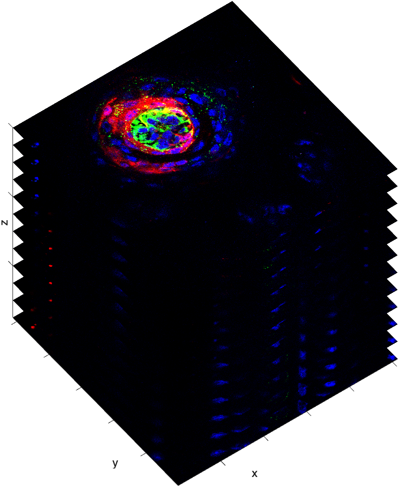

# Loading Microscopy Volumes

Image volumes created by advanced micrography, such as confocal imaging, are best loaded into MATLAB using the [Bio-formats](https://www.openmicroscopy.org/bio-formats/) MATLAB toolbox, [**bfmatlab**](../setup/githubRepoInstallation.md). This toolbox can handle the proprietary file formats generated by all of the major microscope manufacturers. Saving image stacks in the proprietary file format of the microscope best ensures that the full resolution and  bit-depth of the image data is preserved, along with all captured metadata.

In this example, we will load a 4D image stack of a taste bud.

{ width="350"}

This image stack has 4 Dimensions. Its size is `512x512x3x12`, which means that each individual slice in the stack is `512x512` and has three channels (like an RGB image). And there are 12 of these slices.

## mmReadImgND

The course function **mmReadImgND** is a wrapper for the tools included in the **bfmatlab** toolbox. The following syntax loads a color image stack created by a confocal microscope.

```matlab linenums="1" title="Load confocal image dataset"
[RGB4,meta] = mmReadImgND("2641-tastebud-RGB.tif");
```

Reviewing the workspace shows the size and class of RGB4…

```matlab title="result"
  Name        Size                    Bytes  Class     Attributes

  RGB4      512x512x3x12            9437184  uint8               
  meta        1x1                      3775  struct              
```

…RGB4 is an 8-bit 4D array. It has 3 channels and 12 image slices. Each image slice in the volume has 512 rows (Height) and 512 columns (Width).

Reviewing the *`meta`* structure reveals the same information , along with size of the voxels (PixelSpacing) in this volume:

```matlab
meta = struct with fields:
            filename: "2641-tastebud-RGB.tif"
    StudyDescription: '2641-tastebud-RGB.tif'
      SeriesSelected: 0
               Width: 512
              Height: 512
            BitDepth: 'uint8'
        PixelSpacing: [0.30333 0.30333 0.75531]
        ChannelCount: 3
          PlaneCount: 12
           TimeCount: 1
                 XML: "<?xml version="1.0" encoding="utf-8"?>↵<OME xmlns:xsi="http://www.w3.org/2001/XMLSchema-instance" xsi:schemaLocation="http://www.openmicroscopy.org/Schemas/OME/2016-06 http://www.openmicroscopy.org/Schemas/OME/2016-06/ome.xsd">↵<Image ID="Image:0" Name="2641-tastebud-RGB.tif">↵<Description/>↵<Pixels BigEndian="true" DimensionOrder="XYCZT" ID="Pixels:0" Interleaved="false" PhysicalSizeX="0.303326643969745" PhysicalSizeXUnit="µm" PhysicalSizeY="0.303326643969745" PhysicalSizeYUnit="µm" PhysicalSizeZ="0.755310778914241" PhysicalSizeZUnit="µm" SignificantBits="8" SizeC="3" SizeT="1" SizeX="512" SizeY="512" SizeZ="12" Type="uint8">↵<Channel ID="Channel:0:0" SamplesPerPixel="1">↵<LightPath/>↵</Channel>↵<Channel ID="Channel:0:1" SamplesPerPixel="1">↵<LightPath/>↵</Channel>↵<Channel ID="Channel:0:2" SamplesPerPixel="1">↵<LightPath/>↵</Channel>↵<MetadataOnly/>↵</Pixels>↵</Image>↵</OME>"

```

## Using imread

The **imread** function can be used to image stacks saved in the .TIF file format.

To load an image stack, you first need information about that stack. In this example, we will use this .TIF file

The function **imfinfo** returns the metadata for an image stack.

```matlab linenums="1" title="Load the metadata"
meta = imfinfo("TasteBud3D.tif")
```

```matlab title="Output from imfinfo"
meta = 

  12×1 struct array with fields:

    Filename
    FileModDate
    FileSize
    Format
    FormatVersion
    Width
    Height
    ⋮
```

…For this example file, we get a lot of metadata (more than 39 fields). Notice that *`meta`* is a `12X1` structure, so in fact, you get a metadata structure element for *each* slice in the image stack. This is one way to determine the number of slices in the image stack. Most of the data is repeated for each slice, so we can examine the metadata for the first image slice to get information about the image slices:

```matlab title="Review element 1 of the metadata structure"
numel(meta) % number of slices

ans = 

    12

meta(1).Width % number of columns

ans =

   512

meta(1).Height % number of rows

ans =

   512
meta(1).BitDepth % bit depth

ans =

     8
```

…Here we review the first element in the metadata structure and we find that each slice in the image stack is an unsigned 8-bit image with 512 rows (Height) and 512 columns (Width). So, the size of our image stack is `512 X 512 X 12`.

The function **`imread`** can read slices from a .TIF image stack. To read in a slice, you call **`imread`** as you would for a 2D image. The following code loads the first slice from a 3D Image stack.

```matlab linenums="1" title="Read a single slice using imread"
slice = imread("TasteBud3D.tif") % read in the first slice
```

If you want to load a different slice, you indicate the slice number as a second input in **imread**

```matlab linenums="1" title="Indicate which slice to read using imread"
slice3 = imread("TasteBud3D.tif",3) % read in the third slice
```

If you want to load the whole stack using **`imread`**, you need a **`FOR LOOP`**.

```matlab linenums="1" title="Load a TIF image stack using imread"
% preallocate variable
num_rows = meta(1).Height; % number of rows
num_cols = meta(1).Width; % number of columns
num_slices = numel(meta); % number of slices in the image stack
STACK = zeros(num_rows, num_cols, num_slices,'uint8'); % preallocate the variable as a uint8 3D array

% load image stack slice by slice
for n=1:num_slices
    slice = imread("TasteBud3D.tif",n); % read slice from file
    STACK(:,:,n) = slice; % add slice to incrementing location in stack
end
```

…When loading large datasets, it is always a good idea to [preallocate the variable](https://www.mathworks.com/help/matlab/matlab_prog/preallocating-arrays.html) prior to running the **`FOR LOOP`**. Notice how we match the bit depth of the preallocated variable to the bit depth of the image stack. Failure to do so results in bit depth mismatching and much gnashing of teeth.

Reviewing the image stack in the workspace shows the following:

```matlab title="Output from whos"
  Name               Size                    Bytes  Class     Attributes

  STACK            512x512x12              3145728  uint8               
```

…The image stack is loaded into MATLAB just like any other numeric array.
