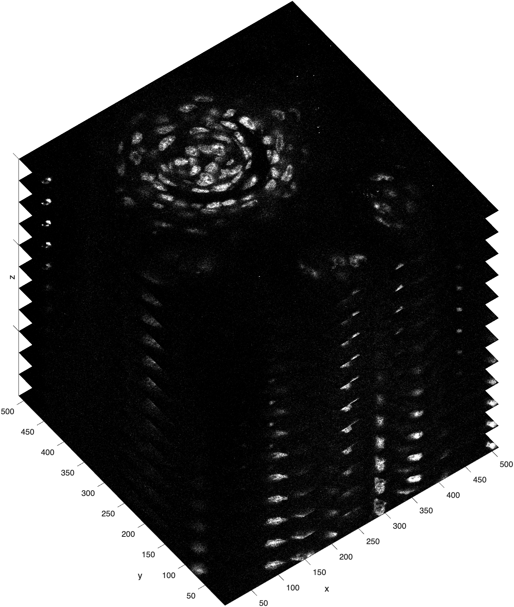
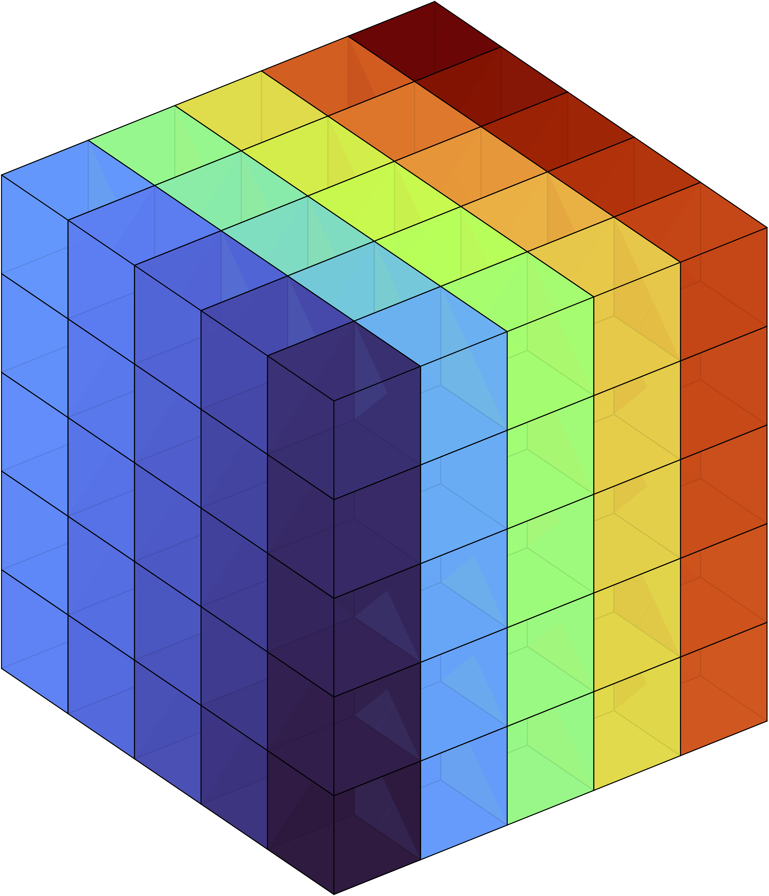
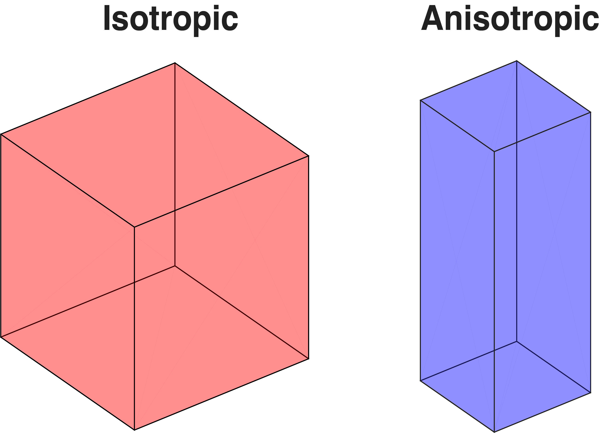

# Volumetric Image Data

Image volumes are like a deck of cards :material-cards-playing: in that they are basically a stack of sequential images. In fact, image volumes are often called image *stacks*. The simplest image volumes have just the three dimensions: X,Y, and Z. In these volumes, images are stored in the xy-plane (like the cards in the deck) and then stacked along the z-dimension, like in this image here:

{ width="450"}

>**Confocal Image Stack from a mouse taste bud.** This image stack was created by a [confocal microscope](https://en.wikipedia.org/wiki/Confocal_microscopy), which captured the volume slice by slice. Starting at the top of the tissue, the microscope captured the surface layer of the tissue and then adjusted the focal plane down the z-axis to captured the next layer. Because the depth of each layer is changed by adjusting the focal plane (and not physically cutting the tissue), each image in this stack is also called an optical slice. As you can see, there are 12 optical slices in this confocal stack. Each optical slice has 512 rows and 512 columns (height and width). Note, in this visualization, the slices along the z-dimension are artificially separated for display purposes to delineate all slices in the stack

<!--
 In this configuration, the z-dimension usually represents either time or distance. If time, then the image stack would in fact be a movie strip. If distance, then the image stack represents the volume of something, like the volume of a tissue section.
-->

## Multidimensional Volumes

In addition to depth, image stacks can also contain color or time information. This information is stored in higher dimensions of the volume. Such volumes are sometimes labeled as `XYCZT`, to indicate the following:

| Dimension | Denotation | Description                                   |
| --------- | -------- | ----------------------------------------------- |
| 1         | X        | the number of columns in the image plane        |
| 2         | Y        | the number of rows in the image plane           |
| 3         | C        | the number of color channels in the volume      |
| 4         | Z        | the number of z-slices (or depth) in the volume |
| 5         | T        | the number of time frames in the volume         |

>So, in an `XYCZT` volume, the first 2 dimensions, X and Y, contain information for a given image plane in the volume, while the higher dimensions represent color, depth, and time, in that order. Note that the order of dimensions can vary depending on the imaging system or software used. For instance, some volumes may be organized as XYZCT or follow another similar permutation.

{ width="450"}

>**Color Image Stack**. As you can see in the above volume, a color component was also captured with each slice.

## Volume as a Cuboid

{ width="250"}

Another way to think of an image volume is as a [cuboid](https://en.wikipedia.org/wiki/Cuboid) made up of smaller cuboids, almost like a Rubik's cube. In this visualization, each of the smaller cuboids is called a **voxel**, the 3D version of a pixel. Like pixels, voxels are point samples and have dimensionality (meaning they have a length, width, and height).

!!! note "Voxel"
    A voxel is a representation of a value on a three-dimensional regular grid, akin to the two-dimensional pixel (1).
    { .annotate }

    1. Adapted from [Wikipedia](https://en.wikipedia.org/wiki/Voxel)

    Think Minecraft

    { width="150"}

### Voxel Shapes

Voxels can be either perfect little cubes, where the dimensions are identical, or cuboidal, where they are not. 

- **Isotropic:** all dimensions of a voxel are identical (i.e. a cube)
- **Anisotropic:** One or more dimensions are not the same (i.e. cuboidal)

In the taste bud image stack, the voxel dimensions are 0.3 µm (x-axis) x 0.3 µm (y-axis) x 0.75 µm (z-axis). So, the voxels in this image stack are not perfect little cubes, but are instead *cuboidal* (aka anisotropic).

{ width="200"}

>**Isotropic vs Anistropic.** The sides of the isotropic voxel are equal along all dimensions, like a perfect cube or a die, while the sides of an anisotropic voxel are equal along the x & y dimensions but different along the z-dimension, resembling a rectangular brick.

### Measuring the Volume

Since voxels have dimensionality, i.e. the lengths of their sides represent real-world measurements, we can use voxels to measure structures inside the volume or the size of the volume itself.

You can usually get the real-world size of a voxel by referencing the metadata. In the above example of a taste bud, the pixel dimensions are 0.3 X 0.3 in the xy plane and 0.75 in the z-plane. So, for example, to get the thickness of the tissue in µm you simply multiply the z-dimension of the voxel by 12 (since there are 12 slices).

$$
0.75 * 12 = 9 \, µm
$$

…And we find that we have a very thin slice of tissue!

To calculate  volume, you first calculate the volume of a single voxel by multiplying the sides of the voxel:

$$
0.3 * 0.3 * 0.75 = 0.0675 µm^3
$$

…This volume is smaller than that of an E.coli bacterium.

To calculate the volume of the whole image stack, you multiply the volume of a voxel by the total number of voxels in the stack…

$$
512 \times 512 \times 12 = 3,145,728 \, voxels
$$

…which converts to…

$$
3,145,728 \times 0.0675 \, \mu\text{m}^3 = 212,336.64 \, \mu\text{m}^3
$$

So the total volume of the image stack is $2.12 \times 10^{-7}$ mL — again, very, very small! (1). If we wanted to calculate the volume of an internal structure inside the volume, we would first segment that structure, add up the number of voxels contained in that structure, and then multiply that number by size of a voxel.
{.annotate}

1. Note: This conversion is based on the fact that $1 \, \mu\text{m}^3 = 10^{-15} \, \text{m}^3$, and $1 \, \text{m}^3 = 10^3 \, \text{L} = 10^6 \, \text{mL}$, so $1\, \mu\text{m}^3 = 10^{-12}$ mL
