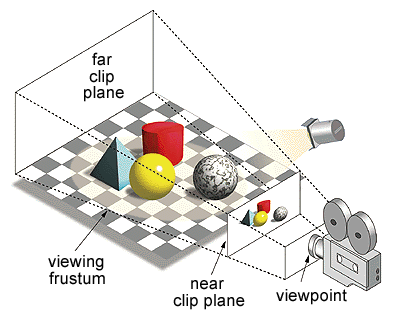
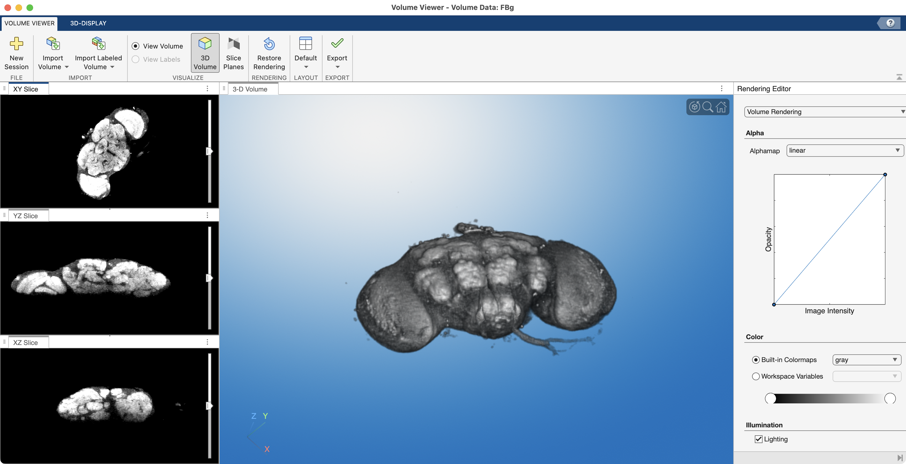
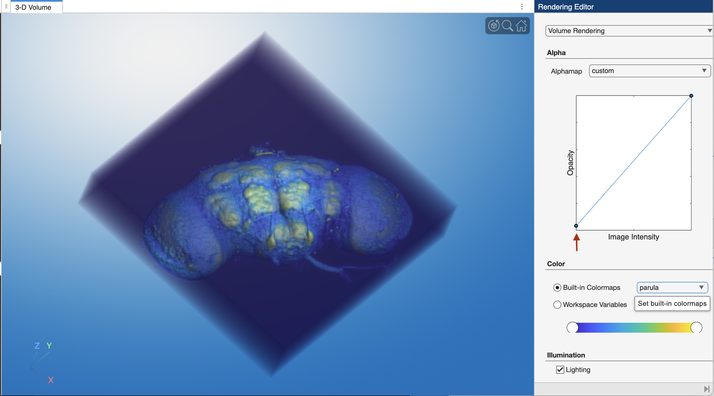
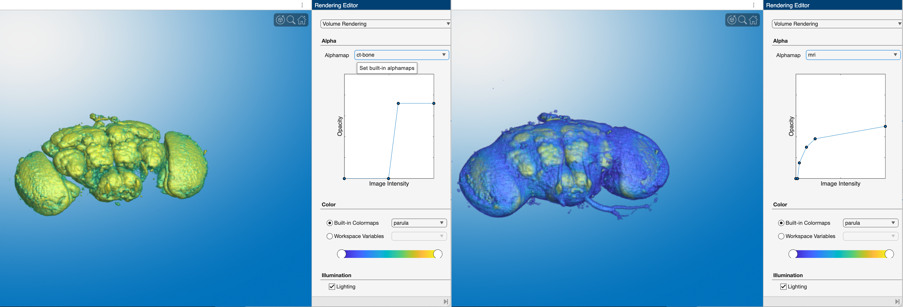
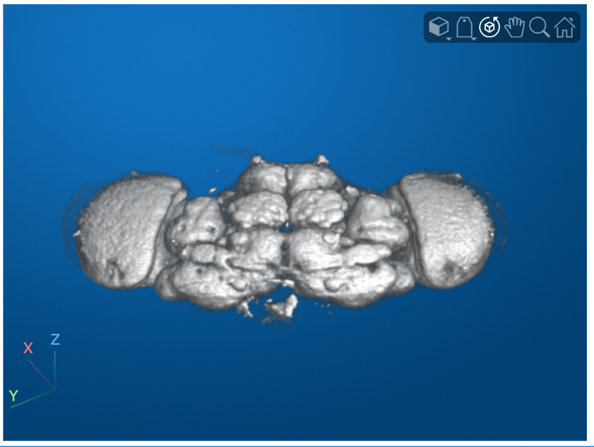
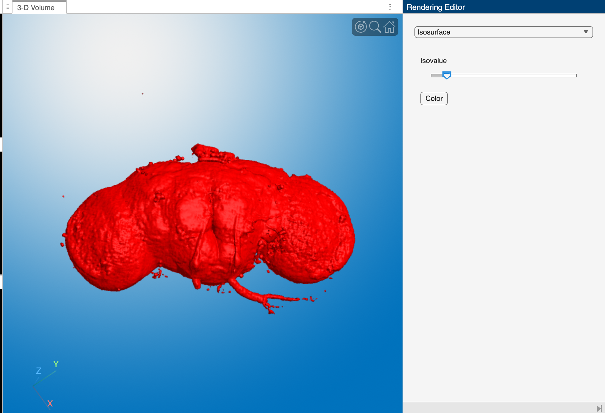

# Volume Rendering and Surface Meshes

When dealing with Image Volumes, it is often useful to see "inside" the volume — that is, to construct 3D representations of internal structures inside that volume. 3D Rendering is the computer graphics process of converting 3D models into 2D images for display on a 2D computer screen. The process considers the positioning of the objects in this 3D scene and renders a 2D image based on this perspective. Any change in the view, such as rotating the scene, generates a new render to reflect the new perspective of the 3D scene, as shown below.

{ width="250"}

>In 3D graphics, the **Viewing frustrum** is the computed view from a virtual camera, represented here as a truncated pyramid lying on its side. Notice the smaller end of the pyramid is closest to the camera, while the large end is further way, representing foreshortening. Everything between the near and far clip planes is the viewing area, and will be rendered. Here, the "near clip plane" represents what is rendered in the 3D Scene. If you move the position of the camera, you change the position of the viewing frustrum and render a different image. For example, if you rotate the camera to the right, the red cylinder would appear in front of the yellow sphere.

There are two main types of rendering that we deal with in this course:

- **Volume Rendering:** visualizes 3D structures by  adjusting the transparencies of the voxels of a 3D volume. Usually, you make completely transparent the outer edge and background voxels, while keeping opaque internal voxels that comprise the structures of interest. Typically, this involves creating a lookup table of transparencies, called an alphamap, that determines the transparencies values for all the voxels in the volume. Only voxels that are not completely transparent are rendered.

- **Surface rendering:** visualizes a surface model of an internal structure. For surface rendering, you first need to create a surface model, made up of vertices and triangular faces. In this method, only the surface is rendered, the rest of the volume is ignored. This technique is commonly used in medical imaging to visualize segmented structures like bones or organs.

## The Volume Viewer App

The MATLAB app **`volumeViewer`** accepts 3D volumes and can render them in 3D, allowing users to visualize and interact with the volumes in a graphical interface.

For this example, we will load a confocal stack of a fruit fly brain.

```matlab linenums="1" title="Load Fly Brain"
[FB,meta] = mmReadImgND("flybrain.tif");
```

```matlab title="Review volume using whos"
  Name        Size                     Bytes  Class     Attributes

  FB        256x256x3x57            11206656  uint8               
  meta        1x1                       3725  struct       
```

- FB is a 4D array with 3 channels and 57 slices. Note that the blue channel is blank (all zeros), which means it does not contribute to the rendering process and can be ignored or excluded when visualizing or processing the data.

### Volume Rendering

**`volumeViewer`** can only handle 3D volumes. So, we'll extract the green channel and display using the app.

```matlab linenums="1" title="Load Ch2 into Volume Viewer"
FBg = squeeze(FB(:,:,2,:)); % extract ch2
volumeViewer(FBg) % display channel 2 in the Volume Viewer app
```

{ width="750"}

>**Screen grab of the Volume Viewer app showing a volume render of the green channel from the fly brain.** The layout has been changed to "Stack 2D slices".

In the **Left Panel,** of the Volume viewer, we see orthogonal slice views from the middle of the volume. The top orthogonal view shows an aerial view of the volume, where the direction of the Z-axis is "out of the screen", towards the viewer. The other two views show views from the sides of the volume, where either the X or Y axis "comes out of the screen." You drag the scroll bar to scrub through slices in the volume along the axis that is coming out of the screen.

The **Large Middle Panel,** shows A 3D render of the volume. In this render, the background voxels surrounding the fly brain have been set to completely transparent, while the voxels that make up the brain tissue are semi-opaque.

In the **Right Panel,** we find the Volume Rendering settings. At the top, the pop-up menu is set to "Volume Rendering." The "Alpha" panel shows the alphamap: a lookup table of voxel transparencies. The alphamap is currently set to "linear." In simple terms, this means that voxels with low intensity values (like 0) are completely transparent, while brighter voxels are more opaque. This allows the background to disappear while highlighting the structures of interest. The "Color" panel shows the colormap (LUT) settings, which in this case is set to the default gray colormap.

We can adjust the Volume Rendering displays using the settings in the right panel.

{ width="450"}

>**Adjusting volume rendering settings.** Here we changed the volume render by  adjusting the alphamap to make the background voxels more opaque. We do this by dragging the left point on the line plot *slightly* upward (red arrow). We also changed the colormap to **`parula`** in the "Color" panel.

There are of course many ways to change the volume render. The "Alphamap" pop-up menu contains a variety of alphamap presets. These are primarily for medical image datasets and are name accordingly: e.g. MRI or CT-BONE. You can also roll your own alphamap by adding points to the alphamap line plot and adjusting their positions manually.

{ width="750"}

>**Comparison of transparency map presets**. Notice how the changes in the transparency map line plot change which voxels in the volume are rendered. **Left Image.** `ct-bone` preset. **Right Image** `mri` preset.

### volshow

The function **volshow** renders the inputed volume using the default alphamap settings.

{ width="350"}

>Similar to **imshow**, **volshow** renders the image in its own figure or directly into a Live Script. To adjust the alphamap, you need to add inputs into the function call. Review the [MATLAB help documentation](https://www.mathworks.com/help/images/ref/volshow.html) for more information.

### Isosurface

A 3D surface model is also known as a Mesh or a Manifold. Surfaces are made up of Vertices and Faces.

One way to generate a Surface Mesh is to use an `isosurface`. An isosurface is  created by connecting voxels with the same intensities in a volume.  Other pre-processing steps may be required, often making surface rendering more time consuming than volume rendering, but the final product can appear more realistic and detailed.

Surface analysis is useful when you:

- Need to rotate the surface in 3D space for you analysis
- Want to measure the extent of your 3D object (e.g. the length of a Femur)
- Want to compare two surfaces in 3D space

**volumeViewer** can create such a surface on the fly by Switching the Rendering Engine to "Isosurface".

{ width="450"}

>**Isosurface render of the fly brain.** Notice the controls have changed dramatically in the right panel — you get one control: a slider.

For the isosurface display, **volumeViewer** does a lot of the processing legwork in the background. First, it constructs a segmented mask of the volume, capturing voxels that fall within the range of the Isovalue set by the slider. Then, it creates a 3D surface based on this mask. Finally, it renders the surface as the beautiful red "isosurface" we see displayed here. Adjusting the Isovalue restarts the process, modifying the generated surface and render displayed.
