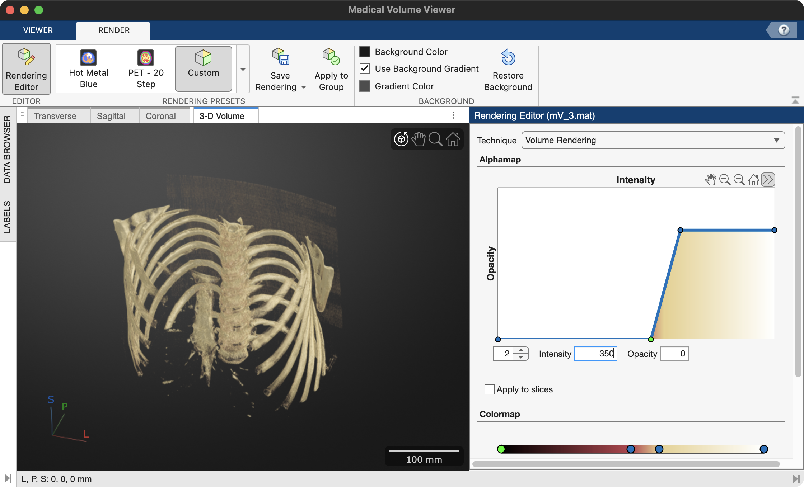
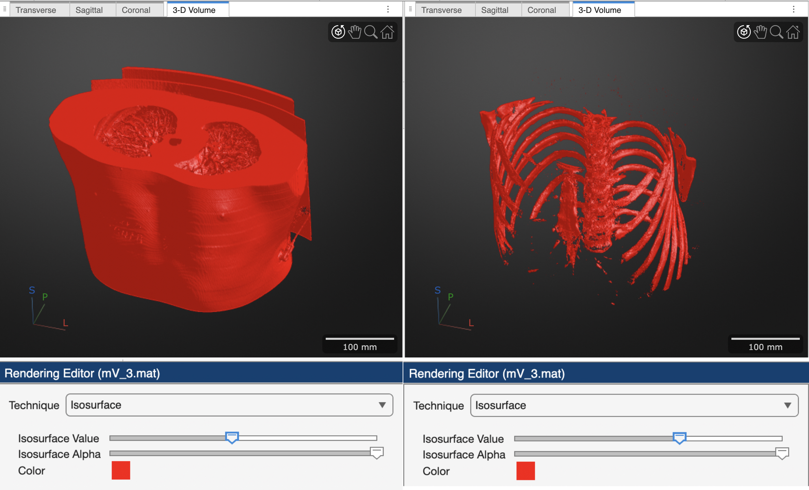

# Volume and Surface Rendering using the Medical Volume Viewer

When dealing with image volumes, it is often useful to see "inside" the volume — that is, to construct 3D representations of internal structures inside that volume. 3D Rendering is the computer graphics process of converting 3D models into 2D images for display on a 2D computer screen. The process considers the positioning of the objects in a 3D scene and renders a 2D image based on this perspective. Any change in the view, such as rotating the scene, generates a new render to reflect the new perspective of the 3D scene, as shown below.

{ width="250"}

>In 3D graphics, the **Viewing frustrum** is the computed view from a virtual camera, represented here as a truncated pyramid lying on its side. Notice the smaller end of the pyramid is closest to the camera, while the large end is further way, representing foreshortening. Everything between the near and far clip planes is the viewing area, and will be rendered. Here, the "near clip plane" represents what is rendered in the 3D Scene. If you move the position of the camera, you change the position of the viewing frustrum and render a different image. For example, if you rotate the camera to the right, the red cylinder would appear in front of the yellow sphere.

There are two main types of rendering that we deal with in this course:

- **Volume Rendering:** visualizes 3D structures by  adjusting the transparencies of the voxels of a 3D volume. Usually, the outer edge and background voxels are made completely transparent — to allow viewing inside the volume. Voxels contained within structures of interest are set to varying levels of opacity to reveal (or render) these structures.  In effect, each voxel in volume has a opacity setting based on its intensity value. These opacities are set using a lookup table called an alphamap, which maps opacity to intensity.

- **Surface rendering:** visualizes a surface model of an internal structure. For surface rendering, you first need to create a surface model, made up of vertices and triangular faces. In this method, only the surface is rendered, the rest of the volume is ignored. This technique is commonly used in medical imaging to visualize segmented structures like bones or organs.

## Volume Rendering

Volume Rendering is useful for exploring a large volumetric dataset, like a medical volume. For this example, we load a CT Chest DICOM volume from the unit3 data folder (1) into the Medical Volume Viewer app (2).
{ .annotate }

1. This data is copied from data included with the MATLAB Medical Toolbox and discussed in this [example](https://www.mathworks.com/help/releases/R2026a/medical-imaging/ug/display-3-d-medical-image-data-in-patient-coordinate-system.html){target="_blank"}.
2. The Medical Volume Viewer app is only available with the 2026a Medical Toolbox or greater.

```matlab linenums="1" title="Load and display medical volume"
mmSetUnitDataFolder(3) % set current folder to unit3 data folder
mV = medicalVolume("MedicalVolumeDICOMData/LungCT02") % load DICOM as a medicalVolume
medicalVolumeViewer(mV.Voxels,ScaleFactors=mV.VoxelSpacing) % display volume 
```

{ width="550"}
>**Default Volume Render.** Lung CT loaded into the Medical Volume Viewer app. Here, we maximize the 3-D volume panel containing the volume render (left panel) and open the Render Editor (right panel) to visualize the alphamap. As you can see in the alphamap, the default volume render is a linear gradient of transparencies where low intensity values are transparent and high intensity values are opaque. The effect is a translucent volume render of the dataset.

!!! note "Hounsfield Units (HU)"
    
    For this CT dataset, which has its intensities in Hounsfield Units, it is useful to recall the Hounsfield scale.

    { width="350"}
    > Hounsfield units (HU) are a quantitative measurement of the radiodensity of a substance as seen on a Computed Tomography (CT) scan, ranging from -1000 for air to +1000. [Radiopaedia](https://radiopaedia.org/cases/hounsfield-scale-diagram)

The Medical Volume Viewer app includes several useful alphamap presets for medical datasets, like CT-Lung and CT-Bone, or you can manually adjust the alphamap for even more renders.

<div class="grid cards" markdown>

-   **All Voxels Opaque**

    ---

    { width="450"}
    
    If we drag the left vertex in the linear alphamap all the way up, we set all voxel opacities to 100%. With all voxels opaque, we can now see that our data is cylindrical (matching the shape of the CT bore). In reality, the data is stored as 3D rectangular prism, with intensity values outside the cylinder all set to an arbitrary minimum value (like -3024). The Medical Volume Viewer excludes these voxels from display as they are not part of the captured dataset.

- **CT Lung Preset**

    ---
    { width="450"}
    
    Notice the alphamap here is semi-opaque (15%) for only a small subset of voxel intensities (ranging from -600 to -400). Remember, air intensities fall range around -1000 HUs.

- **CT Bone Preset**

    ---
    { width="450"}
    
    The alphamap here ramps up from an opacity of 0 at a voxel intensity of -16 to an opacity of 72% at voxel intensities of 641 and greater.

- **Manual Render focusing on Bone**

    ---

    { width="450"}
    
    If you want focus on the bones of the dataset, which have a higher HU intensities, you can manually  shift the ramp further to the right, as shown above. Here the alphamap ramps up from a voxel intensity of 350 to a voxel intensity of 1000.  If you review the HU scale, you can see that trabecular Bone intensities start at ~ 300 HUs.

</div>

So, as you can see, we can reveal different internal structures from the exact same volumetric dataset by adjusting the alphamap.

## Surface Rendering

A 3D surface model is also known as a Mesh or a Manifold. Surfaces are made up of Vertices and Faces (usually in the shape of triangles). One way to generate a Surface Mesh is to use the `isosurface` function. An isosurface is  created by connecting voxels with the same intensities in a volume.  Other pre-processing steps may be required, often making surface rendering more time consuming than volume rendering, but the final product can appear more realistic and detailed.

Surface Rendering is useful when you:

- Need to rotate or translate the surface in 3D space for analysis
- Want to measure the extent of your 3D object (e.g. the length of a Femur)
- Want to compare two surfaces

The **medicalVolumeViewer** app can render volumes as surfaces by switching the Rendering Engine to "Isosurface".

{ width="550"}

>Here we have created two different Surface Renders by adjusting the position of the "Isosurface Value" slider. With this setting, the renderer connects voxels with similar intensities.
