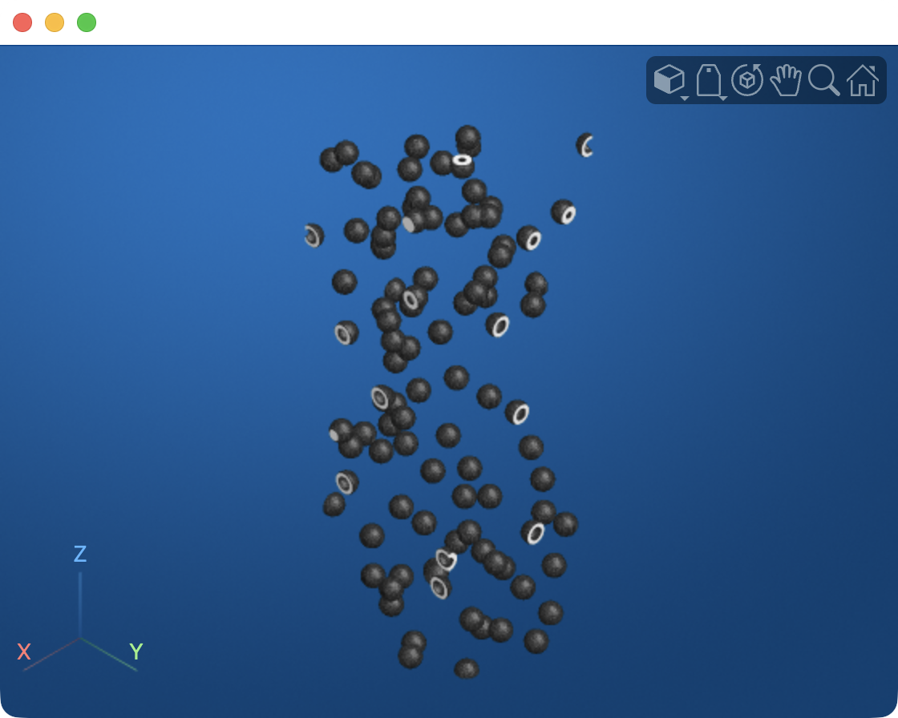
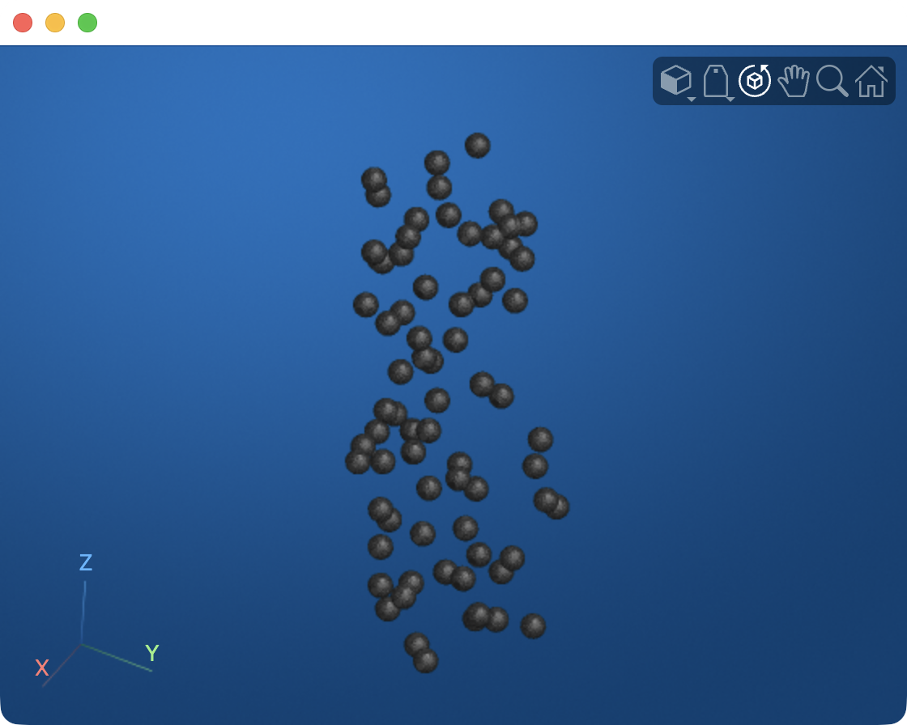
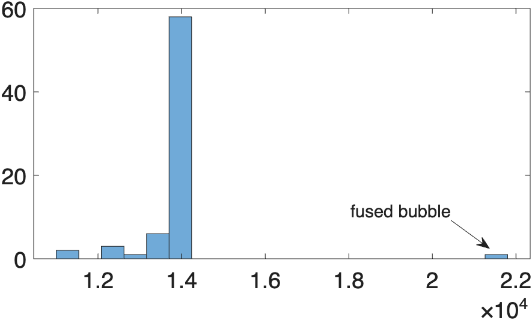
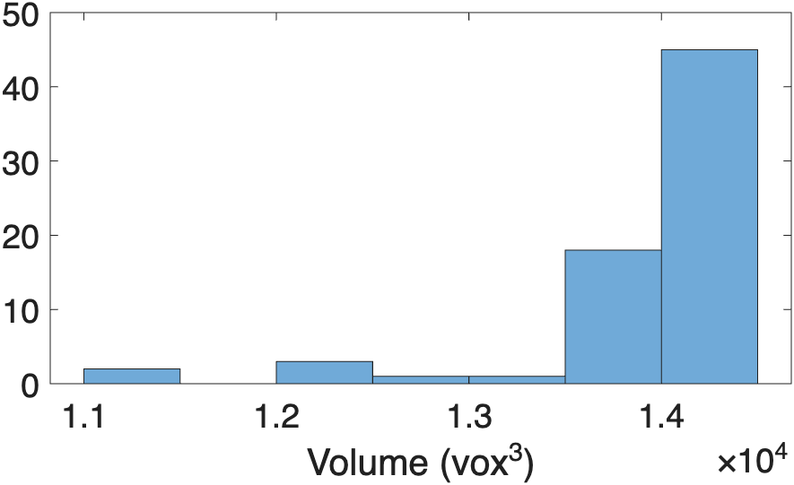
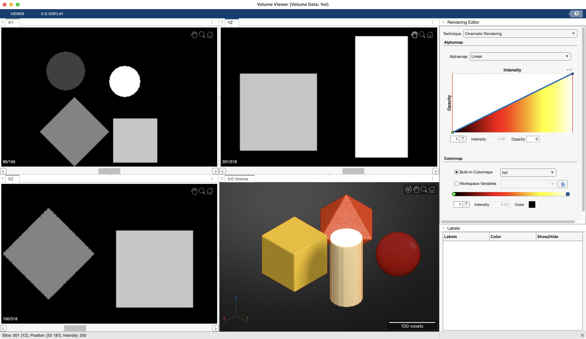
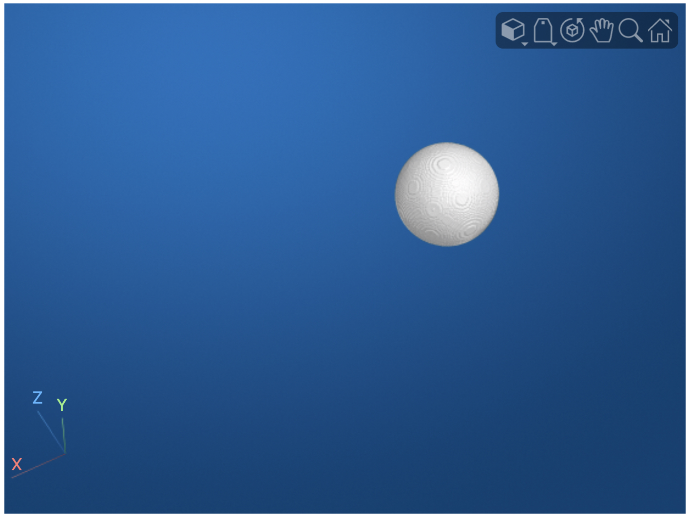
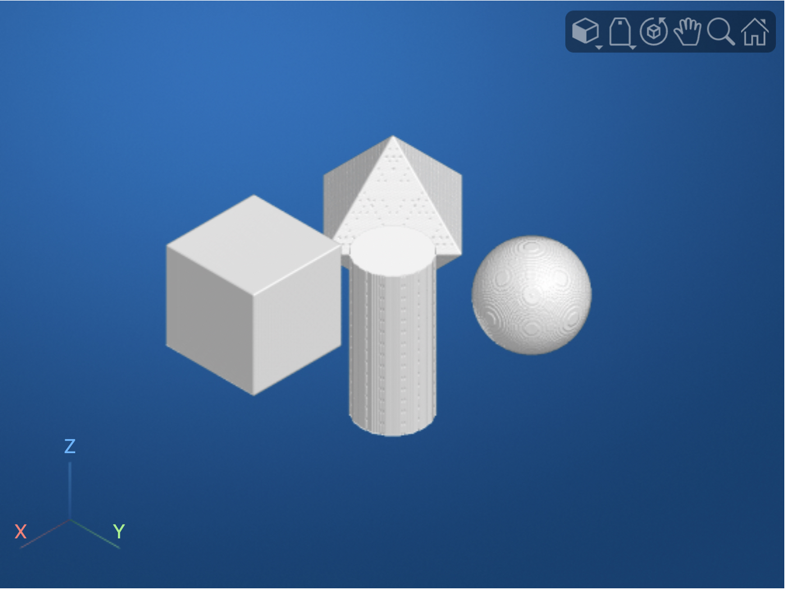

# Volume Segmentation

Volume segmentation is exactly like [Image Segmentation](../imageProcessing/ImageSegmentation.md), but in 3D: instead of just segmenting neighboring pixels, you also segment voxels from adjacent image slices.

Segmentation allows you to isolate specific anatomical structures or features within medical images, such as organs, tumors, or blood vessels, by identifying and labeling voxels that belong to each region of interest. Once a structure is segmented, you can measure its volume, create 3D surface models for visualization, or use it as a mask for further analysis.

## Example: Bubbles

The preprocessing and thresholding steps for 3D volumes are very similar to the [steps we used for 2D segmentation](../imageProcessing/ImageSegmentation.md). Consider the following volume:

```matlab linenums="1" title="Load Bubbles volume"
mmSetUnitDataFolder(3) % set unit 3 data folder
load("bubbles.mat","Vol")
volumeViewer(Vol)
```

{ width="450"}

We can segment the bubbles in the volume using the following steps:

```matlab linenums="1" title="Segment Bubbles"
medVol = medfilt3(Vol); % apply median filter to remove background noise
Mask = imbinarize(medVol); % threshold using default settings
volshow(Mask,RenderingStyle="Isosurface") % render mask
```

{ width="450"}

We can then apply the same morphological operations to clean up the mask…

```matlab linenums="1" title="Clean up mask"
Mask = imfill(Mask,"holes"); % fill interiors of bubbles
Mask = imclearborder(Mask); % remove bubbles touching edges of Volume
volshow(Mask,RenderingStyle="Isosurface")
```

{ width="450"}

…and to separate touching bubbles.

```matlab
waterMask = mmGetWatershed(Mask,[3 1]); % apply watershed transformation
```
>The `mmGetWatershed` function applies the watershed transform to the inputted Mask. The second input of `[3 1]` means the transformation is run twice, first with a Regional Minima pixel size of 3, followed by a pixel size of 1. Often watershed transforms work best with sequential calls.

{ width="750"}
>**Render of the mask before and after the Watershed Transform**. For these renders, we first convert the masks into label maps where each individual bubble has its own numeric label. **In the label map before** the watershed transform, there are 62 individual bubbles, including several fused bubbles. Fused bubbles here have the same color (see arrow and asterisk). **In the label map after** the transform, there are 71 bubbles and only one fused bubble remaining. Here the arrow points to an increased number of colors which indicates an increased number of separated bubbles. Whereas, the asterisk indicates a fused bubble which has the same color throughout. Note, this is the same fused bubble from the "Before" render, but its color has changed because its numeric label, which changed because there are an increase in the number unfused bubbles, shifting the labeling scheme for each bubble in the new label map.

??? example "Code to create the above Watershed Comparison Plot"

    To verify we separated touching bubbles using the watershed transform, we  transform the masks to label maps, where each bubble in the has a unique numeric label. In this label map, bubbles adjacent to each other tend to have adjacent numeric labels. Using `volshow`, we render the masks with the ColorMap set to `colorcube` — a randomized color map that assigns a different color to adjacent lookup values. This allows us to color nearby bubbles separate colors.

    ```matlab linenums="1" title="Visualize Watershed result" 
    % Create Label Maps
    [maskL, countMask] = bwlabeln(Mask); % create label map from mask
    [waterL, countWater] = bwlabeln(waterMask); % create label map from watershed mask
    
    % figure with grid layout
    fig = uifigure(Name="Watershed Transformation",WindowStyle="normal"); % create figure to hold viewers
    g = uigridlayout(fig,[1 2],Padding=[0 0 0 0]); % like tiledlayout, but for uifigures. 1x2 tiles

    % render the before transform volume
    hvr1 = viewer3d(parent=g, ... % add to first grid
        BackgroundColor="white", ... % white background
        BackgroundGradient="off", ... % no gradient
        CameraZoom=1, ...
        Title=sprintf("Before transform - %d",countMask)); % set background color to white and turn off gradient
    volshow(maskL, ... % volume before transform
        Parent=hvr1, ... % display in first viewer3D
        Colormap=colorcube, ... % random colors
        RenderingStyle="CinematicRendering")

    % render the after transform volume
    hvr2 = viewer3d(parent=g, ... % add to second grid
        BackgroundColor="white", ... % white background
        BackgroundGradient="off", ... % no gradient
        CameraZoom=1, ...
        Title=sprintf("After transform - %d",countWater)); 
    volshow(waterL, ... % volume after transform
        Parent=hvr2, ... % display in second viewer3D
        Colormap=colorcube, ... % random colors
        RenderingStyle="CinematicRendering")
    ```

### Region Properties

Finally, we can calculate the properties of the segmented bubbles using the function `regionprops3`

```matlab linenums="1" title="Calculate properties"
rp = regionprops3(waterMask)
```

```matlab
rp =

  71×3 table

    Volume             Centroid                                BoundingBox                    
    ______    __________________________    __________________________________________________

    14002     82.997    234.98    16.988     68.5    220.5      2.5       29       29       29
    14008        195       134    19.997    180.5    119.5      5.5       29       29       29
    13684     114.04    170.69    21.995     99.5    156.5      7.5       29       29       29
   
      :                   :                                         :                         

    14002     185.01    117.01       721    170.5    102.5    706.5       29       29       29
    14015     151.01    95.005       727    136.5     80.5    712.5       29       29       29
    13987     227.99    49.003       733    213.5     34.5    718.5       29       29       29
```

>`rp` has 71 rows: one row for each bubble.

```matlab linenums="1" title="Histogram"
histogram(rp.Volume,20)
```

{ width="450"}
>Histogram of bubble volumes

A histogram of the bubble volumes easily identifies the fused bubble, which has a volume nearly twice the average bubble volume.

We can exclude this volume from further analysis using a simple logical operation:

```matlab linenums="1" title="Exclude Fused Bubble"
la = rp.Volume < 1.6e4; %  only volumes below cut-off
figure;
histogram(rp.Volume(la))
xlabel("Volume (vox^3)")
set(gca,"FontSize",18)
```

{ width="450"}
>Histogram of only non-fused bubble volumes

## Label Maps

Often when segmenting, it is convenient to create label maps, instead of binary arrays. This is especially true when the segmentation occurs sequentially, or when it is important to maintain separate labels for a segment, such as for left and right kidneys.

Consider the following label map, 'shapes3D.mat'(1), which loads as the variable `Vol`.
{ .annotate }

1. The volume, 'shapes3D.mat' is stored as a MATLAB .mat file and can be found in the Unit 3 data folder.

```matlab linenums="1" title="Load Vol"
clearvars
mmSetUnitDataFolder(3) % switch to the Unit 3 Folder
load('shapes3D.mat','Vol'); % load volume as Vol
```

```matlab linenums="1" title="Volume Dimension and Class"
size(Vol)
```

```matlab
 ans =
   318   318   159
```

```matlab linenums="2"
class(Vol)
```

```matlab
ans =
    'uint8'
```

As you can see the label map is a `318x318x159` uint8 volume.  

```matlab linenums="1" title="Volume Histogram"
imhist(Vol)
```

As shown in the histogram, the label map only contains 5 different intensity values (0 plus four more values).

{ width="250"}

We can determine the intensity values in `Vol` using the `unique` function

```matlab linenums="1" title="Get Unique Intensities"
vals = unique(Vol(:)); % unique values
```

```matlab
vals =

  5×1 uint8 column vector

     0
    64
   128
   192
   250
```

A volume render reveals the label map has four embedded shapes of differing intensities.

```matlab linenums="1" title="Volume Render"
volumeViewer(Vol) % render Vol
```

{ width="750"}
> **Volume Render of label map containing multiple 3D shapes.** Here we use the volumeViewer app to render the volume using the "Cinematic Rendering" setting and the "hot" colormap. As you can see in the 3-D volume panel, there are four embedded shapes in the volume: a Cylinder, a Diamond, a Cube, and a Sphere. Each shape comprises a uniform set of intensity values, which is why each shape is rendered in a different hot pseudocolor in the 3D view and in differing shades of gray in the cross-sectional orthogonal views. You can review the intensity values by moving the mouse pointer over a shape in any of the orthogonal views (it doesn't work in the 3D view).

### Segmenting out one shape

Our label map contains only 5 intensity values: a background intensity of 0 plus four different label values, which are segregated by shape.

| Shape      | Intensity |
| ---------- | --------- |
| Background | 0         |
| Sphere     | 64        |
| Diamond    | 128       |
| Cube       | 192       |
| Cylinder   | 250       |

If we want to process a single shape, we can easily index out the shape using a logical operation. For example, to index out the sphere, we just need the following logical operation:

```matlab linenums="1" title="Segment Sphere"
Mask = Vol == 64; % match intensity of 64
volshow(Mask)
```

>`Mask` is a logical array where the sphere voxel values are all logical trues.

{ width="250"}

Or, if we want both the cube and the cylinder, we could use this logical operation

```matlab linenums="1" title="Segment Cube and Cylinder"
Mask = Vol > 128;
```

{ width="250"}
>Here, `Mask` is a logical array, both the cube and cylinder voxel values consist solely of logical `trues`.

Type-casting the volume to a logical array segments all the shapes to logical trues (since all intensity values greater than zero are contained within one of the four shapes).

```matlab linenums="1" title="Segment all shapes"
Mask = logical(Vol);
volshow(Mask)
```

{ width="250"}
>Here, all shape intensity values are logical `trues`.

### Region Properties

We can calculate the region properties of the shapes using the `regionprops3` function

```matlab linenums="1" title="Get region properties of shapes"
rp = regionprops3(Mask)
```

```matlab
rp =

  4×3 table

      Volume               Centroid                                BoundingBox                    
    __________    __________________________    __________________________________________________

    6.9387e+05    80.001    80.001        80      0.5      0.5      0.5      159      159      159
    6.2602e+05    195.17    195.17        80    159.5    159.5      0.5       71       71      159
    1.0303e+06       219        60        60    168.5      9.5      9.5      101      101      101
    4.7792e+05        60       219        60     11.5    170.5     11.5       97       97       97
```

We get four rows in the region properties table, `rp`, because there are four shapes in `Mask`.

If we want a little clarity on which properties belong to which shapes, we can first convert the label map `Vol` to a categorical array and then calculate the properties:

```matlab
volCat = categorical(Vol,[64 128 192 250],["Sphere" "Diamond" "Cube" "Cylinder"]);
rp = regionprops3(volCat,Vol,["Volume" "Centroid" "MaxIntensity"])
```

```matlab
rp =

  4×4 table

    LabelName       Volume               Centroid             MaxIntensity
    __________    __________    __________________________    ____________

    "Sphere"      4.7792e+05        60       219        60         64     
    "Diamond"     6.9387e+05    80.001    80.001        80        128     
    "Cube"        1.0303e+06       219        60        60        192     
    "Cylinder"    6.2602e+05    195.17    195.17        80        250     
```

Now, the region properties table, `rp`, has a column LabelName which can be used to match the Shape to the property. 