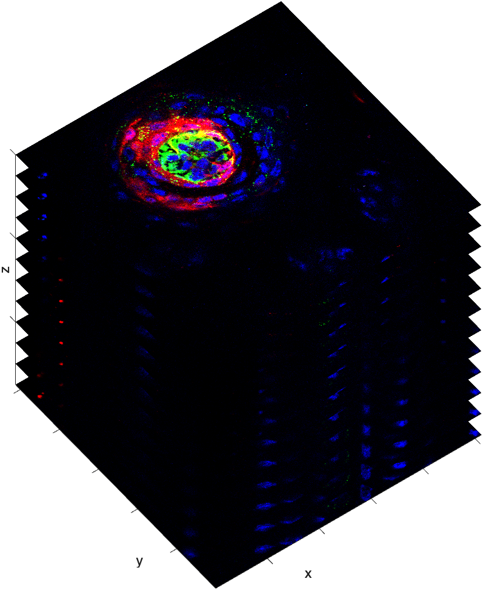

# Viewing Image Stacks

Viewing image stacks often starts by viewing the individual slices of the stack.  Consider the [taste bud image stack](loadingConfocalDatasets.md).

{ width="350"}

This image stack has 4 Dimensions. Its size is `512x512x3x12`, where the first two dimensions (`512x512`) represent the height and width of each slice, the third dimension (`3`) corresponds to the color channels (e.g., RGB), and the fourth dimension (`12`) represents the number of slices in the stack.

## Viewing Individual Slices

A simple way to review the image stack is to index out and view single slices, as follows.

```matlab linenums="1" title="Display single channel slice"
slice = RGB4(:,:,1,6); % all rows, all columns, channel 1, slice 6
imshow(slice)
title("Red Channel, Slice 6")
```

{ width="250"}

You can also display a slice with all the channels, as follows:

```matlab linenums="1" title="Display slice in color"
imshow(RGB4(:,:,:,6))
title("All Channel, Slice 6")
```

{ width="250"}

### Course Function - mmSliceView

The [course function](../reference/courseFunctions.md) **mmSliceView** is a custom MATLAB function designed to display individual slices from an image stack interactively.

```matlab linenums="1" title="mmSliceView"
mmSliceView(RGB4)
```

{ width="450"}

Using **mmSliceView**, you can scrub through the slices of the stack using the mouse scroll wheel. You can also adjust the contrast of the image slice and specify which channel to display.

## Montage

To view all slices of a stack in a single view, you can use the function **`montage`**, which reformats all the slices into a 2D matrix of images. This works better with a small number of slices.

```matlab linenums="1" title="Display Montage"
montage(RGB4)
```

{ width="450"}

>As you can see, **`montage`** accepts 4D arrays with 3 channels. It reformats all the slices into a grid layout (2D matrix) for visualization purposes and displays them as an RGB image. The first slice is positioned in the upper left corner, and the last slice is in the bottom right corner. Notice the montage contains 12 different color images, one for each slice.

If we want to inspect just one channel, you first index out the channel of interest and then plug the 3D array into **`montage`**.

```matlab linenums="1" title="View Blue Channel as a montage"
BLUE = squeeze(RGB4(:,:,3,:)); % index out the blue channel as a 3D array
montage(BLUE)
```

{ width="450"}

>A `4X3` montage of all the slices from the BLUE 3D image stack. The number of each slice has been added to the top left corner of each cross-section for clarity.

## Max Projections

Another way to view an image stack is as a max projection, which enhances visibility by collapsing the brightest structures across slices into a single image. This technique is particularly useful for highlighting features that span multiple slices or for summarizing the entire stack in one view.  It's like an aerial view of the image stack.

Here, we create a max projection of the BLUE array we created above. Recall that *`BLUE`* is a 3D array where the z-axis is in the 3rd dimension:

```matlab linenums="1" title="Max Projection of a 3D array"
proj = max(BLUE,[],3); % max projection across 3rd dimension.
imshow(proj)
title("Max Projection Blue Channel")
```

{ width="250"}

>Notice this image has more information than any of the individual slices shown in the above montage.

We can create a color projection by capturing a max projection of a 4D array. Remember, in a 4D array, the z-axis is in the 4th dimension.

```matlab linenums="1" title="Max Projection of a 4D array"
proj = max(RGB4,[],4); % max projection across 4th dimension
imshow(proj)
```

{ width="250"}

>Here, the max projection ,*`proj`*, retains the color information from the original 4D array, with 3 channels displayed in color.
