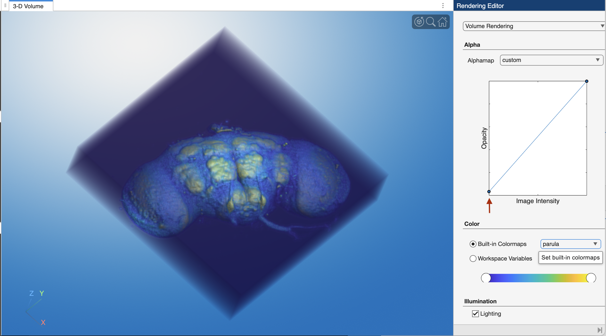
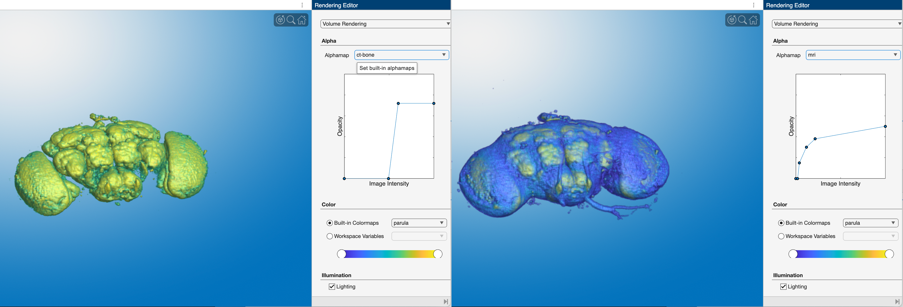
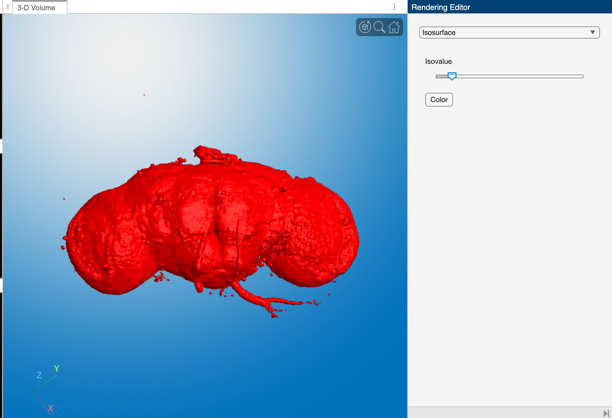

Upon loading the image, the volumeViewer app displays three orthogonal slice views of the volume in the slice viewer panels on the left and one 3D render of the volume in the 3-D volume panel. In the Rendering Editor panel on the right, is a plot of the alphamap. As you can see, the alphamap has a linear relation to voxel intensities.

In the default alphamap only voxels inside the CT bore are opaque—hence the cylindrical 3D render. You can adjust the alphamap to view all voxels in the volume

The volumeViewer app automatically renders the volume on load. You can adjust the Render settings

## The Volume Viewer App

The MATLAB app **`volumeViewer`** accepts 3D volumes and can render them in 3D, allowing users to visualize and interact with the volumes using a graphical interface. This app is 

For this example, we will load a confocal stack of a fruit fly brain, which can be find in the MtMdata/unit3 folder:

```matlab linenums="1" title="Load Fly Brain"
[FB,meta] = mmReadImgND("flybrain.tif");
```

```matlab title="Review volume using whos"
  Name        Size                     Bytes  Class     Attributes

  FB        256x256x3x57            11206656  uint8               
  meta        1x1                       3725  struct       
```

- FB is a 4D array with 3 channels and 57 slices. Note that the blue channel is blank (all zeros), which means it does not contribute to the rendering process and can be ignored or excluded when visualizing or processing the data.

### Volume Rendering

**`volumeViewer`** can only handle 3D volumes. So, we'll extract the green channel for display.

```matlab linenums="1" title="Load Ch2 into Volume Viewer"
FBg = squeeze(FB(:,:,2,:)); % extract ch2
volumeViewer(FBg) % display in the Volume Viewer app
```

{ width="750"}

>**Screen grab of the Volume Viewer app showing a volume render of the green channel from the fly brain.** The layout has been changed to "Stack 2D slices".

The **Left Panel** of the Volume viewer has stacked orthogonal slice views. Here we show slices from the middle of the volume. The top orthogonal view shows an aerial view of the volume, where the direction of the Z-axis is "out of the screen", towards the viewer. The other two views show views from the sides of the volume, where either the X or Y axis "comes out of the screen." You drag the scroll bar to scrub through slices in the volume along the axis that is coming out of the screen.

The **Large Middle Panel** shows A 3D render of the volume. In this render, the background voxels surrounding the fly brain have been set to completely transparent, while the voxels that make up the brain tissue are semi-opaque.

The **Right Panel** contains the Volume Rendering settings. At the top, the pop-up menu is set to "Volume Rendering." The "Alpha" panel shows the alphamap: a lookup table of voxel transparencies. The alphamap is currently set to "linear." In simple terms, this means that voxels with low intensity values (like 0) are completely transparent, while brighter voxels are more opaque. This allows the background to disappear while highlighting the structures of interest. The "Color" panel shows the colormap (LUT) settings, which in this case is set to the default gray colormap.

We can adjust the Volume Rendering displays using the settings in the right panel.

{ width="450"}

>**Adjusting volume rendering settings.** Here we changed the volume render by  adjusting the alphamap to make the background voxels more opaque. We do this by dragging the left point on the line plot *slightly* upward (red arrow). We also changed the colormap to **`parula`** in the "Color" panel.

There are of course many ways to change the volume render. The "Alphamap" pop-up menu contains a variety of alphamap presets. These are primarily for medical image datasets and are name accordingly: e.g. MRI or CT-BONE. You can also roll your own alphamap by adding points to the alphamap line plot and adjusting their positions manually.

{ width="750"}

>**Comparison of transparency map presets**. Notice how the changes in the transparency map line plot change which voxels in the volume are rendered. **Left Image.** `ct-bone` preset. **Right Image** `mri` preset.


## Isosurface

{ width="450"}

>**Isosurface render of the fly brain.** Notice the controls have changed dramatically in the right panel — you get one control: a slider.

For the isosurface display, **volumeViewer** does a lot of the processing legwork in the background. First, it constructs a segmented mask of the volume, capturing voxels that fall within the range of the isovalue set by the slider. Then, it creates a 3D surface based on this mask. Finally, it renders the surface as the beautiful red "isosurface" we see displayed here. Adjusting the Isovalue restarts the process, modifying the generated surface and render displayed.

### volshow

The function **volshow** renders the inputted volume using the default alphamap settings.

{ width="350"}

>Similar to **imshow**, **volshow** renders the image in its own figure or directly into a Live Script. To adjust the alphamap, you need to add inputs into the function call. Review the [MATLAB help documentation](https://www.mathworks.com/help/images/ref/volshow.html) for more information.